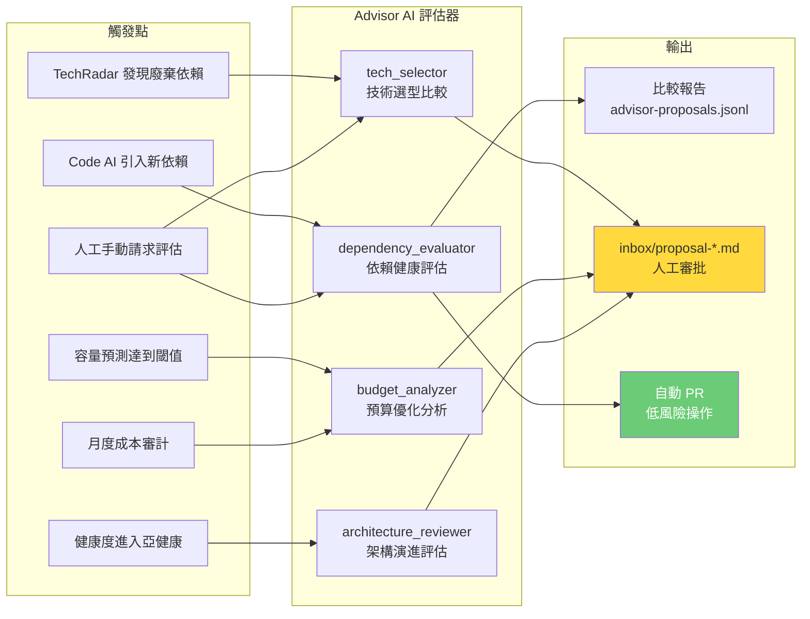

## <a name="part11"></a>第十一部分：AI 決策參與

> **分層狀態：Deferred Program。** 本文件中的 Advisor 能力不是當前 active core 的實作承諾，只保留為延後接入的制度設計。當前階段僅允許保留接口與建議格式，不啟用主動提案流。

> **本部分是 v3 核心新增**。v2 的 AI 只在代碼質量上做決策。v3 的 AI 參與更廣泛的技術決策——不是替代人，而是確保每個決策都有數據，而不是直覺。
>
> **注意**：本文件中的代碼塊為設計參考，說明預期行為。實際實現將基於 StateStore + gateway_client 重寫。

### 11.1 決策參與架構



---

### 11.2 技術選型評估（依賴引入時）

當 Code AI 決定引入新依賴時，Advisor AI 自動並行評估，不阻塞主流水線，但在 PR 描述中附上評估結果。

```python
# advisor/utils.py — advisor 模組共享的審計寫入工具

import json
from pathlib import Path


def _append_jsonl(file_path: str, entry: dict) -> None:
    """原子追加一條 JSON 記錄到 JSONL 文件。"""
    p = Path(file_path)
    p.parent.mkdir(parents=True, exist_ok=True)
    with p.open("a") as f:
        f.write(json.dumps(entry, ensure_ascii=False) + "\n")
```

```python
# advisor/evaluators/dependency_evaluator.py

import asyncio
import json
from dataclasses import dataclass, field
from datetime import datetime, timezone
from pathlib import Path
from typing import Any

import httpx

from advisor.utils import _append_jsonl


@dataclass
class DependencyCandidate:
    """一個候選依賴的完整評估數據。"""
    name: str
    version: str
    package_manager: str

    # 健康指標
    last_commit_days_ago: int = 0
    weekly_downloads: int = 0
    github_stars: int = 0
    open_issues: int = 0
    open_prs: int = 0
    license: str = "unknown"
    has_types: bool = False

    # 安全指標
    known_vulnerabilities: int = 0
    latest_cvss: float = 0.0

    # 成本指標（對於付費依賴）
    monthly_cost_usd: float = 0.0

    # 功能指標
    feature_completeness: float = 0.0  # 0-1，人工或 LLM 評估
    api_stability: str = "unknown"     # "stable", "evolving", "unstable"

    # 綜合評分（由 evaluate() 計算）
    total_score: float = 0.0
    score_breakdown: dict[str, float] = field(default_factory=dict)
    recommendation: str = "neutral"    # "strongly_recommended", "recommended", "neutral", "avoid"


@dataclass
class DependencyEvaluationReport:
    """Advisor AI 的技術選型評估報告。"""
    trigger_event: str          # "code_ai_new_dependency" 等
    evaluated_at: datetime
    requested_package: str      # Code AI 想要引入的包
    candidates: list[DependencyCandidate]
    winner: str                 # 推薦使用的包名
    winner_justification: str
    migration_notes: str        # 如果推薦不同於 Code AI 選擇，說明遷移成本
    cost_usd: float


async def evaluate_dependency(
    package_name: str,
    package_manager: str = "npm",
    find_alternatives: bool = True,
) -> DependencyEvaluationReport:
    """
    Advisor AI 的技術選型主函數。
    
    1. 評估 Code AI 選擇的包
    2. 如果 find_alternatives=True，搜索功能等效的替代方案
    3. 比較所有候選，生成帶數據的推薦
    """
    candidates = []

    async with httpx.AsyncClient() as client:
        # 評估主要候選（Code AI 選擇的）
        primary = await _evaluate_single_package(package_name, package_manager, client)
        candidates.append(primary)

        # 搜索替代方案
        if find_alternatives:
            alternatives = await _search_alternatives(package_name, package_manager, client)
            for alt_name in alternatives[:3]:  # 最多評估 3 個替代方案
                if alt_name != package_name:
                    alt = await _evaluate_single_package(alt_name, package_manager, client)
                    candidates.append(alt)

    # 計算綜合評分
    for candidate in candidates:
        candidate.total_score, candidate.score_breakdown = _calculate_score(candidate)
        candidate.recommendation = _classify_recommendation(candidate.total_score)

    # 排序，選出最佳
    candidates.sort(key=lambda c: c.total_score, reverse=True)
    winner = candidates[0]

    # 生成報告
    migration_notes = ""
    if winner.name != package_name:
        migration_notes = f"Advisor AI 推薦使用 `{winner.name}` 而非 Code AI 選擇的 `{package_name}`。"
        migration_notes += f" 遷移複雜度評估：{'低' if _estimate_migration_cost(package_name, winner.name) < 2 else '中'}。"

    report = DependencyEvaluationReport(
        trigger_event="code_ai_new_dependency",
        evaluated_at=datetime.now(timezone.utc),
        requested_package=package_name,
        candidates=candidates,
        winner=winner.name,
        winner_justification=_generate_justification(winner, candidates),
        migration_notes=migration_notes,
        cost_usd=0.08,  # 每次評估成本（LLM 調用 + API）
    )

    # 寫入審計日誌
    _log_evaluation(report)

    return report


async def _evaluate_single_package(
    name: str,
    package_manager: str,
    client: httpx.AsyncClient,
) -> DependencyCandidate:
    """從 npm registry 或 PyPI 獲取包的完整健康數據。"""
    candidate = DependencyCandidate(name=name, version="", package_manager=package_manager)

    if package_manager == "npm":
        try:
            resp = await client.get(
                f"https://registry.npmjs.org/{name}",
                timeout=10.0,
            )
            if resp.status_code == 200:
                data = resp.json()
                latest = data.get("dist-tags", {}).get("latest", "")
                candidate.version = latest

                time_data = data.get("time", {})
                if latest and latest in time_data:
                    from techradar.techradar_scanner import TechRadarScanner
                    scanner = TechRadarScanner.__new__(TechRadarScanner)
                    candidate.last_commit_days_ago = scanner._days_since(time_data[latest])

                candidate.license = data.get("license", "unknown")

                # 獲取週下載量
                dl_resp = await client.get(
                    f"https://api.npmjs.org/downloads/point/last-week/{name}",
                    timeout=5.0,
                )
                if dl_resp.status_code == 200:
                    candidate.weekly_downloads = dl_resp.json().get("downloads", 0)

        except Exception as e:
            pass

    return candidate


def _calculate_score(candidate: DependencyCandidate) -> tuple[float, dict[str, float]]:
    """
    計算依賴的綜合評分（0-100）。

    評分維度：
    - 維護活躍度（30%）：最後更新時間 + 下載量
    - 安全狀況（30%）：已知漏洞數 + 最高 CVSS
    - 社區健康（20%）：Stars + Issues 比
    - 許可證兼容性（10%）：是否 MIT/Apache
    - TypeScript 支持（10%）：是否有類型定義
    """
    breakdown = {}

    # 維護活躍度
    recency_score = max(0, 100 - candidate.last_commit_days_ago / 3.65)  # 365 天 = 0分
    popularity_score = min(100, candidate.weekly_downloads / 10000)  # 100萬/週 = 100分
    maintenance = (recency_score * 0.7 + popularity_score * 0.3)
    breakdown["maintenance"] = maintenance

    # 安全狀況
    security = 100 - (candidate.known_vulnerabilities * 20) - (candidate.latest_cvss * 5)
    security = max(0, security)
    breakdown["security"] = security

    # 社區健康
    issue_ratio = candidate.open_issues / max(1, candidate.github_stars / 100)
    community = max(0, 100 - issue_ratio * 10)
    breakdown["community"] = community

    # 許可證
    license_score = 100 if candidate.license in ("MIT", "Apache-2.0", "BSD-3-Clause", "ISC") else \
                   50 if candidate.license in ("GPL-2.0", "GPL-3.0") else 30
    breakdown["license"] = license_score

    # TypeScript
    ts_score = 100 if candidate.has_types else 50
    breakdown["typescript"] = ts_score

    total = (
        maintenance * 0.30 +
        security * 0.30 +
        community * 0.20 +
        license_score * 0.10 +
        ts_score * 0.10
    )

    return total, breakdown


def _classify_recommendation(score: float) -> str:
    if score >= 80:
        return "strongly_recommended"
    elif score >= 60:
        return "recommended"
    elif score >= 40:
        return "neutral"
    return "avoid"


def _generate_justification(winner: DependencyCandidate, all_candidates: list[DependencyCandidate]) -> str:
    """生成人類可讀的推薦理由。"""
    lines = [f"推薦 `{winner.name}`（評分 {winner.total_score:.1f}/100）："]
    
    sb = winner.score_breakdown
    if sb.get("maintenance", 0) >= 80:
        lines.append(f"- ✅ 維護活躍（{winner.last_commit_days_ago} 天前更新，週下載 {winner.weekly_downloads:,}）")
    elif sb.get("maintenance", 0) < 50:
        lines.append(f"- ⚠ 維護活躍度偏低（{winner.last_commit_days_ago} 天未更新）")

    if winner.known_vulnerabilities == 0:
        lines.append("- ✅ 無已知安全漏洞")
    else:
        lines.append(f"- ⚠ {winner.known_vulnerabilities} 個已知漏洞（最高 CVSS {winner.latest_cvss}）")

    if winner.has_types:
        lines.append("- ✅ 有 TypeScript 類型定義")

    # 對比說明
    losers = [c for c in all_candidates if c.name != winner.name]
    if losers:
        lines.append(f"\n其他評估方案：" + "、".join(
            f"`{c.name}`（{c.total_score:.0f}分）" for c in losers
        ))

    return "\n".join(lines)


def _estimate_migration_cost(from_pkg: str, to_pkg: str) -> int:
    """估算遷移成本（1-5，5最高）。簡化實現。"""
    return 2  # 默認中等成本


def _log_evaluation(report: DependencyEvaluationReport):
    """記錄評估結果到 advisor-proposals.jsonl。"""
    entry = {
        "timestamp": report.evaluated_at.isoformat() + "Z",
        "type": "dependency_evaluation",
        "requested_package": report.requested_package,
        "winner": report.winner,
        "candidates_count": len(report.candidates),
        "cost_usd": report.cost_usd,
    }
    _append_jsonl("audit/advisor-proposals.jsonl", entry)
```

---

### 11.3 架構演進評估

當健康度連續下降或 Critic AI 置信度持續偏低時，Advisor AI 觸發架構評估，主動提出重構建議。

```python
# advisor/evaluators/architecture_reviewer.py

from dataclasses import dataclass, field
from datetime import datetime, timezone
from pathlib import Path
import json
import subprocess


@dataclass
class ArchitectureSmell:
    """單個架構問題。"""
    location: str          # 文件路徑或模塊名
    smell_type: str        # "god_class", "cross_slice_dep", "high_complexity", etc.
    description: str
    severity: str          # "critical", "high", "medium", "low"
    affected_slices: list[str]
    suggested_fix: str
    estimated_effort_hours: float


@dataclass
class ArchitectureReviewReport:
    """架構評審報告。"""
    reviewed_at: datetime
    trigger: str           # "health_score_decline", "critic_score_trend", "manual"
    smells: list[ArchitectureSmell]
    overall_assessment: str
    refactoring_priority: list[str]  # 按優先級排序的重構建議
    estimated_total_effort_hours: float
    risk_if_deferred: str
    cost_usd: float


def review_architecture(
    trigger: str = "health_score_decline",
    focus_slices: list[str] | None = None,
) -> ArchitectureReviewReport:
    """
    掃描代碼庫，識別架構問題，生成重構優先級報告。

    分析維度：
    1. 跨切片直接依賴（違反垂直切片原則）
    2. 高 McCabe 複雜度模塊（複雜度 > 10）
    3. 上帝類/上帝模塊（文件超過 500 行 + 職責過多）
    4. 過時的基礎設施適配（使用廢棄 API 的防腐層）
    """
    smells = []

    # 1. 跨切片依賴分析
    cross_slice_smells = _detect_cross_slice_dependencies(focus_slices)
    smells.extend(cross_slice_smells)

    # 2. 複雜度分析
    complexity_smells = _detect_high_complexity()
    smells.extend(complexity_smells)

    # 3. 上帝類分析
    god_class_smells = _detect_god_classes()
    smells.extend(god_class_smells)

    # 4. 生成重構優先級
    priority_order = _prioritize_refactoring(smells)

    total_effort = sum(s.estimated_effort_hours for s in smells)

    report = ArchitectureReviewReport(
        reviewed_at=datetime.now(timezone.utc),
        trigger=trigger,
        smells=smells,
        overall_assessment=_summarize_assessment(smells),
        refactoring_priority=priority_order,
        estimated_total_effort_hours=total_effort,
        risk_if_deferred=_assess_deferral_risk(smells),
        cost_usd=0.05,  # 主要是靜態分析，LLM 成本極低
    )

    # 如果發現嚴重問題，創建提案
    critical_smells = [s for s in smells if s.severity in ("critical", "high")]
    if critical_smells:
        _create_refactoring_proposal(report, critical_smells)

    return report


def _detect_cross_slice_dependencies(
    focus_slices: list[str] | None,
) -> list[ArchitectureSmell]:
    """
    使用 AST 分析檢測跨切片直接依賴。
    正常情況應該由 CI 攔截，但 Advisor AI 提供重構建議。
    """
    smells = []
    src_path = Path("src")
    if not src_path.exists():
        return smells

    slices = [d.name for d in src_path.iterdir() if d.is_dir()]
    if focus_slices:
        slices = [s for s in slices if s in focus_slices]

    for slice_name in slices:
        slice_path = src_path / slice_name
        for py_file in slice_path.rglob("*.py"):
            content = py_file.read_text()
            for other_slice in slices:
                if other_slice == slice_name:
                    continue
                # 檢測直接導入（不通過 events/）
                import_pattern = f"from src.{other_slice}"
                if import_pattern in content and "/events/" not in str(py_file):
                    smells.append(ArchitectureSmell(
                        location=str(py_file),
                        smell_type="cross_slice_dep",
                        description=f"`{slice_name}` 直接導入了 `{other_slice}` 切片的代碼，違反垂直切片原則",
                        severity="high",
                        affected_slices=[slice_name, other_slice],
                        suggested_fix=f"通過 `src/{other_slice}/events/` 中定義的接口或事件進行通信",
                        estimated_effort_hours=2.0,
                    ))

    return smells


def _detect_high_complexity() -> list[ArchitectureSmell]:
    """使用 radon 分析 Python 代碼的 McCabe 複雜度。"""
    smells = []
    try:
        result = subprocess.run(
            ["python", "-m", "radon", "cc", "src/", "--min", "C", "--json"],
            capture_output=True, text=True,
        )
        if result.returncode == 0:
            data = json.loads(result.stdout)
            for file_path, functions in data.items():
                for func in functions:
                    if func.get("complexity", 0) > 10:
                        smells.append(ArchitectureSmell(
                            location=f"{file_path}:{func.get('name')}",
                            smell_type="high_complexity",
                            description=f"函數 `{func.get('name')}` McCabe 複雜度 {func.get('complexity')}，超過閾值 10",
                            severity="high" if func.get("complexity", 0) > 20 else "medium",
                            affected_slices=[file_path.split("/")[1] if "/" in file_path else "unknown"],
                            suggested_fix="提取子函數，使用策略模式或早期返回降低嵌套深度",
                            estimated_effort_hours=float(func.get("complexity", 10)) / 5,
                        ))
    except FileNotFoundError:
        return []  # 缺少 radon 時安全降級為「不產生複雜度結論」

    return smells


def _detect_god_classes() -> list[ArchitectureSmell]:
    """識別超過 500 行且包含過多職責的文件。"""
    smells = []
    for py_file in Path("src").rglob("*.py"):
        lines = py_file.read_text().splitlines()
        if len(lines) > 500:
            # 簡單啟發式：行數超過 500 且包含多個不同職責的關鍵詞
            content = py_file.read_text()
            concerns = sum([
                "def validate" in content,
                "def render" in content or "def serialize" in content,
                "def save" in content or "def persist" in content,
                "def notify" in content or "def send" in content,
                "def calculate" in content or "def compute" in content,
            ])
            if concerns >= 3:
                smells.append(ArchitectureSmell(
                    location=str(py_file),
                    smell_type="god_class",
                    description=f"文件 {py_file.name} 有 {len(lines)} 行，承擔了 {concerns} 個不同職責",
                    severity="medium",
                    affected_slices=[py_file.parts[1] if len(py_file.parts) > 1 else "unknown"],
                    suggested_fix="按職責拆分：驗證邏輯、序列化邏輯、持久化邏輯各自獨立",
                    estimated_effort_hours=8.0,
                ))

    return smells


def _prioritize_refactoring(smells: list[ArchitectureSmell]) -> list[str]:
    """按嚴重程度 + 影響範圍 + 修復成本排序重構建議。"""
    SEVERITY_WEIGHT = {"critical": 4, "high": 3, "medium": 2, "low": 1}

    def priority_score(smell: ArchitectureSmell) -> float:
        severity = SEVERITY_WEIGHT.get(smell.severity, 1)
        scope = len(smell.affected_slices)
        cost_inverse = 1 / max(0.5, smell.estimated_effort_hours)
        return severity * scope * cost_inverse

    sorted_smells = sorted(smells, key=priority_score, reverse=True)
    return [f"{s.smell_type}@{s.location}: {s.suggested_fix}" for s in sorted_smells[:5]]


def _summarize_assessment(smells: list[ArchitectureSmell]) -> str:
    critical = sum(1 for s in smells if s.severity == "critical")
    high = sum(1 for s in smells if s.severity == "high")
    total = len(smells)

    if critical > 0:
        return f"架構存在 {critical} 個嚴重問題，需要優先重構"
    elif high > 2:
        return f"架構積累了 {total} 個問題（{high} 個高危），建議計劃重構 Sprint"
    elif total > 0:
        return f"架構整體健康，有 {total} 個低優先級改進機會"
    return "架構健康，無需立即重構"


def _assess_deferral_risk(smells: list[ArchitectureSmell]) -> str:
    if any(s.severity == "critical" for s in smells):
        return "高風險：嚴重架構問題可能在 1-2 個月內導致流水線失敗率上升"
    elif any(s.severity == "high" for s in smells):
        return "中等風險：高嚴重性問題若不處理，技術債累積將加速"
    return "低風險：當前問題不會立即影響系統穩定性"


def _create_refactoring_proposal(report: ArchitectureReviewReport, critical_smells: list[ArchitectureSmell]):
    """將重要架構問題轉化為 inbox/proposal-*.md。"""
    proposal_id = f"ARCH-{datetime.now(timezone.utc).strftime('%Y%m%d-%H%M%S')}"

    lines = [f"# Advisor AI 架構演進提案"]
    lines.append(f"\n**提案 ID**：{proposal_id}  ")
    lines.append(f"**觸發原因**：{report.trigger}  ")
    lines.append(f"**評估時間**：{report.reviewed_at.isoformat()}Z  ")
    lines.append(f"**有效期**：14 天  ")
    lines.append(f"\n---\n")
    lines.append(f"## 總體評估\n\n{report.overall_assessment}")
    lines.append(f"\n## 發現的問題（{len(critical_smells)} 個高優先級）\n")

    for i, smell in enumerate(critical_smells, 1):
        lines.append(f"### {i}. {smell.smell_type}：{smell.location}")
        lines.append(f"\n**描述**：{smell.description}  ")
        lines.append(f"**嚴重程度**：{smell.severity}  ")
        lines.append(f"**影響切片**：{', '.join(smell.affected_slices)}  ")
        lines.append(f"**建議修復**：{smell.suggested_fix}  ")
        lines.append(f"**預計工時**：{smell.estimated_effort_hours} 小時  \n")

    lines.append(f"## 重構優先級\n")
    for item in report.refactoring_priority:
        lines.append(f"- {item}")

    lines.append(f"\n## 延遲風險\n\n{report.risk_if_deferred}")
    lines.append(f"\n---\n\n*批准此提案後，Advisor AI 將生成詳細的重構計劃和代碼變更 PR。*")
    lines.append(f"*重大架構重構（影響 > 3 個切片）屬於紅區，需要人工執行和監督。*")

    proposal_path = Path(f"inbox/proposal-{proposal_id}.md")
    proposal_path.write_text("\n".join(lines), encoding="utf-8")
```

---

### 11.4 預算智能分析

```python
# advisor/evaluators/budget_analyzer.py

from dataclasses import dataclass
from datetime import datetime, timedelta, timezone
from pathlib import Path
import json


@dataclass
class SubscriptionUtilization:
    service: str
    monthly_cost_usd: float
    utilization_rate: float         # 實際使用率（0-1）
    value_assessment: str           # "high_value", "medium_value", "low_value", "unused"
    recommendation: str             # "keep", "downgrade", "cancel", "upgrade"
    potential_savings_usd: float    # 如果採納建議，每月節省金額


@dataclass
class BudgetOpportunity:
    opportunity_type: str  # "model_switch", "subscription_downgrade", "service_consolidation"
    description: str
    current_monthly_cost_usd: float
    proposed_monthly_cost_usd: float
    monthly_savings_usd: float
    implementation_effort: str  # "trivial", "low", "medium", "high"
    risk_level: str            # "none", "low", "medium", "high"
    evidence: dict             # 數據支撐


@dataclass
class BudgetAnalysisReport:
    analyzed_at: datetime
    period_days: int
    subscription_utilizations: list[SubscriptionUtilization]
    opportunities: list[BudgetOpportunity]
    total_current_monthly_usd: float
    total_potential_savings_usd: float
    high_confidence_savings_usd: float  # 低風險的節省機會
    cost_usd: float


def analyze_budget(
    lookback_days: int = 30,
) -> BudgetAnalysisReport:
    """
    分析過去 N 天的成本數據，識別優化機會。

    分析維度：
    1. 訂閱使用率：每個訂閱實際使用了多少配額？
    2. 路由網關模型效率：是否用了比必要更貴的模型？（從網關事件流分析）
    3. 服務重疊：是否有功能重疊的付費服務？
    4. 閒置訂閱：是否有從未使用或極少使用的訂閱？
    """
    usage_data = _load_usage_data(lookback_days)
    benchmark_data = _load_benchmark_data()

    utilizations = _analyze_subscription_utilizations(usage_data)
    opportunities = _identify_opportunities(usage_data, benchmark_data)

    total_current = sum(u.monthly_cost_usd for u in utilizations)
    total_savings = sum(o.monthly_savings_usd for o in opportunities)
    high_conf_savings = sum(
        o.monthly_savings_usd for o in opportunities
        if o.risk_level in ("none", "low")
    )

    report = BudgetAnalysisReport(
        analyzed_at=datetime.now(timezone.utc),
        period_days=lookback_days,
        subscription_utilizations=utilizations,
        opportunities=opportunities,
        total_current_monthly_usd=total_current,
        total_potential_savings_usd=total_savings,
        high_confidence_savings_usd=high_conf_savings,
        cost_usd=0.03,  # 預算分析成本極低
    )

    if total_savings > 5.0:  # 節省超過 $5/月 才值得創建提案
        _create_budget_proposal(report)

    return report


def _analyze_subscription_utilizations(usage_data: dict) -> list[SubscriptionUtilization]:
    """分析各訂閱的實際使用率。"""
    utilizations = []

    # Claude Code 使用率分析
    cc_windows = usage_data.get("claude_code", {}).get("windows_used_30d", 0)
    cc_available = 30 * 3  # 假設每天 3 個窗口
    cc_utilization = cc_windows / max(1, cc_available)

    cc_plan = usage_data.get("claude_code", {}).get("plan", "pro")
    cc_cost = 20 if cc_plan == "pro" else 100 if cc_plan == "max_5x" else 200

    utilizations.append(SubscriptionUtilization(
        service="Claude Code",
        monthly_cost_usd=cc_cost,
        utilization_rate=cc_utilization,
        value_assessment="high_value" if cc_utilization > 0.7 else
                         "medium_value" if cc_utilization > 0.4 else "low_value",
        recommendation="keep" if cc_utilization > 0.5 else "downgrade",
        potential_savings_usd=80 if cc_plan == "max_5x" and cc_utilization < 0.3 else 0,
    ))

    # 路由網關按量調用效率分析（從網關事件流或 usage-tracking 聚合）
    gw_data = usage_data.get("gateway_calls", {}).get("by_task_class", {})
    for task_class, task_usage in gw_data.items():
        calls = task_usage.get("calls_30d", 0)
        cost = task_usage.get("cost_30d", 0)
        if calls > 0:
            cost_per_call = cost / calls
            # 如果某類任務的平均成本遠高於其 max_cost 預算
            expected_max = {"code_gen": 0.10, "structured_analysis": 0.05, "reasoning": 0.30}.get(task_class, 0.10)
            if cost_per_call > expected_max * 2:
                utilizations.append(SubscriptionUtilization(
                    service=f"Gateway/{task_class}",
                    monthly_cost_usd=cost,
                    utilization_rate=1.0,
                    value_assessment="medium_value",
                    recommendation="review_routing_policy",
                    potential_savings_usd=cost * 0.5,
                ))

    return utilizations


def _identify_opportunities(
    usage_data: dict,
    benchmark_data: dict,
) -> list[BudgetOpportunity]:
    """識別具體的成本優化機會。"""
    opportunities = []

    # 機會 1：如果 Claude Code 使用率持續低，建議降級
    cc_utilization = usage_data.get("claude_code", {}).get("avg_utilization_30d", 1.0)
    cc_plan = usage_data.get("claude_code", {}).get("plan", "pro")
    if cc_plan == "max_5x" and cc_utilization < 0.40:
        opportunities.append(BudgetOpportunity(
            opportunity_type="subscription_downgrade",
            description="Claude Code Max 5× 過去 30 天平均使用率僅 {:.0%}，建議降級至 Pro 計劃".format(cc_utilization),
            current_monthly_cost_usd=100,
            proposed_monthly_cost_usd=20,
            monthly_savings_usd=80,
            implementation_effort="trivial",
            risk_level="low",
            evidence={"avg_utilization_30d": cc_utilization, "plan": cc_plan},
        ))

    # 機會 2：路由網關成本異常（某類 task_class 的成本顯著高於預期）
    for task_class, task_data in gw_data.items():
        cost_30d = task_data.get("cost_30d", 0)
        calls_30d = task_data.get("calls_30d", 0)
        if calls_30d > 10 and cost_30d > 5:  # 只關注有足夠數據的類別
            expected_max = {"code_gen": 0.10, "structured_analysis": 0.05, "reasoning": 0.30}.get(task_class, 0.10)
            avg_cost = cost_30d / calls_30d
            if avg_cost > expected_max * 1.5:
                potential_savings = cost_30d - (calls_30d * expected_max)
                opportunities.append(BudgetOpportunity(
                    opportunity_type="routing_policy_review",
                    description=f"任務類型 {task_class} 平均每次成本 ${avg_cost:.3f}，超出預期上限 ${expected_max:.2f} 的 50%。建議檢查路由網關策略",
                    current_monthly_cost_usd=cost_30d,
                    proposed_monthly_cost_usd=calls_30d * expected_max,
                    monthly_savings_usd=potential_savings,
                    implementation_effort="trivial",
                    risk_level="low",
                    evidence={"avg_cost_per_call": avg_cost, "expected_max": expected_max, "calls_30d": calls_30d},
                ))

    return opportunities


def _load_usage_data(lookback_days: int) -> dict:
    """從 audit/usage-tracking.jsonl 加載使用數據。"""
    path = Path("audit/usage-tracking.jsonl")
    if not path.exists():
        return {}

    cutoff = datetime.now(timezone.utc) - timedelta(days=lookback_days)
    records = []
    for line in path.read_text().splitlines():
        try:
            entry = json.loads(line)
            date_str = entry.get("date", "")
            if date_str:
                entry_date = datetime.strptime(date_str, "%Y-%m-%d")
                if entry_date >= cutoff:
                    records.append(entry)
        except Exception:
            continue

    if not records:
        return {}

    # 聚合數據
    claude_windows = sum(r.get("claude_code", {}).get("windows_used", 0) for r in records)
    gateway_by_task_class: dict = {}
    for r in records:
        for task_class, data in r.get("gateway_calls", {}).get("by_task_class", {}).items():
            if task_class not in gateway_by_task_class:
                gateway_by_task_class[task_class] = {"calls_30d": 0, "cost_30d": 0}
            gateway_by_task_class[task_class]["calls_30d"] += data.get("calls", 0)
            gateway_by_task_class[task_class]["cost_30d"] += data.get("cost", 0)

    return {
        "claude_code": {
            "windows_used_30d": claude_windows,
            "avg_utilization_30d": claude_windows / (lookback_days * 3),
            "plan": "pro",  # 從配置中讀取
        },
        "gateway_calls": {"by_task_class": gateway_by_task_class},
    }


def _load_benchmark_data() -> dict:
    """從 weekly-benchmarks 加載最近的 AI 性能數據。"""
    benchmarks_dir = Path("audit/weekly-benchmarks")
    if not benchmarks_dir.exists():
        return {}
    files = sorted(benchmarks_dir.glob("*.json"))
    if not files:
        return {}
    return json.loads(files[-1].read_text())


def _create_budget_proposal(report: BudgetAnalysisReport):
    """將預算優化機會轉化為 inbox/proposal-*.md。"""
    proposal_id = f"BUDGET-{datetime.now(timezone.utc).strftime('%Y%m')}"

    lines = ["# Advisor AI 預算優化提案"]
    lines.append(f"\n**提案 ID**：{proposal_id}  ")
    lines.append(f"**分析時間**：{report.analyzed_at.strftime('%Y-%m-%d')}  ")
    lines.append(f"**分析週期**：過去 {report.period_days} 天  ")
    lines.append(f"**有效期**：30 天  \n")
    lines.append(f"---\n")
    lines.append(f"## 執行摘要\n")
    lines.append(f"- 當前月度成本：**${report.total_current_monthly_usd:.1f}**")
    lines.append(f"- 潛在節省（低風險）：**${report.high_confidence_savings_usd:.1f}/月**")
    lines.append(f"- 潛在節省（全部）：${report.total_potential_savings_usd:.1f}/月\n")

    lines.append(f"\n## 優化機會\n")
    for i, opp in enumerate(report.opportunities, 1):
        risk_icon = "✅" if opp.risk_level in ("none", "low") else "⚠"
        lines.append(f"### {i}. {opp.description}\n")
        lines.append(f"- **每月節省**：${opp.monthly_savings_usd:.1f}")
        lines.append(f"- **實施難度**：{opp.implementation_effort}")
        lines.append(f"- **風險等級**：{risk_icon} {opp.risk_level}")
        lines.append(f"- **數據支撐**：`{json.dumps(opp.evidence, ensure_ascii=False)}`\n")

    lines.append(f"\n---\n")
    lines.append(f"*批准後，Advisor AI 將自動執行低風險優化（如修改 cost_policy.yaml 中的模型配置）。*")
    lines.append(f"*降級訂閱等操作需要人工執行，並屬於紅區保護。*")

    proposal_path = Path(f"inbox/proposal-{proposal_id}.md")
    proposal_path.write_text("\n".join(lines), encoding="utf-8")
```

---

### 11.5 提案生命週期管理

```python
# advisor/proposal_manager.py

import json
from dataclasses import dataclass
from datetime import datetime, timedelta, timezone
from enum import Enum
from pathlib import Path

from advisor.utils import _append_jsonl


class ProposalStatus(Enum):
    PENDING = "pending"         # 待審批
    APPROVED = "approved"       # 已批准
    REJECTED = "rejected"       # 已拒絕
    EXPIRED = "expired"         # 已過期
    EXECUTED = "executed"       # 已執行（批准後自動執行完成）


@dataclass
class ProposalRecord:
    proposal_id: str
    proposal_type: str          # "security", "dependency_replacement", "architecture", "budget", "ops"
    generated_at: datetime
    expires_at: datetime
    status: ProposalStatus
    generated_by: str           # "ops_ai", "techradar", "advisor_ai"
    human_decision_at: datetime | None = None
    human_decision_by: str | None = None
    execution_result: str | None = None


def check_expired_proposals() -> list[ProposalRecord]:
    """
    每日運行：將超過有效期的待審提案標記為過期。
    過期提案不會重新生成，但會記錄在 audit 中。
    """
    expired = []
    proposals_log = Path("audit/advisor-proposals.jsonl")
    now = datetime.now(timezone.utc)

    if not proposals_log.exists():
        return expired

    # 讀取所有待審提案
    pending = {}
    for line in proposals_log.read_text().splitlines():
        try:
            entry = json.loads(line)
            pid = entry.get("proposal_id")
            if pid and entry.get("status") == "pending":
                pending[pid] = entry
        except Exception:
            continue

    # 檢查並更新過期狀態
    for pid, entry in pending.items():
        expires_str = entry.get("expires_at", "")
        if expires_str:
            try:
                expires_at = datetime.fromisoformat(expires_str.replace("Z", "+00:00"))
                if now > expires_at:
                    # 標記過期
                    _update_proposal_status(pid, ProposalStatus.EXPIRED, "auto_expire")
                    # 清理 inbox 中的 proposal 文件
                    for proposal_file in Path("inbox").glob(f"proposal-{pid}*.md"):
                        proposal_file.rename(
                            Path("audit/expired-proposals") / proposal_file.name
                        )
                    expired.append(pid)
            except Exception:
                pass

    return expired


def record_human_decision(
    proposal_id: str,
    decision: str,  # "approved" or "rejected"
    decided_by: str,
    rejection_reason: str = "",
):
    """
    記錄人類對提案的決策。
    批准後觸發執行，拒絕後記錄原因供 AI 學習。
    """
    now = datetime.now(timezone.utc)

    entry = {
        "timestamp": now.isoformat() + "Z",
        "type": "proposal_decision",
        "proposal_id": proposal_id,
        "decision": decision,
        "decided_by": decided_by,
        "rejection_reason": rejection_reason,
    }
    _append_jsonl("audit/advisor-proposals.jsonl", entry)

    if decision == "approved":
        _trigger_proposal_execution(proposal_id)
    elif decision == "rejected" and rejection_reason:
        # 保存拒絕原因，供未來提案改進
        _record_rejection_learning(proposal_id, rejection_reason)


def _update_proposal_status(proposal_id: str, status: ProposalStatus, actor: str):
    entry = {
        "timestamp": datetime.now(timezone.utc).isoformat() + "Z",
        "type": "proposal_status_change",
        "proposal_id": proposal_id,
        "new_status": status.value,
        "actor": actor,
    }
    _append_jsonl("audit/advisor-proposals.jsonl", entry)


def _trigger_proposal_execution(proposal_id: str):
    """
    批准後執行提案。
    根據提案類型分發到對應的執行器。
    """
    # 從提案文件解析類型
    proposal_files = list(Path("inbox").glob(f"proposal-{proposal_id}*.md"))
    if not proposal_files:
        return

    content = proposal_files[0].read_text()

    if proposal_id.startswith("SEC-"):
        # 安全更新：觸發依賴升級 PR
        _execute_security_update(proposal_id, content)
    elif proposal_id.startswith("DEP-"):
        # 依賴替換：生成 Spec + Code AI 任務
        _execute_dependency_replacement(proposal_id, content)
    elif proposal_id.startswith("MODEL-"):
        # 模型升級：更新 cost_policy.yaml
        _execute_model_upgrade(proposal_id, content)
    elif proposal_id.startswith("BUDGET-"):
        # 預算優化：更新配置（低風險部分）
        _execute_budget_optimization(proposal_id, content)
    elif proposal_id.startswith("ARCH-"):
        # 架構重構：創建 requirement-*.md，進入正常流水線
        _execute_architecture_refactoring(proposal_id, content)


def _execute_security_update(proposal_id: str, content: str):
    """執行安全更新：創建依賴升級 PR。"""
    # 從提案中提取包名和目標版本
    # 創建標準 requirement-*.md 讓正常流水線處理
    req_id = f"auto-sec-{proposal_id}"
    req_content = f"""# 自動安全更新：{proposal_id}

**背景**：TechRadar 發現安全漏洞，已由人工批准更新。  
**類型**：security_patch（自動批准後執行）  

## 範圍
執行 {proposal_id} 提案中描述的依賴安全更新。

## 驗收標準
- Given: 依賴已更新到安全版本
- When: 運行全套測試
- Then: 所有測試通過，無回歸

## 約束
- 只允許更新指定的依賴版本
- 不允許更改任何業務邏輯
- 成本上限：$1.00
"""
    Path(f"inbox/requirement-{req_id}.md").write_text(req_content, encoding="utf-8")


def _record_rejection_learning(proposal_id: str, reason: str):
    """記錄拒絕原因，未來提案生成時參考。"""
    entry = {
        "timestamp": datetime.now(timezone.utc).isoformat() + "Z",
        "type": "rejection_learning",
        "proposal_id": proposal_id,
        "reason": reason,
    }
    _append_jsonl("audit/advisor-proposals.jsonl", entry)


def _execute_dependency_replacement(proposal_id: str, content: str):
    req_id = f"auto-dep-{proposal_id.lower()}"
    req_content = f"""# 依賴替換執行：{proposal_id}

**背景**：Advisor AI 提案已批准，需要執行依賴替換。  
**類型**：dependency_replacement

## 範圍
- 僅替換提案中列出的依賴
- 補齊兼容性測試與遷移說明

## 驗收標準
- Given: 新依賴已接入並通過契約測試
- When: 執行 Result Gate + Canary
- Then: 無破壞性變更且性能不低於基線
"""
    Path(f"inbox/requirement-{req_id}.md").write_text(req_content, encoding="utf-8")


def _execute_model_upgrade(proposal_id: str, content: str):
    entry = {
        "timestamp": datetime.now(timezone.utc).isoformat() + "Z",
        "type": "model_upgrade_execution",
        "proposal_id": proposal_id,
        "action": "update_cost_policy_required",
        "status": "queued_for_config_change",
    }
    _append_jsonl("audit/advisor-proposals.jsonl", entry)


def _execute_budget_optimization(proposal_id: str, content: str):
    entry = {
        "timestamp": datetime.now(timezone.utc).isoformat() + "Z",
        "type": "budget_optimization_execution",
        "proposal_id": proposal_id,
        "action": "update_preferred_models_required",
        "status": "queued_for_config_change",
    }
    _append_jsonl("audit/advisor-proposals.jsonl", entry)


def _execute_architecture_refactoring(proposal_id: str, content: str):
    req_id = f"auto-arch-{proposal_id.lower()}"
    req_content = f"""# 架構重構執行：{proposal_id}

**背景**：Advisor AI 架構提案已批准。  
**類型**：architecture_refactoring

## 範圍
- 僅處理提案中列出的切片與重構目標
- 必須保留可回滾方案與分批遷移計劃

## 驗收標準
- Given: 目標切片完成重構
- When: 運行契約測試、集成測試、架構規則檢查
- Then: 無新增跨切片直接依賴，健康度提升且可回滾
"""
    Path(f"inbox/requirement-{req_id}.md").write_text(req_content, encoding="utf-8")
```

---

### 11.6 決策參與治理原則

v3 的決策參與基於以下不可違背的治理原則：

```
原則 1：數據先於直覺
每個 Advisor AI 提案必須附帶可驗證的數據支撐。
「我認為這個庫更好」不是有效的建議依據。
「這個庫最後更新是 847 天前，週下載量從 10 萬下降到 2 萬」才是。

原則 2：AI 發現，人類決策
無論 Advisor AI 的建議多麼充分，凡是超出綠區範圍的操作，
都必須等待人類審批。沒有緊急例外，沒有「先做後報告」。

原則 3：提案有成本意識
每個 Advisor AI 調用都有成本。如果每天生成 20 個提案，
人類的審批負擔會讓整個機制失去意義。
每週主動提案上限：3 個。緊急安全公告不受此限制。

原則 4：拒絕是有效反饋
當人類拒絕一個提案時，必須附帶拒絕原因。
Advisor AI 學習這些拒絕，避免重複提出類似建議。
拒絕記錄是提案質量提升的主要數據來源。

原則 5：執行與建議分離
Advisor AI 不執行自己的建議（紅/黃區）。
執行永遠通過正常的流水線或人工操作。
Advisor AI 的輸出是 proposal-*.md，不是直接的代碼變更。
```

---
