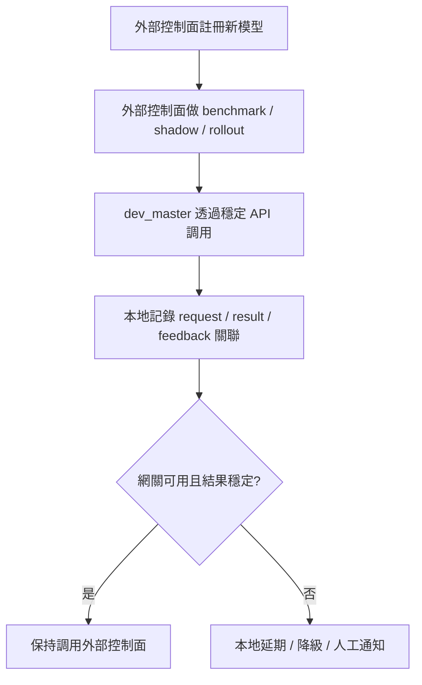

## <a name="part12"></a>第十二部分：災難恢復與系統韌性 *(v3 新增)*

> **分層狀態：Future Blueprint。** 本文件中的 rewrite、model governance、長期操作系統能力屬於未來藍圖，不進入當前 active build program。僅保留可復原性原則作為長期參考。

> 整個系統重度依賴 `audit/*.jsonl` 文件和 `inbox/` 文件系統。本部分定義可復原性保障和從零恢復的步驟。

### 12.1 審計日誌備份策略

**審計日誌是系統的記憶，不可丟失**。備份分兩層：

```
Layer 1：Git 倉庫本身（主副本）
  - audit/*.jsonl 每次 CI commit 即推送到 Git
  - Git 歷史提供完整變更回溯
  - 風險：倉庫損毀時丟失全部歷史

Layer 2：Supabase 結構化備份（離線副本）
  - 每日 GitHub Actions 將 audit/*.jsonl 寫入 Supabase 表
  - 可查詢、可聚合、可導出
  - 風險：Supabase 只是結構化副本，不是唯一真相源
```

```yaml
# .github/workflows/audit-backup.yml
name: Daily Audit Backup to Supabase

on:
  schedule:
    - cron: '30 0 * * *'  # 每日 00:30 UTC
  workflow_dispatch:

jobs:
  backup:
    runs-on: ubuntu-latest
    steps:
      - uses: actions/checkout@v4
      - name: Sync audit logs to Supabase
        env:
          SUPABASE_URL: ${{ secrets.SUPABASE_URL }}
          SUPABASE_SERVICE_KEY: ${{ secrets.SUPABASE_SERVICE_KEY }}
        run: python scripts/backup_audit_to_supabase.py
```

### 12.2 從零恢復步驟

當倉庫損毀或關鍵文件意外被覆寫時：

```
1. 從 GitHub 遠端 clone 最新版本（Git 歷史未損壞的情況）
   git clone {repo_url} && cd {project-root}

2. 如果 audit/ 目錄丟失，從 Supabase 恢復：
   python scripts/restore_audit_from_supabase.py

3. 熔斷器狀態自動從 audit/circuit-breaker-state.json 恢復
   （該文件丟失時，所有熔斷器重置為 CLOSED，原則上安全但建議人工確認）

4. 重建 TechRadar 狀態：手動觸發 TechRadar 掃描
   python -m techradar.techradar_scanner --full-scan

5. 重建 Ops AI 狀態：下一次 15 分鐘巡檢自動恢復（無狀態設計）

6. 確認 inbox/ 目錄中的待審提案：對照 Supabase 中的提案記錄補回
```

### 12.3 AI 模型服務故障應對

當路由網關整體宕機或特定模型下線時：

```
影響範圍：
  - 執行層（Test AI / Security AI）：流水線暂停，任務排隊
  - 感知層（Ops AI / TechRadar / Advisor AI）：降級為純 API 巡檢（無 LLM 分析）
  - 訂閱層（Claude Code / Codex CLI）：不受影響（獨立服務）

應對機制：
  1. `auto_router` 在其內部完成 classifier / routing / failover 切換
  2. 若網關整體不可用，`dev_master` 僅保留訂閱制路徑，將需要網關的任務延遲到下一個窗口
  3. 延遲超過 2 小時，觸發人工通知（通過通知適配層 §6.5）
  4. `dev_master` 只記錄「網關不可用 / 任務延期 / 人工介入」等本地事件；模型級 fallback 事件以 `auto_router` 審計為準
```

### 12.4 長期項目操作系統缺口清單（新增）

> v3 已能支撐高強度交付治理，但若目標是陪項目活很多年、支撐多次架構演進甚至整體重寫，還需要以下 10 個能力。這些能力是系統未來演進的主幹，不是附加功能。

1. **整項目重寫工作流**
   - 支持舊系統/新系統雙軌運行、能力對齊、遷移波次、流量切換、退役判定
2. **非 Web 項目適配層**
   - 將治理內核與 Web/SaaS 實現細節拆開，支持 App、桌面、CLI、遊戲、嵌入式
3. **生命周期階段模型**
   - 區分 0→1、PMF 前、規模化、平台化、退役/重寫期的不同治理策略
4. **領域模型保護層**
   - 保護核心業務概念、不變量、關鍵狀態機與術語兼容性
5. **技術債投資組合管理**
   - 區分高風險債、拖慢迭代的債、阻塞重寫的債與低價值噪聲
6. **架構演進地圖**
   - 明確當前架構站位、目標架構、穩定區、待替換區、待拆除區
7. **數據遷移與兼容性治理**
   - 管理 API 並存、數據模型兼容期、客戶端舊版本支持與事件演進
8. **知識沉澱與決策檢索**
   - 讓 AI 和人能查到歷史決策、事故、門禁變更、提案拒絕原因
9. **組織與協作適配層**
   - 支持多人協作下的角色分層、審批權模型、值班與升級路由
10. **外部模型治理接入層**
   - 對接外部路由控制面（如 `auto_router`）的模型治理結果，而不是在 `dev_master` 內重新實作一套

**設計原則**：
- 不把這 10 項能力一次性做完，而是按項目規模與演進階段逐步接入
- 每新增一項能力，都必須對應一份 `schema`、一份 `ruleset`、一條審計路徑
- 長期演進能力的目標不是“更智能”，而是“更可控、更可回退、更可繼承”

### 12.5 整項目重寫工作流（新增）

當項目目標不變，但現有實現已嚴重阻礙迭代、穩定性或擴展性時，系統需要把“整體重寫”視為一等工作流，而不是一次例外操作。

**立項標準**（滿足任一組合即可提出 rewrite 提案）：
- 健康度連續 8 週低於 60，且重構提案執行後無明顯改善
- 關鍵 feature 的交付 lead time 較 90 天基線惡化超過 50%
- 兼容性包袱導致核心能力無法演進，且 patch/refactor 成本高於重寫成本
- 安全、合規或可用性風險已無法通過局部修補控制

**Rewrite 提案必含字段**：
- `rewrite_scope`：本次重寫覆蓋哪些切片/服務/客戶端
- `capability_matrix`：舊系統能力與新系統對齊表
- `migration_waves`：數據與流量的遷移波次
- `freeze_policy`：重寫期間哪些功能凍結、哪些繼續開發
- `retirement_gates`：舊系統退役前必須達成的門禁
- `knowledge_transfer`：ADR、事故、門禁、反模式如何繼承

**能力對齊矩陣**：

| 能力類型 | 舊系統 | 新系統狀態 | 缺口 | 阻斷級別 |
| --- | --- | --- | --- | --- |
| 核心業務流程 | 已支持 | 待驗證 | 支付退款分支缺失 | blocking |
| 運維與告警 | 已支持 | 部分支持 | 無值班路由 | high |
| 合規審計 | 已支持 | 未接入 | 缺審計導出 | blocking |
| 性能與容量 | 已支持 | 待壓測 | 無容量基線 | medium |

**雙軌運行規則**：
- 舊系統保持服務，新系統先跑影子流量
- 高風險寫操作先雙寫，後雙讀比對，再切主讀
- 不允許在未完成 `capability_matrix` blocking 項前切換正式流量
- 任一波次失敗，可回退到上一波次，不允許跨波次硬切

**數據雙寫/雙讀與校驗**：
- 所有關鍵表或事件流必須定義對賬規則
- 對賬失敗率超過 `0.1%` 即停止下一波次
- 數據校驗結果必須寫入 `audit/rewrite-validation.jsonl`

**流量切換策略**：
1. 內部流量
2. 低風險真實流量
3. 非核心業務流量
4. 全量流量

每一階段至少滿足：
- Canary/業務 KPI 不低於舊系統基線
- 無新增 blocking 安全問題
- rollback 已演練通過

**退役門禁**：
- 新系統所有 blocking 能力補齊
- 連續 14 天無需回退到舊系統
- 關鍵對賬誤差低於閾值
- 舊系統所有遺留決策、風險、兼容策略已轉移到新系統知識庫

**重寫期間的邊界政策**：
- 重寫涉及 > 3 個切片時，永遠屬於紅區
- 重寫期間禁止同時做無關的大功能擴張
- 凍結策略不是全凍結，而是根據 `freeze_policy` 分層執行

**重寫後知識繼承**：
- 舊系統 ADR、事故、門禁、Semgrep 例外、PII 特判、運維 runbook 必須遷入新系統
- 缺少知識繼承時，重寫視為未完成，不得宣告退役成功

#### 12.5.1 Rewrite Proposal 模板（可直接套用）

```markdown
# Rewrite Proposal: {project_or_domain_name}

## 基本信息
- proposal_id: RW-{YYYYMMDD}-{slug}
- trace_id: tr_{id}
- owner: {human_owner}
- sponsors: {approvers}
- related_adrs:
  - ADR-xxx
- current_phase: proposal

## 立項原因
- 觸發信號：
  - [ ] 健康度連續 8 週 < 60
  - [ ] lead time 惡化 > 50%
  - [ ] 兼容性包袱不可持續
  - [ ] 安全/合規/可用性風險不可接受
- 問題摘要：
- 若不重寫的代價：

## Rewrite Scope
- in_scope:
  - {slice/service/client}
- out_of_scope:
  - {clearly excluded scope}
- preserved_invariants:
  - {business invariant}

## 成功定義
- 業務目標不變
- blocking 能力全部對齊
- 可回滾
- 舊系統可退役

## 附件
- capability_matrix: docs/rewrite/{id}/capability-matrix.md
- migration_waves: docs/rewrite/{id}/migration-waves.md
- freeze_policy: docs/rewrite/{id}/freeze-policy.md
- retirement_gates: docs/rewrite/{id}/retirement-gates.md
- knowledge_transfer: docs/rewrite/{id}/knowledge-transfer.md
```

#### 12.5.2 Capability Matrix 模板

```markdown
# Capability Matrix

| capability_id | capability_name | old_system_status | new_system_status | evidence | gap | severity | owner | target_wave |
| --- | --- | --- | --- | --- | --- | --- | --- | --- |
| CAP-001 | 支付下單主流程 | serving | partial | tests/e2e/payment.md | 缺退款分支 | blocking | alice | wave-2 |
| CAP-002 | 審計導出 | serving | missing | audit/export-log.json | 無導出接口 | blocking | bob | wave-1 |
| CAP-003 | 值班告警 | serving | partial | runbooks/ops.md | 無 pager 路由 | high | ops | wave-1 |

判定規則：
- `blocking`: 不補齊不得切正式流量
- `high`: 不補齊不得進入全量
- `medium`: 可帶問題進下一波，但需在 retirement 前清零
- `low`: 記錄為技術債，納入重寫後 backlog
```

#### 12.5.3 Migration Waves 模板

```markdown
# Migration Waves

## Wave 0: Shadow
- goal: 新系統不影響真實用戶，僅接收影子流量
- traffic: 0% user-facing / 100% mirrored
- write_mode: no-write or shadow-write
- validation:
  - schema parity
  - response diff
  - event diff
- rollback: 停止鏡像即可

## Wave 1: Internal
- goal: 內部流量驗證
- traffic: internal only
- write_mode: dual-write
- validation:
  - reconciliation_error_rate < 0.1%
  - no blocking security findings
- rollback: 切回舊系統主寫

## Wave 2: Low-Risk
- goal: 低風險真實流量
- traffic: 5%-10%
- write_mode: dual-write + primary-read-old
- validation:
  - KPI not below baseline
  - rollback drill passed

## Wave 3: Primary
- goal: 新系統主服務
- traffic: 50%-100%
- write_mode: primary-write-new, fallback-read-old if needed
- validation:
  - all blocking capabilities closed
  - 14 days no forced rollback
```

#### 12.5.4 Freeze Policy 模板

```markdown
# Freeze Policy

## 完全凍結
- 跨切片新能力擴張
- 新依賴大版本升級
- 非必要數據模型大改

## 條件允許
- 舊系統的 P0/P1 缺陷修復
- 合規/安全修復
- 重寫必需的兼容性改造

## 正常允許
- 文檔更新
- 測試補充
- 觀測性增強

## 決策規則
- 凡是會增加新舊系統差異面的改動，默認禁止
- 凡是能降低重寫風險的改動，優先允許
- 有爭議時按紅區處理
```

#### 12.5.5 Retirement Gates 模板

```markdown
# Retirement Gates

- [ ] capability_matrix 中所有 blocking 項已清零
- [ ] 關鍵對賬誤差 < 0.1%
- [ ] 連續 14 天無需回退
- [ ] 所有 runbook 已切換到新系統
- [ ] 所有 dashboard / alert / audit 已指向新系統
- [ ] 舊系統資料只讀或已封存
- [ ] 知識遷移完成並經人工簽字
- [ ] 舊系統退役演練已完成
```

#### 12.5.6 Knowledge Transfer Checklist 模板

```markdown
# Knowledge Transfer

## 必遷資料
- [ ] ADR
- [ ] 事故復盤
- [ ] 邊界例外
- [ ] 安全例外
- [ ] PII 特判
- [ ] Semgrep 忽略理由
- [ ] 依賴替換歷史
- [ ] 運維 runbook
- [ ] 歷史 rollback 原因

## 必答問題
- 這個決策當年為什麼這樣做？
- 哪些假設已經失效？
- 哪些門禁是事故後補上的？
- 哪些坑新系統絕不能再踩？
```

#### 12.5.7 Rewrite 專項審計文件（新增）

重寫期間新增以下審計文件：
- `audit/rewrite-decisions.jsonl`
- `audit/rewrite-validation.jsonl`
- `audit/rewrite-cutovers.jsonl`
- `audit/rewrite-retirement.jsonl`

每次波次切換都必須寫入：
- `trace_id`
- `proposal_id`
- `wave_id`
- `old_system_version`
- `new_system_version`
- `rollback_ready`
- `validation_summary`

#### 12.5.8 Rewrite 執行順序（新增）

1. 創建 `Rewrite Proposal`
2. 完成 `Capability Matrix`
3. 定義 `Migration Waves`
4. 批准 `Freeze Policy`
5. 進入 `Wave 0: Shadow`
6. 完成雙寫/雙讀與對賬
7. 分波次切流
8. 驗證 `Retirement Gates`
9. 完成 `Knowledge Transfer`
10. 宣告舊系統退役並封存審計

### 12.6 非 Web 項目適配層（新增）

v3 的治理內核應與具體技術棧解耦。當前文檔中的 OpenAPI、Prisma、Canary、GitHub Actions 等實現偏向 Web/SaaS，未來應演進為“治理內核 + 項目類型適配器”的兩層結構。

**上層：通用治理內核**：
- `requirement`
- `spec`
- `critic`
- `test`
- `security`
- `audit`
- `proposal`
- `health`
- `trust_evolution`

**下層：項目類型適配器**：
- `web_adapter`
- `mobile_adapter`
- `backend_service_adapter`
- `cli_adapter`
- `desktop_adapter`
- `game_adapter`
- `embedded_adapter`

**每種適配器必須定義的 5 件事**：
1. 契約格式
2. 構建命令
3. 測試矩陣
4. 發布策略
5. 運行期指標

**適配器接口（最小抽象）**：

```yaml
adapter:
  id: mobile_adapter
  contract_formats:
    - swift-protocol
    - kotlin-interface
  build_commands:
    - xcodebuild -scheme App
    - ./gradlew assembleRelease
  test_matrix:
    - unit
    - ui
    - device_compatibility
    - offline_recovery
  release_strategy:
    - testflight
    - phased_rollout
  runtime_metrics:
    - crash_free_sessions
    - app_start_p95_ms
    - upgrade_success_rate
```

**不同項目類型的關鍵差異**：

| 類型 | 契約 | 發布 | 運行期觀測 |
| --- | --- | --- | --- |
| Web / SaaS | OpenAPI / Prisma / Event Schema | Canary / Feature Flag | error rate / p99 / business KPI |
| Mobile App | API Contract + Local DB Schema | TestFlight / phased rollout | crash-free sessions / ANR / app start |
| CLI | Command Contract / Config Schema | package release / signed binary | exit code / install success / telemetry opt-in |
| Desktop | IPC Contract / Plugin Schema | staged rollout / auto update | crash rate / update success / startup time |
| Game | State/Event Contract | region rollout / cohort rollout | frame time / crash rate / economy anomalies |
| Embedded | Firmware Contract / Device Protocol | fleet batch rollout | boot success / rollback success / device health |

**適配原則**：
- 治理內核不感知具體框架，只依賴適配器輸出的標準化結果
- 新增項目類型時，優先新增適配器，而不是改寫治理內核
- 同一項目若同時包含 Web + App + Backend，可使用多適配器並行掛接

#### 12.6.1 Adapter Spec 模板（可直接套用）

```yaml
adapter:
  id: "{adapter_id}"
  display_name: "{human_readable_name}"
  project_types:
    - "{project_type}"
  version: "1.0.0"
  owner: "{team_or_person}"
  status: "draft"   # draft / active / deprecated

  contract_formats:
    - "{contract_type}"

  build_commands:
    - "{build_command}"

  test_matrix:
    - "{test_type}"

  release_strategy:
    - "{release_mode}"

  runtime_metrics:
    - "{metric_name}"

  artifact_paths:
    contracts: ["{path_glob}"]
    source: ["{path_glob}"]
    tests: ["{path_glob}"]
    release: ["{path_glob}"]

  gate_policies:
    result_gate: "{policy_id}"
    canary_or_rollout_gate: "{policy_id}"
    security_gate: "{policy_id}"

  audit_outputs:
    - "audit/{adapter_id}-runs.jsonl"
```

#### 12.6.2 適配器接口規範（新增）

每個適配器都必須向治理內核提供相同形狀的輸出，不允許內核直接感知底層工具差異。

```ts
interface ProjectAdapter {
  id: string;
  version: string;

  detectProject(root: string): Promise<boolean>;
  loadContracts(root: string): Promise<ContractArtifact[]>;
  build(root: string): Promise<BuildResult>;
  runTests(root: string): Promise<TestResult>;
  runSecurityChecks(root: string): Promise<SecurityResult>;
  prepareRelease(root: string): Promise<ReleasePlan>;
  collectRuntimeMetrics(window: string): Promise<RuntimeMetrics>;
  validateCompatibility(): Promise<CompatibilityReport>;
}
```

**標準化返回結構**：
- `BuildResult`
  - `status`: `passed | failed`
  - `artifacts[]`
  - `duration_ms`
- `TestResult`
  - `status`
  - `suite_results[]`
  - `coverage_by_layer`
- `SecurityResult`
  - `status`
  - `blocking_findings[]`
  - `warning_findings[]`
- `ReleasePlan`
  - `strategy`
  - `rollout_stages[]`
  - `rollback_strategy`
- `RuntimeMetrics`
  - `metrics[]`
  - `baseline_window`
  - `sample_size`

#### 12.6.3 項目類型模板（新增）

**Web Adapter**：

```yaml
adapter:
  id: web_adapter
  contract_formats: [openapi, prisma, event_schema]
  build_commands:
    - pnpm build
  test_matrix:
    - unit
    - integration
    - contract
    - canary_validation
  release_strategy:
    - canary
    - feature_flag
  runtime_metrics:
    - error_rate
    - latency_p99_ms
    - business_kpi
```

**Mobile Adapter**：

```yaml
adapter:
  id: mobile_adapter
  contract_formats: [swift_protocol, kotlin_interface, local_db_schema]
  build_commands:
    - xcodebuild -scheme App
    - ./gradlew assembleRelease
  test_matrix:
    - unit
    - ui
    - device_compatibility
    - upgrade_path
  release_strategy:
    - testflight
    - phased_rollout
  runtime_metrics:
    - crash_free_sessions
    - app_start_p95_ms
    - upgrade_success_rate
```

**CLI Adapter**：

```yaml
adapter:
  id: cli_adapter
  contract_formats: [command_contract, config_schema]
  build_commands:
    - go build ./cmd/app
  test_matrix:
    - unit
    - snapshot
    - install_smoke
    - backward_compatibility
  release_strategy:
    - signed_binary_release
    - package_registry_release
  runtime_metrics:
    - install_success_rate
    - command_exit_code_distribution
    - opt_in_telemetry_error_rate
```

#### 12.6.4 適配器兼容性規則（新增）

- 每個項目可以掛接 1 個主適配器 + N 個輔助適配器
- 主適配器決定默認 `build/test/release/runtime` 行為
- 輔助適配器只能補充，不得覆蓋主適配器的 blocking 門禁
- 多適配器結果衝突時，以更保守的門禁為準
- 同一 repo 的不同子系統可按目錄綁定不同適配器

**多適配器映射示例**：

```yaml
adapter_bindings:
  - path: "apps/web"
    adapter: web_adapter
  - path: "apps/mobile"
    adapter: mobile_adapter
  - path: "services/api"
    adapter: backend_service_adapter
```

#### 12.6.5 適配器驗收標準（新增）

新適配器投入使用前，至少滿足：
- `detectProject()` 準確識別目標項目
- 能輸出標準化 `BuildResult/TestResult/SecurityResult/ReleasePlan`
- 能接入治理內核的 Result Gate
- 能產生至少 1 類發布策略與 1 類回滾策略
- 能寫出對應 `audit/{adapter_id}-runs.jsonl`

**適配器 smoke checklist**：
- [ ] 本地 build 成功
- [ ] 測試矩陣可執行
- [ ] 安全檢查有結果輸出
- [ ] 發布計劃可生成
- [ ] 運行期指標可采集
- [ ] 審計日誌可落盤

#### 12.6.6 適配器審計格式（新增）

```jsonl
{
  "timestamp": "2026-05-03T10:00:00Z",
  "trace_id": "tr_adapter_20260503x1",
  "adapter_id": "mobile_adapter",
  "version": "1.0.0",
  "project_path": "apps/mobile",
  "event_type": "adapter_run",
  "build_status": "passed",
  "test_status": "passed",
  "security_status": "passed",
  "release_strategy": "testflight",
  "runtime_metric_keys": ["crash_free_sessions", "app_start_p95_ms"],
  "policy_version": "v3.1",
  "ruleset_version": "adapter-v1"
}
```

### 12.7 外部模型治理接入說明（修正版）

`dev_master` 不再把模型治理視為本側內建控制面。對於 `auto_router` 這類已存在的外部路由與模型治理系統，`dev_master` 的職責應收斂為：

- 消費網關提供的穩定 API：`/chat`、`/v1/chat/completions`、`/feedback`
- 在本地記錄 request/result/feedback 關聯
- 在網關不可用時做任務延期與本地降級
- 不在本側重複實作 model registry、灰度、publish gate、fallback chain

**也就是說**：
- 模型註冊表屬於外部控制面
- 模型灰度屬於外部控制面
- 模型生命周期審計屬於外部控制面
- `dev_master` 只關心這些外部能力對自己的可用性、穩定性與恢復策略

未來若需要在 `dev_master` 保留模型治理相關文檔，也應改寫為：
- 外部控制面依賴說明
- 對接契約
- 本地降級策略
- 跨系統審計關聯方式

#### 12.7.1 模型演進生命周期流程圖（新增）



#### 12.7.2 模型評估指標字典（改為外部參考）

| 指標 | 含義 | 來源 | 用途 |
| --- | --- | --- | --- |
| `gateway_availability` | 外部控制面是否可用 | 健康檢查 | 是否需要本地降級 |
| `gateway_latency_p95` | 網關 p95 響應延遲 | runtime metrics | 判斷 active core 是否受阻 |
| `gateway_feedback_link_rate` | request 與 feedback 關聯成功率 | request/result/feedback 審計 | 保證閉環未中斷 |
| `gateway_cost_per_success` | 每次成功請求的平均成本 | usage-tracking + result gate | 觀察性價比 |
| `gateway_error_rate` | 網關請求失敗率 | client metrics | 決定是否進入延遲/重試模式 |

**指標標籤**：
- `model_id`
- `agent`
- `stage`
- `feature_type`
- `policy_version`
- `ruleset_version`

#### 12.7.3 Stage 級切換門禁表（移出當前實作承諾）

本節不再作為 `dev_master` 的現行制度。若外部控制面已提供模型灰度與切換門禁，則以外部控制面為準；`dev_master` 只記錄其對本地 active core 的影響。

#### 12.7.4 模型切換與回滾策略表（改為對接原則）

| 事件 | `dev_master` 動作 | 審計要求 |
| --- | --- | --- |
| 外部控制面可用 | 正常調用 | 記錄 request / result |
| 外部控制面返回 request_id | 任務結束後上報 feedback | 記錄 feedback 關聯 |
| 外部控制面不可用 | 延遲依賴網關的任務 | 記錄延期原因 |
| 延遲超時 | 升級人工 | 記錄人工介入 |
| 本地降級啟用 | 保留訂閱制能力，停用依賴網關的 active path | 記錄降級範圍 |

**本地恢復 SLA**：
- 任務延期決策：5 分鐘內完成
- 人工升級通知：15 分鐘內完成
- 恢復正常調用：以外部控制面恢復為準

#### 12.7.5 網關關聯事件審計格式（修正版）

```jsonl
{
  "timestamp": "2026-05-02T08:30:00Z",
  "trace_id": "tr_gateway_20260502a1",
  "event_type": "gateway_request_result_feedback",
  "tenant": "dev-master",
  "request_id": "req_123",
  "stage": "verifier",
  "gateway_status": "success",
  "cost_usd": 0.07,
  "feedback_sent": true,
  "policy_version": "v4.0",
  "ruleset_version": "gateway-link-v1"
}
```

#### 12.7.6 邊界動態調整規則（保留原則）

- 外部控制面再智能，也不能直接改變 `dev_master` 已生效的邊界
- 所有放權都必須通過 `trust_evolution`
- 連續 4 週穩定僅代表“可提案”，不代表“自動放權”
- 任一關鍵風險指標惡化，系統可自動收緊邊界，不需等待人工批准

### 12.8 長期演進的三根主梁（新增）

從“高強度交付治理系統”演進到“長期項目操作系統”，最關鍵的不是增加更多掃描器，而是補上三根主梁：

1. `rewrite_system`
   - 讓整項目重寫成為可治理、可回退、可繼承的標準流程
2. `project_type_adapter`
   - 讓治理內核不被 Web 技術棧綁死
3. `model_governance`
   - 讓 AI 能力演進成為受控紅利，而不是系統性風險

這三者一旦建立，系統才真正具備“陪項目一起進步，甚至為了配合項目而修改系統本身”的能力。

---
