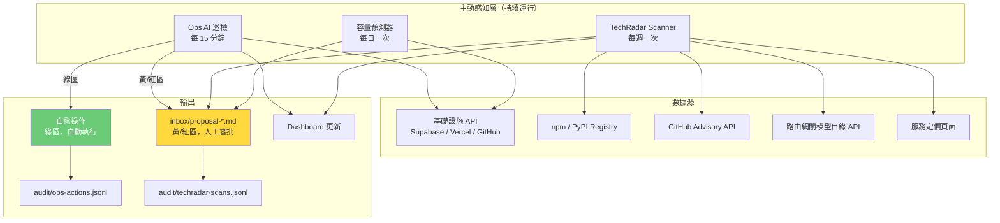

## <a name="part10"></a>第十部分：AI 主動運維與外部感知

> **分層狀態：Deferred Program（藍圖層）。** 本文件描述的能力方向正確，但不屬於當前 active build program。當前倉庫尚未重建 Ops AI runtime，巡檢未排程、自愈動作未綁定。只有在執行內核穩定、治理帶寬足夠、且已有證據證明需要主動感知時，才可從 deferred 升級為 active。

> **本部分是 v3 核心新增**。v2 的系統只響應 `inbox/requirement-*.md` 觸發。v3 的目標是有一個持續運行的感知層——啟用後不等待問題發生，而是主動探測、預測和響應。當前該感知層尚未實現。
>
> **注意**：本文件中所有代碼塊、巡檢頻率、自愈動作、提案範例都是 Ops AI 啟用時的目標形態，不是運行中行為。實際實現需基於 StateStore + gateway_client 重寫。

### 10.1 架構概覽



---

### 10.2 Ops AI 巡檢系統

#### 巡檢架構設計

Ops AI 不是一個「告警接收器」，而是一個「持續值班的基礎設施工程師」。它的行動分三層：

```
Layer 1：感知（始終執行）
  ├── 收集各基礎設施組件的實時指標
  ├── 與歷史基線對比，識別異常趨勢
  └── 評估每個發現的嚴重程度

Layer 2：自愈（綠區，自動執行）
  ├── 緩存清理（Redis 使用率 > 80%）
  ├── 服務重啟（健康檢查連續失敗 3 次）
  ├── 臨時文件清理（磁盤使用率 > 85%）
  └── 連接池刷新（連接洩漏檢測）

Layer 3：提案（黃/紅區，人工審批）
  ├── 容量擴容建議（趨勢預測達到閾值）
  ├── 配置調整建議（性能瓶頸識別）
  └── 服務替換或升級建議
```

#### 主程序實現

```python
# ops/ops_ai_runner.py

import asyncio
import json
import logging
from dataclasses import dataclass, field
from datetime import datetime, timedelta, timezone
from enum import Enum
from pathlib import Path
from typing import Any

import httpx

logger = logging.getLogger(__name__)


class FindingSeverity(Enum):
    LOW = "low"
    MEDIUM = "medium"
    HIGH = "high"
    CRITICAL = "critical"


class FindingZone(Enum):
    GREEN = "green"       # 自愈，自動執行
    YELLOW = "yellow"     # 需要人工審批
    RED = "red"           # 需要人工，且屬於紅區保護


@dataclass
class InfraFinding:
    """Ops AI 的單條發現。"""
    component: str              # e.g. "supabase/db", "vercel/edge", "redis/cache"
    description: str            # 人類可讀的問題描述
    severity: FindingSeverity
    zone: FindingZone
    metrics: dict[str, Any]     # 觸發此發現的原始指標
    recommended_action: str     # 建議的操作
    auto_executable: bool       # 是否可以自動執行
    estimated_impact: str       # 如果不處理，預計影響
    discovered_at: datetime = field(default_factory=lambda: datetime.now(timezone.utc))


@dataclass
class OpsRunResult:
    """單次巡檢的結果摘要。"""
    run_id: str
    started_at: datetime
    completed_at: datetime
    findings: list[InfraFinding]
    self_heals_executed: list[str]
    proposals_created: list[str]
    total_cost_usd: float


class OpsAIRunner:
    """
    Ops AI 主程序。
    設計為無狀態——每次巡檢獨立運行，結果寫入 audit/ops-actions.jsonl。
    """

    def __init__(self, config_path: str = "ops/ops_config.yaml"):
        self.config = self._load_config(config_path)
        self.findings: list[InfraFinding] = []
        self.heals_executed: list[str] = []

    def _load_config(self, path: str) -> dict:
        import yaml
        return yaml.safe_load(Path(path).read_text())

    async def run_inspection(self) -> OpsRunResult:
        """執行完整的基礎設施巡檢。"""
        run_id = f"ops-{datetime.now(timezone.utc).strftime('%Y%m%dT%H%M%S')}"
        started_at = datetime.now(timezone.utc)

        logger.info(f"開始 Ops AI 巡檢 [{run_id}]")

        # 並行執行所有健康檢查
        checks = await asyncio.gather(
            self._check_database_health(),
            self._check_edge_network_health(),
            self._check_cache_health(),
            self._check_github_actions_quota(),
            self._check_service_error_rates(),
            return_exceptions=True,
        )

        for result in checks:
            if isinstance(result, Exception):
                logger.error(f"健康檢查失敗：{result}")
            elif isinstance(result, list):
                self.findings.extend(result)

        # 處理發現：自愈或生成提案
        proposals_created = []
        for finding in self.findings:
            if finding.auto_executable and finding.zone == FindingZone.GREEN:
                success = await self._execute_self_heal(finding)
                if success:
                    self.heals_executed.append(finding.description)
            else:
                proposal_id = await self._create_proposal(finding)
                proposals_created.append(proposal_id)

        completed_at = datetime.now(timezone.utc)
        result = OpsRunResult(
            run_id=run_id,
            started_at=started_at,
            completed_at=completed_at,
            findings=self.findings,
            self_heals_executed=self.heals_executed,
            proposals_created=proposals_created,
            total_cost_usd=self._calculate_run_cost(),
        )

        await self._write_audit_log(result)
        return result

    async def _check_database_health(self) -> list[InfraFinding]:
        """檢查 Supabase 資料庫健康指標。"""
        findings = []
        
        async with httpx.AsyncClient() as client:
            # 查詢 Supabase Management API
            resp = await client.get(
                f"https://api.supabase.com/v1/projects/{self.config['supabase_project_id']}/database/health",
                headers={"Authorization": f"Bearer {self.config['supabase_service_key']}"},
                timeout=10.0,
            )
            metrics = resp.json()

        # 連接數分析
        conn_usage = metrics.get("connection_count", 0) / metrics.get("max_connections", 100)
        if conn_usage > 0.85:
            findings.append(InfraFinding(
                component="supabase/db",
                description=f"資料庫連接池使用率達 {conn_usage:.0%}，接近上限",
                severity=FindingSeverity.HIGH if conn_usage > 0.95 else FindingSeverity.MEDIUM,
                zone=FindingZone.YELLOW,
                metrics={"connection_usage_ratio": conn_usage},
                recommended_action="考慮啟用 PgBouncer 連接池，或升級 Supabase 計劃",
                auto_executable=False,
                estimated_impact="連接池耗盡將導致新請求失敗",
            ))

        # 慢查詢分析
        slow_queries = metrics.get("slow_queries_per_minute", 0)
        if slow_queries > 10:
            findings.append(InfraFinding(
                component="supabase/db",
                description=f"慢查詢頻率 {slow_queries}/分鐘，超過基線 10 倍",
                severity=FindingSeverity.MEDIUM,
                zone=FindingZone.YELLOW,
                metrics={"slow_queries_per_minute": slow_queries},
                recommended_action="Advisor AI 已啟動查詢優化分析",
                auto_executable=False,
                estimated_impact="影響 API 響應時間，p99 可能超過 SLA",
            ))

        return findings

    async def _check_cache_health(self) -> list[InfraFinding]:
        """檢查 Redis 緩存健康指標。"""
        findings = []

        try:
            import redis.asyncio as aioredis
            r = aioredis.from_url(self.config["redis_url"])
            info = await r.info("memory")
            
            used_memory = info["used_memory"]
            max_memory = info.get("maxmemory", 0)
            
            if max_memory > 0:
                usage_ratio = used_memory / max_memory
                if usage_ratio > 0.80:
                    findings.append(InfraFinding(
                        component="redis/cache",
                        description=f"Redis 內存使用率 {usage_ratio:.0%}，觸發自動清理",
                        severity=FindingSeverity.LOW,
                        zone=FindingZone.GREEN,
                        metrics={"memory_usage_ratio": usage_ratio, "used_mb": used_memory // 1024 // 1024},
                        recommended_action="執行 MEMORY PURGE，清理過期 key",
                        auto_executable=True,
                        estimated_impact="如不清理，將觸發 LRU 驅逐，影響緩存命中率",
                    ))
            await r.aclose()
        except Exception as e:
            logger.warning(f"Redis 健康檢查失敗：{e}")

        return findings

    async def _check_github_actions_quota(self) -> list[InfraFinding]:
        """檢查 GitHub Actions 配額使用情況。"""
        findings = []

        async with httpx.AsyncClient() as client:
            resp = await client.get(
                "https://api.github.com/repos/{owner}/{repo}/actions/cache/usage",
                headers={
                    "Authorization": f"token {self.config['github_token']}",
                    "Accept": "application/vnd.github.v3+json",
                },
            )
            if resp.status_code == 200:
                usage = resp.json()
                cache_used_gb = usage.get("active_caches_size_in_bytes", 0) / 1e9
                if cache_used_gb > 8:  # GitHub 免費層緩存限制 10GB
                    findings.append(InfraFinding(
                        component="github/actions-cache",
                        description=f"GitHub Actions 緩存使用 {cache_used_gb:.1f}GB，接近 10GB 免費限制",
                        severity=FindingSeverity.LOW,
                        zone=FindingZone.GREEN,
                        metrics={"cache_used_gb": cache_used_gb},
                        recommended_action="清理舊的 Actions 緩存條目",
                        auto_executable=True,
                        estimated_impact="超出限制後 CI 構建速度降低（無緩存命中）",
                    ))

        return findings

    async def _check_edge_network_health(self) -> list[InfraFinding]:
        """檢查 Vercel 邊緣網絡健康指標。"""
        findings = []
        # 通過 Vercel API 獲取 error rate
        # 實現略（同數據庫健康檢查模式）
        return findings

    async def _check_service_error_rates(self) -> list[InfraFinding]:
        """從可觀測性指標中識別異常 error rate 趨勢。"""
        findings = []
        metrics_path = Path("observability/metrics.jsonl")
        if not metrics_path.exists():
            return findings

        # 讀取最近 1 小時的指標，計算滾動 error rate
        cutoff = datetime.now(timezone.utc) - timedelta(hours=1)
        recent_metrics = []
        for line in metrics_path.read_text().splitlines()[-1000:]:
            try:
                entry = json.loads(line)
                ts = datetime.fromisoformat(entry["timestamp"].replace("Z", "+00:00"))
                if ts > cutoff.replace(tzinfo=ts.tzinfo):
                    recent_metrics.append(entry)
            except Exception:
                continue

        # 計算 error rate（簡化實現）
        if len(recent_metrics) > 10:
            error_count = sum(1 for m in recent_metrics if not m.get("success", True))
            error_rate = error_count / len(recent_metrics)
            if error_rate > 0.05:  # > 5% error rate
                findings.append(InfraFinding(
                    component="pipeline/agent-errors",
                    description=f"過去 1 小時 Agent 執行錯誤率 {error_rate:.1%}，超過基線",
                    severity=FindingSeverity.HIGH,
                    zone=FindingZone.YELLOW,
                    metrics={"error_rate_1h": error_rate},
                    recommended_action="檢查 Agent 日誌，識別是模型問題還是配置問題",
                    auto_executable=False,
                    estimated_impact="高錯誤率將觸發熔斷器",
                ))

        return findings

    async def _execute_self_heal(self, finding: InfraFinding) -> bool:
        """
        執行自愈操作。
        僅限綠區操作，所有執行必須記錄。
        自愈後驗證指標：如果指標惡化，停止同類自愈並升級為人工。
        """
        before_metrics = finding.metrics.copy()
        
        try:
            if "redis/cache" in finding.component and "memory" in finding.description:
                # Redis 緩存清理
                import redis.asyncio as aioredis
                r = aioredis.from_url(self.config["redis_url"])
                # 自愈前快照：記錄當前狀態供回滾分析
                pre_info = await r.info("memory")
                pre_keycount = await r.dbsize()
                
                await r.execute_command("MEMORY", "PURGE")
                # 主動觸發過期淘汰：SCAN 遍歷 key 會迫使 Redis 檢查惰性過期
                # 同時清理無 TTL 的臨時緩存 key（以 cache: 前綴標識）
                cursor = 0
                deleted = 0
                while True:
                    cursor, keys = await r.scan(cursor, match="cache:*", count=200)
                    for key in keys:
                        ttl = await r.ttl(key)
                        if ttl == -1:
                            # key 存在但無 TTL（不應長期佔用記憶體），設置 1 小時過期
                            await r.expire(key, 3600)
                        # SCAN 本身會觸發 Redis 惰性過期檢查，已過期 key 不會被返回
                    deleted += len(keys)
                    if cursor == 0:
                        break
                
                # ── 自愈後驗證 ──
                post_info = await r.info("memory")
                post_usage = post_info["used_memory"] / post_info.get("maxmemory", 1)
                pre_usage = pre_info["used_memory"] / pre_info.get("maxmemory", 1)
                
                if post_usage > pre_usage:
                    logger.warning(
                        f"Redis 自愈後指標惡化（{pre_usage:.0%} → {post_usage:.0%}），"
                        f"停止同類自愈，升級為人工"
                    )
                    await self._log_selfheal(
                        finding, before_metrics, success=False,
                        error=f"post-heal validation failed: {pre_usage:.0%} -> {post_usage:.0%}",
                        after_metrics={"memory_usage_ratio": post_usage},
                    )
                    # 創建人工提案而非繼續自愈
                    finding.zone = FindingZone.YELLOW
                    finding.auto_executable = False
                    await self._create_proposal(finding)
                    await r.aclose()
                    return False
                
                await r.aclose()
                logger.info(
                    f"Redis 緩存清理完成，刪除 {deleted} 個過期 key，"
                    f"內存使用率 {pre_usage:.0%} → {post_usage:.0%}"
                )

            elif "github/actions-cache" in finding.component:
                # 清理舊的 GitHub Actions 緩存
                import subprocess
                result = subprocess.run(
                    ["gh", "cache", "delete", "--all"],
                    capture_output=True, text=True,
                )
                if result.returncode != 0:
                    logger.error(f"GitHub 緩存清理失敗：{result.stderr}")
                    return False

            # 記錄自愈操作
            await self._log_selfheal(finding, before_metrics, success=True)
            return True

        except Exception as e:
            logger.error(f"自愈操作失敗：{e}")
            await self._log_selfheal(finding, before_metrics, success=False, error=str(e))
            return False

    async def _create_proposal(self, finding: InfraFinding) -> str:
        """
        將黃/紅區發現轉化為 inbox/proposal-*.md，等待人工審批。
        """
        proposal_id = f"OPS-{datetime.now(timezone.utc).strftime('%Y%m%d-%H%M%S')}"
        proposal_path = Path(f"inbox/proposal-{proposal_id}.md")

        content = f"""# Ops AI 提案：{finding.description}

**提案 ID**：{proposal_id}  
**生成時間**：{finding.discovered_at.isoformat()}Z  
**嚴重程度**：{finding.severity.value}  
**操作區域**：{finding.zone.value}  
**有效期**：7 天（{(finding.discovered_at + timedelta(days=7)).strftime('%Y-%m-%d')}）  

---

## 問題描述

**組件**：{finding.component}  
**發現**：{finding.description}  
**預計影響**：{finding.estimated_impact}  

**觸發指標**：
```json
{json.dumps(finding.metrics, indent=2, ensure_ascii=False)}
```

## 建議操作

{finding.recommended_action}

## 需要人工決策的原因

此操作屬於 {finding.zone.value} 區，根據 BOUNDARIES.md 中的採購邊界規定，需要人工審批後執行。

---

*批准此提案後，Ops AI 將在下一次巡檢週期自動執行。*  
*拒絕此提案後，將在 7 天後重新評估是否再次提案。*
"""
        proposal_path.write_text(content, encoding="utf-8")
        logger.info(f"已創建運維提案：{proposal_path}")
        return proposal_id

    async def _log_selfheal(
        self,
        finding: InfraFinding,
        before_metrics: dict,
        success: bool,
        error: str = "",
        after_metrics: dict | None = None,
    ):
        """記錄自愈操作到 audit/ops-actions.jsonl。"""
        entry = {
            "timestamp": datetime.now(timezone.utc).isoformat(),
            "agent": "ops_ai",
            "action_type": "self_heal",
            "description": finding.description,
            "target": finding.component,
            "zone": finding.zone.value,
            "auto_executed": True,
            "result": "success" if success else "failed",
            "error": error,
            "before_metrics": before_metrics,
            "after_metrics": after_metrics or {},  # 自愈後驗證指標（若有）
            "cost_usd": 0.02,  # 自愈操作不調用 LLM，成本極低
        }
        log_path = Path("audit/ops-actions.jsonl")
        log_path.parent.mkdir(parents=True, exist_ok=True)
        with log_path.open("a") as f:
            f.write(json.dumps(entry, ensure_ascii=False) + "\n")

    async def _write_audit_log(self, result: OpsRunResult):
        """寫入本次巡檢的整體摘要。"""
        summary = {
            "timestamp": result.started_at.isoformat() + "Z",
            "run_id": result.run_id,
            "duration_seconds": (result.completed_at - result.started_at).total_seconds(),
            "findings_count": len(result.findings),
            "findings_by_severity": {
                s.value: sum(1 for f in result.findings if f.severity == s)
                for s in FindingSeverity
            },
            "self_heals_count": len(result.self_heals_executed),
            "proposals_count": len(result.proposals_created),
            "total_cost_usd": result.total_cost_usd,
        }
        log_path = Path("audit/ops-actions.jsonl")
        log_path.parent.mkdir(parents=True, exist_ok=True)
        with log_path.open("a") as f:
            f.write(json.dumps({"type": "inspection_summary", **summary}, ensure_ascii=False) + "\n")

    def _calculate_run_cost(self) -> float:
        """估算本次巡檢的 LLM 成本（主要是分析發現時的 API 調用）。"""
        # 每條發現分析約 0.01 USD（DeepSeek V3.1 超低成本）
        return len(self.findings) * 0.01 + 0.02  # 基礎巡檢成本
```

---

#### 容量預測器

```python
# ops/health_checks/capacity_predictor.py

from dataclasses import dataclass
from datetime import datetime, timedelta, timezone
from pathlib import Path
import json
import statistics


@dataclass
class CapacityTrend:
    metric_name: str
    component: str
    current_value: float
    current_threshold: float   # 告警閾值（如 80% CPU）
    daily_growth_rate: float   # 每日增長率（如 0.02 = 2%/天）
    days_to_threshold: float   # 預計幾天後達到閾值
    confidence: float          # 預測置信度（0-1）


@dataclass
class CapacityProposal:
    trends: list[CapacityTrend]
    summary: str
    recommended_actions: list[str]
    estimated_cost_delta_monthly_usd: float  # 升級後月度成本變化


def predict_capacity(
    metrics_path: str = "observability/metrics.jsonl",
    lookback_days: int = 30,
    horizon_days: int = 30,
) -> list[CapacityTrend]:
    """
    基於過去 N 天的指標，線性外推預測未來 N 天的容量趨勢。

    使用最小二乘法擬合線性趨勢，計算達到閾值的預計天數。
    置信度基於 R² 值（趨勢的線性性越強，置信度越高）。
    """
    trends = []
    cutoff = datetime.now(timezone.utc) - timedelta(days=lookback_days)

    MONITORED_METRICS = [
        ("supabase/db", "connection_usage_ratio", 0.85),
        ("supabase/db", "disk_usage_ratio", 0.90),
        ("redis/cache", "memory_usage_ratio", 0.85),
        ("github/actions", "storage_usage_gb", 9.0),
    ]

    for component, metric_name, threshold in MONITORED_METRICS:
        data_points = _load_metric_series(
            metrics_path, component, metric_name, cutoff
        )
        if len(data_points) < 7:  # 至少需要 7 天數據
            continue

        trend = _fit_linear_trend(
            data_points, metric_name, component, threshold, horizon_days
        )
        if trend and trend.days_to_threshold <= horizon_days:
            trends.append(trend)

    return sorted(trends, key=lambda t: t.days_to_threshold)


def _load_metric_series(
    metrics_path: str,
    component: str,
    metric_name: str,
    cutoff: datetime,
) -> list[tuple[float, float]]:
    """
    從 metrics.jsonl 加載指定組件和指標的時間序列。
    返回 [(day_offset, value), ...] 列表。
    """
    path = Path(metrics_path)
    if not path.exists():
        return []

    series = []
    base_time = cutoff

    for line in path.read_text().splitlines():
        try:
            entry = json.loads(line)
            if entry.get("component") != component:
                continue
            ts = datetime.fromisoformat(entry["timestamp"].replace("Z", "+00:00"))
            if ts < cutoff.replace(tzinfo=ts.tzinfo):
                continue
            value = entry.get("metrics", {}).get(metric_name)
            if value is not None:
                day_offset = (ts - cutoff.replace(tzinfo=ts.tzinfo)).total_seconds() / 86400
                series.append((day_offset, value))
        except Exception:
            continue

    return series


def _fit_linear_trend(
    data_points: list[tuple[float, float]],
    metric_name: str,
    component: str,
    threshold: float,
    horizon_days: int,
) -> CapacityTrend | None:
    """使用最小二乘法擬合線性趨勢，返回容量預測。"""
    if len(data_points) < 2:
        return None

    xs = [p[0] for p in data_points]
    ys = [p[1] for p in data_points]

    # 最小二乘線性回歸
    n = len(xs)
    sum_x = sum(xs)
    sum_y = sum(ys)
    sum_xy = sum(x * y for x, y in zip(xs, ys))
    sum_x2 = sum(x ** 2 for x in xs)

    denom = n * sum_x2 - sum_x ** 2
    if abs(denom) < 1e-10:
        return None

    slope = (n * sum_xy - sum_x * sum_y) / denom
    intercept = (sum_y - slope * sum_x) / n

    # 計算 R²
    y_mean = statistics.mean(ys)
    ss_tot = sum((y - y_mean) ** 2 for y in ys)
    ss_res = sum((y - (slope * x + intercept)) ** 2 for x, y in zip(xs, ys))
    r_squared = 1 - ss_res / ss_tot if ss_tot > 1e-10 else 0.0

    current_value = slope * max(xs) + intercept
    daily_growth = slope

    if daily_growth <= 0:
        return None  # 指標在下降，不需要容量告警

    days_to_threshold = (threshold - current_value) / daily_growth if daily_growth > 0 else float("inf")

    if days_to_threshold <= 0:
        days_to_threshold = 0  # 已經超過閾值

    return CapacityTrend(
        metric_name=metric_name,
        component=component,
        current_value=current_value,
        current_threshold=threshold,
        daily_growth_rate=daily_growth,
        days_to_threshold=days_to_threshold,
        confidence=max(0.0, min(1.0, r_squared)),
    )
```

---

### 10.3 TechRadar 外部感知系統

#### 設計原則

TechRadar Scanner 的目標是：在人類注意到之前，發現以下四類外部變化：

1. **安全威脅**：依賴出現 CVE，需要緊急更新
2. **維護風險**：關鍵依賴的維護者停止活躍，項目走向廢棄
3. **技術機遇**：出現更好的替代方案（性能、成本、功能）
4. **成本變化**：當前使用的服務調整定價，或出現更便宜的替代

#### 主程序實現

```python
# techradar/techradar_scanner.py

import asyncio
import json
import logging
from dataclasses import dataclass, field
from datetime import datetime, timedelta, timezone
from pathlib import Path
from typing import Any

import httpx

logger = logging.getLogger(__name__)


@dataclass
class SecurityAdvisory:
    package: str
    package_manager: str  # "npm", "pypi", "go", etc.
    current_version: str
    safe_version: str
    cve_id: str
    cvss_score: float
    severity: str        # "critical", "high", "medium", "low"
    description: str
    published_at: datetime


@dataclass
class DependencyHealthReport:
    package: str
    package_manager: str
    current_version: str
    latest_version: str
    last_commit_days_ago: int
    weekly_downloads: int
    open_issues: int
    stars: int
    is_deprecated: bool
    maintenance_status: str  # "active", "maintenance-only", "abandoned"
    has_better_alternative: bool
    suggested_alternative: str | None


@dataclass
class ModelUpdate:
    model_id: str
    provider: str
    release_date: datetime
    key_improvements: list[str]
    pricing_per_1m_input_usd: float
    pricing_per_1m_output_usd: float
    benchmark_scores: dict[str, float]
    replaces: list[str]  # 建議替代的舊模型


@dataclass
class TechRadarScanResult:
    scan_id: str
    scanned_at: datetime
    security_advisories: list[SecurityAdvisory]
    dependency_health_reports: list[DependencyHealthReport]
    model_updates: list[ModelUpdate]
    packages_scanned: int
    total_cost_usd: float
    proposals_created: list[str]


class TechRadarScanner:
    """
    每週執行一次的外部感知掃描器。
    掃描結果寫入 audit/techradar-scans.jsonl。
    需要處理的發現轉化為 inbox/proposal-*.md。
    """

    GITHUB_ADVISORY_API = "https://api.github.com/advisories"
    NPM_REGISTRY_API = "https://registry.npmjs.org"
    PYPI_API = "https://pypi.org/pypi"
    # 模型目錄 API：從路由網關或其模型同步服務獲取
    MODELS_CATALOG_API = os.environ.get("MODELS_CATALOG_URL", "http://localhost:8080/admin/catalog")

    def __init__(self, config_path: str = "techradar/techradar_config.yaml"):
        import yaml
        self.config = yaml.safe_load(Path(config_path).read_text())

    async def run_full_scan(self) -> TechRadarScanResult:
        """執行完整的週度 TechRadar 掃描。"""
        scan_id = f"radar-{datetime.now(timezone.utc).strftime('%Y%m%dT%H%M%S')}"
        scanned_at = datetime.now(timezone.utc)

        logger.info(f"開始 TechRadar 掃描 [{scan_id}]")

        # 讀取項目依賴列表
        npm_deps = self._read_npm_dependencies()
        pypi_deps = self._read_pypi_dependencies()

        # 並行執行所有掃描
        advisory_results, health_results, model_results = await asyncio.gather(
            self._scan_security_advisories(npm_deps + pypi_deps),
            self._scan_dependency_health(npm_deps, pypi_deps),
            self._scan_model_updates(),
        )

        # 生成提案
        proposals_created = []
        for advisory in advisory_results:
            if advisory.cvss_score >= 9.0:
                proposal_id = await self._create_security_proposal(advisory, urgent=True)
                proposals_created.append(proposal_id)
            elif advisory.cvss_score >= 4.0:
                proposal_id = await self._create_security_proposal(advisory, urgent=False)
                proposals_created.append(proposal_id)
            # CVSS < 4.0：自動創建 patch 更新 PR，不創建 proposal

        for health in health_results:
            if health.maintenance_status == "abandoned" or health.is_deprecated:
                proposal_id = await self._create_replacement_proposal(health)
                proposals_created.append(proposal_id)

        for model in model_results:
            if model.benchmark_scores.get("overall", 0) > self._get_current_model_score(model.replaces):
                proposal_id = await self._create_model_upgrade_proposal(model)
                proposals_created.append(proposal_id)

        result = TechRadarScanResult(
            scan_id=scan_id,
            scanned_at=scanned_at,
            security_advisories=advisory_results,
            dependency_health_reports=health_results,
            model_updates=model_results,
            packages_scanned=len(npm_deps) + len(pypi_deps),
            total_cost_usd=self._calculate_scan_cost(len(npm_deps) + len(pypi_deps)),
            proposals_created=proposals_created,
        )

        await self._write_scan_log(result)
        return result

    async def _scan_security_advisories(
        self,
        packages: list[dict],
    ) -> list[SecurityAdvisory]:
        """
        通過 GitHub Advisory Database API 獲取依賴安全公告。
        使用 GraphQL API 批量查詢以降低請求數。
        """
        advisories = []

        async with httpx.AsyncClient() as client:
            for package in packages:
                try:
                    resp = await client.get(
                        self.GITHUB_ADVISORY_API,
                        params={
                            "ecosystem": package["ecosystem"],
                            "package": package["name"],
                            "severity": "low,medium,high,critical",
                        },
                        headers={
                            "Authorization": f"token {self.config['github_token']}",
                            "Accept": "application/vnd.github.v3+json",
                        },
                        timeout=15.0,
                    )
                    if resp.status_code == 200:
                        for adv in resp.json():
                            # 只處理影響當前版本的公告
                            if self._affects_current_version(adv, package["version"]):
                                advisories.append(SecurityAdvisory(
                                    package=package["name"],
                                    package_manager=package["ecosystem"],
                                    current_version=package["version"],
                                    safe_version=self._extract_safe_version(adv),
                                    cve_id=adv.get("cve_id", ""),
                                    cvss_score=adv.get("cvss", {}).get("score", 0.0),
                                    severity=adv.get("severity", "unknown"),
                                    description=adv.get("summary", ""),
                                    published_at=datetime.fromisoformat(
                                        adv.get("published_at", datetime.now(timezone.utc).isoformat())
                                    ),
                                ))
                except Exception as e:
                    logger.warning(f"安全公告查詢失敗 [{package['name']}]：{e}")

        return advisories

    async def _scan_dependency_health(
        self,
        npm_packages: list[dict],
        pypi_packages: list[dict],
    ) -> list[DependencyHealthReport]:
        """評估每個依賴的維護健康狀況。"""
        reports = []

        async with httpx.AsyncClient() as client:
            # npm 依賴健康評估
            for pkg in npm_packages:
                try:
                    resp = await client.get(
                        f"{self.NPM_REGISTRY_API}/{pkg['name']}",
                        timeout=10.0,
                    )
                    if resp.status_code == 200:
                        data = resp.json()
                        last_publish = data.get("time", {}).get("modified", "")
                        last_days = self._days_since(last_publish)
                        weekly_dl = data.get("downloads", {}).get("weekly", 0)

                        report = DependencyHealthReport(
                            package=pkg["name"],
                            package_manager="npm",
                            current_version=pkg["version"],
                            latest_version=data.get("dist-tags", {}).get("latest", "?"),
                            last_commit_days_ago=last_days,
                            weekly_downloads=weekly_dl,
                            open_issues=0,  # npm registry 不提供此數據
                            stars=0,
                            is_deprecated="deprecated" in data.get("description", "").lower(),
                            maintenance_status=self._assess_maintenance(last_days, weekly_dl),
                            has_better_alternative=False,
                            suggested_alternative=None,
                        )

                        # 如果維護停滯，觸發 Advisor AI 搜索替代方案
                        if report.maintenance_status in ("maintenance-only", "abandoned"):
                            alternative = await self._find_alternative(pkg["name"], "npm", client)
                            report.has_better_alternative = alternative is not None
                            report.suggested_alternative = alternative

                        reports.append(report)
                except Exception as e:
                    logger.warning(f"npm 健康評估失敗 [{pkg['name']}]：{e}")

        return reports

    async def _scan_model_updates(self) -> list[ModelUpdate]:
        """從路由網關的模型目錄獲取新模型列表，識別值得升級的模型。"""
        updates = []
        async with httpx.AsyncClient() as client:
            resp = await client.get(
                self.MODELS_CATALOG_API,
                headers={"Authorization": f"Bearer {self.config.get('gateway_api_key', '')}"},
                timeout=15.0,
            )
            if resp.status_code != 200:
                return updates

            all_models = resp.json().get("data", [])
            current_models = set(self.config.get("current_models", {}).values())

            # 找到比當前使用模型更新的版本
            for model in all_models:
                model_id = model.get("id", "")
                for current in current_models:
                    if self._is_upgrade_of(model_id, current):
                        pricing = model.get("pricing", {})
                        updates.append(ModelUpdate(
                            model_id=model_id,
                            provider=model.get("owned_by", ""),
                            release_date=datetime.fromisoformat(
                                model.get("created", datetime.now(timezone.utc).isoformat())
                            ),
                            key_improvements=model.get("description", "").split("\n")[:3],
                            pricing_per_1m_input_usd=float(pricing.get("prompt", 0)),
                            pricing_per_1m_output_usd=float(pricing.get("completion", 0)),
                            benchmark_scores={},  # 從模型描述中提取
                            replaces=[current],
                        ))

        return updates

    async def _create_security_proposal(
        self,
        advisory: SecurityAdvisory,
        urgent: bool,
    ) -> str:
        """生成安全更新提案。"""
        proposal_id = f"SEC-{advisory.cve_id or datetime.now(timezone.utc).strftime('%Y%m%d-%H%M%S')}"
        urgency = "🔴 緊急" if urgent else "⚠ 建議"

        content = f"""# TechRadar 安全提案：{advisory.package} 依賴漏洞

**提案 ID**：{proposal_id}  
**嚴重程度**：{urgency}（CVSS {advisory.cvss_score}）  
**CVE**：{advisory.cve_id}  
**發現時間**：{advisory.published_at.isoformat()}Z  
**有效期**：{"48 小時" if urgent else "7 天"}  

---

## 漏洞信息

**受影響包**：`{advisory.package}` {advisory.current_version}（{advisory.package_manager}）  
**安全版本**：{advisory.safe_version}  
**漏洞摘要**：{advisory.description}  

## 建議操作

1. 將 `{advisory.package}` 從 {advisory.current_version} 升級到 {advisory.safe_version}
2. 運行完整測試套件確認兼容性
3. 部署更新

{"**⚠ 高危漏洞，建議在 48 小時內處理。**" if urgent else "此漏洞嚴重程度為中等，建議在本週內更新。"}

---

*批准後，Code AI 將自動執行依賴升級並創建 PR。*
"""
        proposal_path = Path(f"inbox/proposal-{proposal_id}.md")
        proposal_path.write_text(content, encoding="utf-8")
        return proposal_id

    async def _create_replacement_proposal(self, health: DependencyHealthReport) -> str:
        """為維護停滯的依賴生成替換提案。"""
        proposal_id = f"DEP-{health.package}-{datetime.now(timezone.utc).strftime('%Y%m%d')}"

        content = f"""# TechRadar 依賴健康提案：{health.package} 維護狀態異常

**提案 ID**：{proposal_id}  
**類型**：依賴替換建議  
**優先級**：中等  
**有效期**：30 天  

---

## 依賴健康評估

| 指標 | 數值 |
|------|------|
| 包名 | `{health.package}` ({health.package_manager}) |
| 當前版本 | {health.current_version} |
| 最新版本 | {health.latest_version} |
| 距上次更新 | {health.last_commit_days_ago} 天 |
| 週下載量 | {health.weekly_downloads:,} |
| 維護狀態 | **{health.maintenance_status}** |
| 是否廢棄 | {"是" if health.is_deprecated else "否"} |

## 風險分析

**維護停滯風險**：當一個依賴長期無人維護時：
- 已知安全漏洞不會被修復
- 對新版本 Node.js/Python 的兼容性問題不會被解決
- 社區遷移到替代方案後，問題定位支持將消失

## 建議替代方案

{"**推薦替代**：`" + health.suggested_alternative + "`" if health.suggested_alternative else "**暫無明確替代方案**，建議評估是否可以內部實現此功能。"}

---

*如批准替換，Advisor AI 將生成詳細的遷移計劃和代碼變更。*
"""
        proposal_path = Path(f"inbox/proposal-{proposal_id}.md")
        proposal_path.write_text(content, encoding="utf-8")
        return proposal_id

    async def _create_model_upgrade_proposal(self, model: ModelUpdate) -> str:
        """生成 AI 模型升級提案。"""
        proposal_id = f"MODEL-{model.model_id.replace('/', '-')}-{datetime.now(timezone.utc).strftime('%Y%m%d')}"

        content = f"""# TechRadar 模型更新提案：{model.model_id}

**提案 ID**：{proposal_id}  
**類型**：AI 模型升級建議  
**發布時間**：{model.release_date.strftime('%Y-%m-%d')}  
**有效期**：14 天  

---

## 模型信息

**新模型**：`{model.model_id}`（{model.provider}）  
**建議替換**：{', '.join(f'`{m}`' for m in model.replaces)}  

**主要改進**：
{chr(10).join(f'- {imp}' for imp in model.key_improvements)}

## 定價對比

| 項目 | 當前模型 | 新模型 |
|------|---------|--------|
| 輸入（每 1M token） | 查看 cost_policy.yaml | ${model.pricing_per_1m_input_usd:.3f} |
| 輸出（每 1M token） | 查看 cost_policy.yaml | ${model.pricing_per_1m_output_usd:.3f} |

## 建議操作

1. 在 `cost_policy.yaml` 的 `preferred_models` 中更新模型 ID
2. 在 staging 環境運行標準 Benchmark 對比新舊模型表現
3. 確認成本變化在可接受範圍內

---

*此提案不涉及代碼變更，只需要修改配置文件。*
"""
        proposal_path = Path(f"inbox/proposal-{proposal_id}.md")
        proposal_path.write_text(content, encoding="utf-8")
        return proposal_id

    # 工具方法
    def _read_npm_dependencies(self) -> list[dict]:
        """從 package.json 讀取 npm 依賴。"""
        try:
            pkg = json.loads(Path("package.json").read_text())
            deps = {}
            deps.update(pkg.get("dependencies", {}))
            deps.update(pkg.get("devDependencies", {}))
            return [{"name": k, "version": v.lstrip("^~"), "ecosystem": "npm"}
                    for k, v in deps.items()]
        except FileNotFoundError:
            return []

    def _read_pypi_dependencies(self) -> list[dict]:
        """從 requirements.txt 或 pyproject.toml 讀取 Python 依賴。"""
        deps = []
        req_path = Path("requirements.txt")
        if req_path.exists():
            for line in req_path.read_text().splitlines():
                line = line.strip()
                if line and not line.startswith("#"):
                    parts = line.split("==")
                    if len(parts) == 2:
                        deps.append({"name": parts[0], "version": parts[1], "ecosystem": "pypi"})
        return deps

    def _days_since(self, date_str: str) -> int:
        """計算距離指定日期的天數。"""
        if not date_str:
            return 9999
        try:
            dt = datetime.fromisoformat(date_str.replace("Z", "+00:00"))
            return (datetime.now(tz=dt.tzinfo) - dt).days
        except Exception:
            return 9999

    def _assess_maintenance(self, last_commit_days: int, weekly_downloads: int) -> str:
        """評估維護狀態。"""
        if last_commit_days > 730:  # 2 年未更新
            return "abandoned"
        elif last_commit_days > 365:  # 1 年未更新
            return "maintenance-only"
        return "active"

    def _affects_current_version(self, advisory: dict, current_version: str) -> bool:
        """
        判斷安全公告是否影響當前版本。
        使用 semver 範圍匹配，避免大量誤報。
        """
        try:
            from packaging.version import Version
            from packaging.specifiers import SpecifierSet

            vulns = advisory.get("vulnerabilities", [])
            for vuln in vulns:
                affected_range = vuln.get("vulnerable_version_range", "")
                if not affected_range:
                    continue
                # GitHub Advisory 格式：">= 1.0.0, < 1.2.3"
                specifier = SpecifierSet(affected_range.replace(" ", ""))
                if Version(current_version.lstrip("v")) in specifier:
                    return True
            # 沒有任何 vulnerability range 匹配當前版本
            return bool(not vulns)  # 無 range 信息時保守報告
        except Exception:
            return True  # 解析失敗時保守報告

    def _extract_safe_version(self, advisory: dict) -> str:
        """從安全公告中提取最低安全版本。"""
        vulns = advisory.get("vulnerabilities", [])
        for vuln in vulns:
            patched = vuln.get("patched_versions", "")
            if patched:
                return patched.lstrip(">= ")
        return "最新版本"

    async def _find_alternative(self, package: str, ecosystem: str, client: httpx.AsyncClient) -> str | None:
        """為廢棄的依賴搜索替代方案（通過 npm 搜索 API）。"""
        try:
            resp = await client.get(
                f"https://registry.npmjs.org/-/v1/search",
                params={"text": f"alternatives to {package}", "size": 3},
                timeout=10.0,
            )
            if resp.status_code == 200:
                objects = resp.json().get("objects", [])
                if objects:
                    return objects[0].get("package", {}).get("name")
        except Exception:
            pass
        return None

    def _is_upgrade_of(self, new_model_id: str, current_model_id: str) -> bool:
        """判斷新模型是否是當前模型的升級版。簡化版本比較。"""
        # 例如：deepseek-v3.2 是 deepseek-v3.1 的升級
        current_base = current_model_id.rsplit(".", 1)[0] if "." in current_model_id else current_model_id
        return new_model_id.startswith(current_base) and new_model_id != current_model_id

    def _get_current_model_score(self, model_ids: list[str]) -> float:
        """從配置中獲取當前模型的 benchmark 分數。簡化實現。"""
        return 0.0

    def _calculate_scan_cost(self, package_count: int) -> float:
        """估算掃描成本（主要是 API 調用，LLM 只用於摘要生成）。"""
        api_cost = package_count * 0.001  # 每個包約 $0.001（HTTP 請求）
        llm_cost = 0.15  # 摘要生成固定成本（DeepSeek 超低成本）
        return api_cost + llm_cost

    async def _write_scan_log(self, result: TechRadarScanResult):
        """寫入掃描結果到 audit/techradar-scans.jsonl。"""
        entry = {
            "timestamp": result.scanned_at.isoformat() + "Z",
            "scan_id": result.scan_id,
            "packages_scanned": result.packages_scanned,
            "security_advisories": [
                {
                    "package": a.package,
                    "cve_id": a.cve_id,
                    "cvss_score": a.cvss_score,
                    "severity": a.severity,
                }
                for a in result.security_advisories
            ],
            "dependency_issues": [
                {
                    "package": h.package,
                    "maintenance_status": h.maintenance_status,
                    "last_commit_days_ago": h.last_commit_days_ago,
                }
                for h in result.dependency_health_reports
                if h.maintenance_status != "active"
            ],
            "new_model_releases": [m.model_id for m in result.model_updates],
            "proposals_created": result.proposals_created,
            "total_cost_usd": result.total_cost_usd,
        }
        log_path = Path("audit/techradar-scans.jsonl")
        log_path.parent.mkdir(parents=True, exist_ok=True)
        with log_path.open("a") as f:
            f.write(json.dumps(entry, ensure_ascii=False) + "\n")
```

---

### 10.4 週度 TechRadar GitHub Actions 配置

```yaml
# .github/workflows/techradar-weekly.yml
name: TechRadar Weekly Scan

on:
  schedule:
    - cron: '0 1 * * 0'  # 每週日 01:00 UTC（東京時間 10:00）
  workflow_dispatch:       # 支持手動觸發

jobs:
  techradar-scan:
    runs-on: ubuntu-latest
    permissions:
      contents: write      # 需要創建 proposal-*.md 文件
      security-events: read

    steps:
      - uses: actions/checkout@v4

      - name: Set up Python
        uses: actions/setup-python@v5
        with:
          python-version: '3.14'

      - name: Install dependencies
        run: pip install httpx pyyaml redis aiofiles

      - name: Run TechRadar Scanner
        env:
          GITHUB_TOKEN: ${{ secrets.GITHUB_TOKEN }}
          LLM_GATEWAY_API_KEY: ${{ secrets.LLM_GATEWAY_API_KEY }}
          LLM_GATEWAY_URL: ${{ secrets.LLM_GATEWAY_URL }}
          SUPABASE_SERVICE_KEY: ${{ secrets.SUPABASE_SERVICE_KEY }}
        run: |
          python -c "
          import asyncio
          from techradar.techradar_scanner import TechRadarScanner
          
          scanner = TechRadarScanner()
          result = asyncio.run(scanner.run_full_scan())
          
          print(f'掃描完成：{result.packages_scanned} 個包')
          print(f'安全公告：{len(result.security_advisories)} 個')
          print(f'創建提案：{len(result.proposals_created)} 個')
          print(f'掃描成本：\${result.total_cost_usd:.3f}')
          "

      - name: Auto-patch low-severity dependencies
        run: |
          python scripts/auto_patch_dependencies.py \
            --max-cvss 4.0 \
            --create-pr true
        # 只自動更新 CVSS < 4.0 的依賴

      - name: Commit proposals and audit logs
        run: |
          git config user.name "TechRadar AI"
          git config user.email "techradar@ai.local"
          git add inbox/proposal-*.md audit/techradar-scans.jsonl
          git diff --staged --quiet || git commit -m "chore: TechRadar 週度掃描 $(date +'%Y-W%V')"
          git push

      - name: Update dashboard
        run: python scripts/update_dashboard_techradar.py
```

---

### 10.5 Ops AI 定時任務配置

> **為什麼不用 GitHub Actions**：GitHub Actions cron 精度不保證（可延遲數十分鐘），且每 15 分鐘觸發一次的消耗遠超 GitHub Free 的 2000 分鐘/月配額。Ops AI 巡檢改用 Supabase Edge Function + pg_cron 觸發。

**方案：Supabase Edge Function + pg_cron**：

```sql
-- 在 Supabase SQL Editor 中執行（啟用 pg_cron 擴展）
SELECT cron.schedule(
  'ops-ai-inspection',
  '*/15 * * * *',  -- 每 15 分鐘
  $$
  SELECT net.http_post(
    url := 'https://{project-ref}.supabase.co/functions/v1/ops-inspection',
    headers := jsonb_build_object(
      'Authorization', 'Bearer ' || current_setting('app.settings.service_role_key')
    ),
    body := '{}'::jsonb
  );
  $$
);
```

```typescript
// supabase/functions/ops-inspection/index.ts
import { serve } from "https://deno.land/std@0.208.0/http/server.ts";

serve(async (req) => {
  // 調用 Ops AI 巡檢 API（部署為獨立的輕量級服務，或直接在 Edge Function 中執行）
  const checks = await Promise.all([
    checkDatabaseHealth(),
    checkCacheHealth(),
    checkServiceErrorRates(),
  ]);

  const findings = checks.flat().filter(Boolean);

  // 自愈 + 提案（邏輯同 ops_ai_runner.py）
  for (const finding of findings) {
    if (finding.auto_executable && finding.zone === "green") {
      await executeSelfHeal(finding);
    } else {
      await createProposal(finding);
    }
  }

  // 寫入審計日誌（Supabase 表，每日同步到 Git 倉庫）
  await writeAuditLog(findings);

  return new Response(JSON.stringify({ findings: findings.length }), {
    headers: { "Content-Type": "application/json" },
  });
});
```

**審計日誌同步**：巡檢結果寫入 Supabase `ops_audit` 表，每日通過 GitHub Actions 同步到 `audit/ops-actions.jsonl`：

```yaml
# .github/workflows/ops-audit-sync.yml
name: Sync Ops Audit Logs

on:
  schedule:
    - cron: '0 0 * * *'  # 每日 00:00 UTC
  workflow_dispatch:

jobs:
  sync:
    runs-on: ubuntu-latest
    steps:
      - uses: actions/checkout@v4
      - name: Fetch and append ops audit from Supabase
        env:
          SUPABASE_URL: ${{ secrets.SUPABASE_URL }}
          SUPABASE_SERVICE_KEY: ${{ secrets.SUPABASE_SERVICE_KEY }}
        run: python scripts/sync_ops_audit.py
      - name: Commit
        run: |
          git config user.name "Ops AI"
          git config user.email "ops-ai@ai.local"
          git add audit/ops-actions.jsonl inbox/proposal-OPS-*.md || true
          git diff --staged --quiet || git commit -m "ops: 同步巡檢日誌 $(date -u +'%Y-%m-%d')"
          git push
```

---
