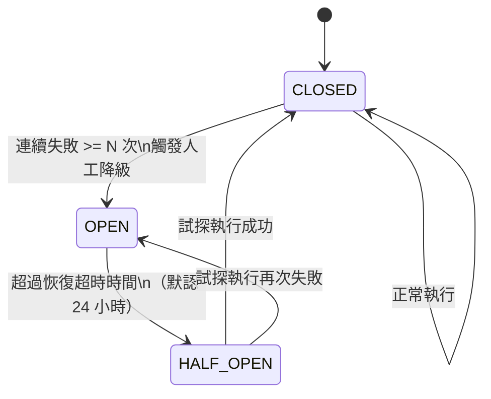
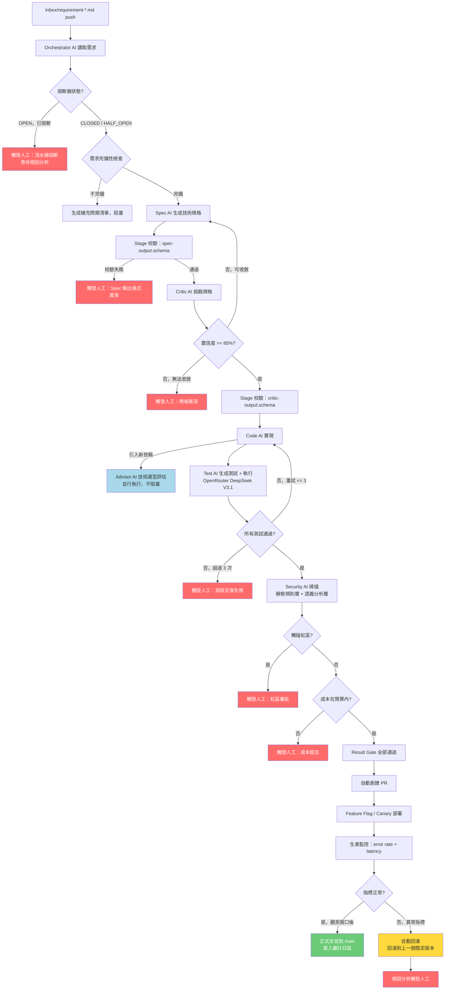
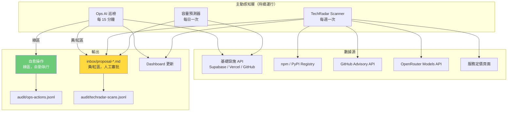
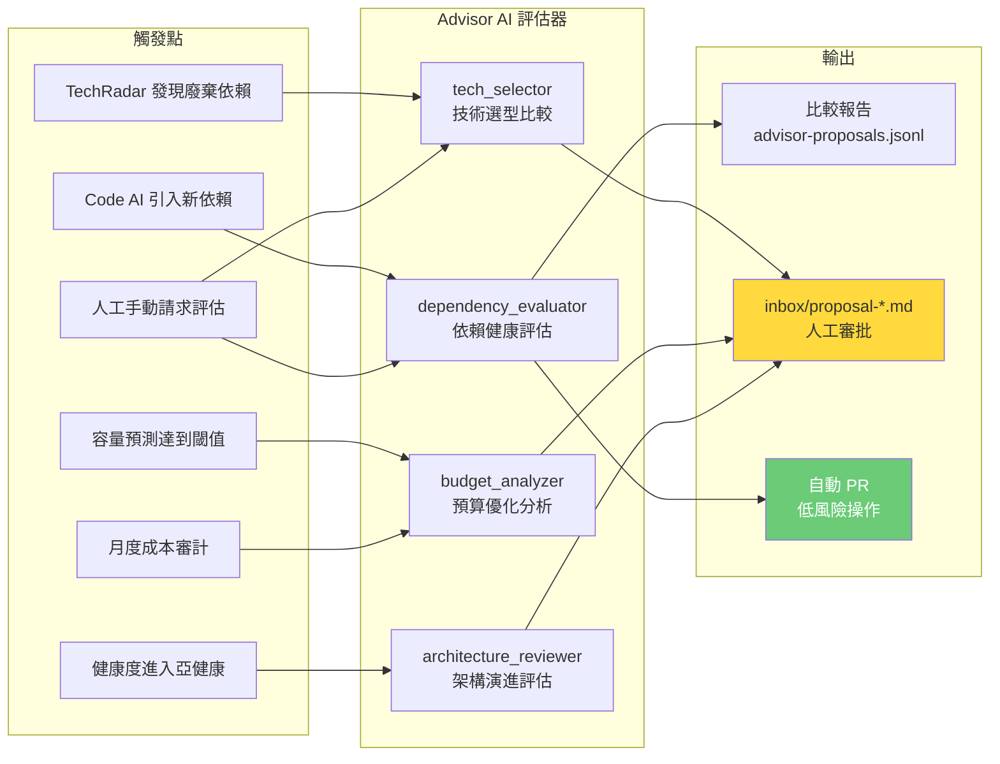
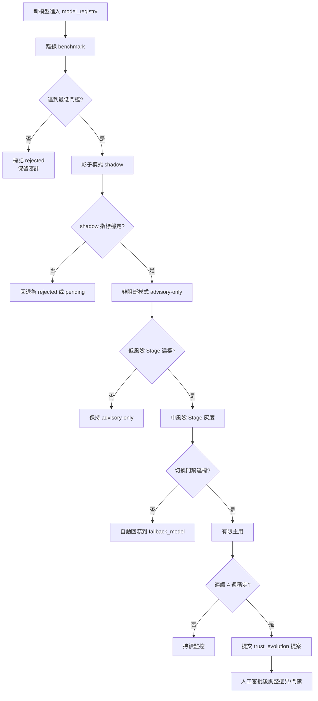

# AI 自主開發流水線 · 2026 設計方案 v3

> **遷移註記（2026-04-29）**：本文件仍是歷史礦源，不是現行權威。已回收的主題包括：契約與版本治理見 `CONTRACTS.md`；Result Gate 核心斷言見 `05-quality.md`；成本政策骨架見 `02-tools-cost.md`；區域邊界與採購規則見 `07-governance.md`；執行紀律、task 契約、drift / gate 行為見 `16-drift-control.md`、`17-task-templates.md`、`18-master-execution-task.md`、`21-agent-behavior-guidelines.md`；恢復總覽見 `12-disaster-recovery.md`；重寫藍圖見 `29-rewrite-blueprint.md`；適配層藍圖見 `30-project-adapter-blueprint.md`；外部模型治理接入見 `31-external-model-governance-integration.md`。

> **核心定位**：實現者是 AI（Claude Code + Codex CLI + OpenRouter 上的開放模型），不是人類工程師。人類的角色是設定目標、定義邊界、確認異常、審批風險——而不是逐行審查代碼或逐步確認流程。**v3 核心演進**：AI 不只是被動執行者，更是主動的運維夥伴和決策顧問。AI 主動發現基礎設施需求、預測容量趨勢、評估技術選型、感知外部生態變化——人類知識和精力是有限的，AI 應填補這個缺口。本文件是完整、獨立的設計方案，讀者無需閱讀任何先前版本。

---

## 文件導航

**[第一部分](#part1)** | 戰略定位與設計哲學  
**[第二部分](#part2)** | 工具與成本體系  
**[第三部分](#part3)** | AI 角色架構  
**[第四部分](#part4)** | 自主流水線設計  
**[第五部分](#part5)** | 質量體系  
**[第六部分](#part6)** | 可觀測性  
**[第七部分](#part7)** | 治理與紅區保護  
**[第八部分](#part8)** | 倉庫結構  
**[第九部分](#part9)** | 實施路線圖  
**[第十部分](#part10)** | AI 主動運維與外部感知 *(v3 新增)*  
**[第十一部分](#part11)** | AI 決策參與 *(v3 新增)*  
**[第十二部分](#part12)** | 災難恢復與系統韌性 *(v3 新增)*  
**[附錄](#appendix)** | RULES.md · cost_policy.yaml · 每日清單  

---

## <a name="part1"></a>第一部分：戰略定位與設計哲學

### 1.1 設計假設與風險對沖

2026 年的 AI 能力邊界與 2023 年截然不同。以下三個假設決定了本文件的所有設計選擇——但請注意，它們是**設計假設**，不是已充分證明的事實。每個假設後面附有「假設不成立時」的降級策略。

---

**假設一：上下文窗口不再是瓶頸。**

Claude Opus 4.6 等模型擁有超過 100 萬 token 的上下文，可以完整加載一個中等規模項目的所有核心文件。人工拼接上下文是 2023 年的補丁，2026 年不需要了。

*假設不成立時（模型實際能力低於預期）*：回退到垂直切片的嚴格邊界，Orchestrator 只加載對應切片的文件，重啟上下文窗口管理腳本。

---

**假設二：AI 可以可靠地執行完整的功能迭代。**

從理解需求、生成 Spec、挑戰 Spec、實現代碼、寫測試、運行測試，到生成 PR 描述——這個完整鏈條可以在 AI 內部閉環，不需要人在每個節點等待確認。

*風險現實*：端到端成功率在現實部署中約為 50%，複雜任務更低。這不是否定自動化的理由，而是設計熔斷和降級機制的理由。

*假設不成立時*：枷鎖版本可回退。當某類任務連續失敗率超過 40% 時，信任引擎自動提案將該任務類型降回黃區或紅區，人工介入比例相應提升。整個系統設計為漸進式自動化，而非全有或全無。

---

**假設三：「AI 輔助人」的模式在吞吐量上有上限。**

每個 PR 都要人審查，等於把 AI 的執行速度拉回到人的審查速度。正確模式是：AI 主導執行，人守護邊界。

*假設不成立時*：如果發現自動合並導致生產問題率不可接受，立即回退到「黃區以上任務全部人工 Review」模式，僅保留純綠區的自動化。

---

**假設四（v3 新增）：人類知識覆蓋面是有限的瓶頸。**

一個人無法同時追蹤所有依賴的安全動態、所有競爭工具的更新、所有服務的定價變化、以及基礎設施的微小退化信號。這些盲點累積起來構成真實的運營風險——不是惡意攻擊，而是緩慢腐蝕。

*v3 設計響應*：Ops AI 和 Advisor AI 填補這個感知缺口。它們持續掃描外部世界和內部指標，在人類注意到問題之前主動提出。AI 主動發現需求，人類決定是否響應。

*假設不成立時*：如果主動掃描產生過多噪音（誤報率 > 30%），收緊信噪比閾值，優先聚焦高置信度的發現。

---

這四個假設的推論是：**舊流程中大部分「人工確認節點」的存在理由已經消失，而大部分「人工發現問題節點」也應該被 AI 感知層所取代**。保留它們只是習慣，不是必要。但在數據積累之前，保持適度保守是合理的。

---

### 1.2 心智模型：從「AI 執行者」到「AI 運營夥伴」

**v1 模式**（2023-2024）：
```
需求 → Spec AI → 人工批准 → Code AI → 人工 Review → 合並
         ↑ 每個箭頭都是人類等待節點
```

**v2 模式**（2026 初）：
```
需求（自然語言）→ Orchestrator AI
  ├── Spec AI：生成技術規格
  ├── Critic AI：專門挑戰 Spec（找漏洞、邊界、矛盾）
  ├── Code AI：按批准的 Spec 實現
  ├── Test AI：生成測試 + 驗收
  ├── Security AI：安全掃描 + PII 檢測（雙層架構）
  └── 全部通過 → 自動合並 → Canary 部署 → 自動監控
        ↓ 只有以下情況才觸發人工：
        • 觸碰紅區（支付/刪除/遷移/跨境）
        • 多個 AI 角色意見衝突無法收斂
        • Critic AI 置信度 < 70%
        • 成本超預算
        • 熔斷器觸發（同一 feature 連續失敗 N 次）
        • 生產異常指標觸發回滾後的根因分析
```

**v3 模式**（2026 成熟）：
```
┌──────────────────────────────────────────────────────────────┐
│  主動感知層（持續運行，不需要 inbox 觸發）                     │
│  ├── Ops AI：基礎設施健康監控、容量預測、自愈                   │
│  ├── Advisor AI：技術生態掃描、決策支持、採購建議               │
│  └── TechRadar Scanner：每週外部世界感知                       │
│          ↓ AI 主動發現需求，生成 proposal-*.md                  │
│          ↓ 人類審批提案，決定是否響應                           │
└──────────────────────────────────────────────────────────────┘
               ↕ （被動感知觸發 + 主動感知觸發）
┌──────────────────────────────────────────────────────────────┐
│  執行層（v2 核心，保留完整）                                    │
│  需求（inbox/requirement-*.md 或 inbox/proposal-*.md）         │
│  → Orchestrator AI → Spec AI → Critic AI → Code AI          │
│  → Test AI → Security AI → Canary 部署                        │
└──────────────────────────────────────────────────────────────┘
               ↕
┌──────────────────────────────────────────────────────────────┐
│  決策參與層（v3 新增）                                          │
│  ├── 技術選型評估：新庫引入時 AI 自動做競品比對                  │
│  ├── 架構演進提案：檢測到反模式時 AI 生成重構建議               │
│  ├── 預算智能：發現成本優化機會時 AI 提案                       │
│  └── 採購建議：基於運維數據發現工具缺口                         │
│          ↓ 所有提案走相同治理：AI 提案，人類審批                 │
└──────────────────────────────────────────────────────────────┘
```

這不是「降低人類參與度」，而是**把人類的注意力集中在真正需要判斷的地方**：邊界定義、異常確認、風險審批、戰略決策。AI 負責發現、分析、和提案；人類負責決定。

---

### 1.3 七大設計原則（v3 版）

#### 原則 1：結果優先，過程自主

**是什麼**：不管 AI 走什麼執行路徑，只要最終結果滿足條件就放行。

**為什麼**：流程合規是為了確保質量，但當質量可以直接驗證時，流程本身變成了開銷。

**怎麼做**：定義「結果門禁」（Result Gate）取代「流程門禁」（Process Gate）：
- 所有自動測試通過
- Critic AI 置信度 ≥ 85
- 未觸碰紅區
- 審計日誌完整
- 成本在預算內
- 熔斷器未觸發

這六個條件全部滿足，自動合並。人審查的是**這六個條件的定義**，不是每個 PR 的執行過程。

---

#### 原則 2：契約即 AI 間協議

**是什麼**：OpenAPI spec 和 Prisma schema 是 AI Agent 之間的機器可讀協議，不只是人類文檔。

**為什麼**：多個 AI Agent 並行工作，Spec AI 輸出的契約直接作為 Code AI 的輸入約束，Test AI 直接從契約生成測試矩陣。契約的精確性決定了 AI 協作的可靠性。Agent 間的每次傳遞都需要 schema 驗證，防止「微妙地錯」在鏈路中被放大。

**怎麼做**：
```yaml
# 契約變更必須同時更新：
contracts/
  ├── openapi/{feature}.yaml     # API 契約（Spec AI → Code AI）
  ├── prisma/schema.prisma       # 數據契約（Spec AI → Code AI）
  ├── events/{feature}.schema    # 事件契約（AI 間異步通信）
  └── pact/{consumer}.pact       # 消費者驅動契約（防破壞性變更）
```

契約變更不需要人工確認，但 Security AI 會自動掃描 PII 字段，breaking changes 會觸發版本升級提案。每個契約文件附帶語義哈希（semantic hash），用於 Agent 間傳遞時的一致性校驗。

**契約版本治理（新增）**：
- 每個 Stage 產物必須攜帶 `schema_version`、`policy_version`、`ruleset_version`
- `schema_version` 採 semver：新增可選字段為 minor，刪除/重命名/語義變更為 major
- 同一條流水線內禁止混用不同 major 版本的 schema
- `policy_version` 對應門禁矩陣、邊界規則、SLO/SLI 定義；規則變更必須在 ADR 中留痕
- `ruleset_version` 對應 Semgrep、PII、Canary、告警、分類器等可執行規則集；任何命中結果必須記錄命中的版本號

---

#### 原則 3：邊界守護

**是什麼**：人類定義的是「什麼不能動」，而不是「每步怎麼做」。

**為什麼**：「人在環（Human-in-the-Loop）」原本是為了防止 AI 犯錯，但 AI 的錯誤率已低到讓每個 PR 都走人工 Review 成為純粹的延遲，而不是質量保障。真正需要人類判斷的是邊界，而不是過程。

**怎麼做**：維護根目錄下的 `BOUNDARIES.md`——人類唯一需要持續維護的文件：

```markdown
# 邊界定義 v3.0

## 紅區（永遠人工，無論 AI 能力多強）
- 支付規則變更（合規要求，不是能力問題）
- 生產數據刪除
- 跨境數據傳輸規則
- 破壞性資料庫遷移
- 採購新付費服務（月費 > $50）         ← v3 新增
- 終止現有付費訂閱                      ← v3 新增
- 架構重大重構（影響 > 3 個切片）       ← v3 新增

## 黃區（置信度 70-84 或涉及採購時觸發人工）
- 新 API 端點
- 數據模型變更
- 第三方依賴大版本升級
- 採購新工具/服務（月費 ≤ $50）         ← v3 新增
- 依賴替換（換用功能等效的新庫）         ← v3 新增

## 綠區（全自動，僅記錄）
- 文檔更新
- 樣式調整
- 測試補充
- 日誌增強
- 依賴小版本安全更新（patch version）   ← v3 新增
- Ops AI 自愈操作（服務重啟、緩存清理） ← v3 新增
```

邊界定義變更本身，需要人工審批並記入 ADR。

---

#### 原則 4：垂直切片（授權邊界）

**是什麼**：以 Feature 為單位劃分代碼，限制每個 AI Agent 的工作範圍。

**為什麼（2026 年的理由）**：垂直切片不再只是為了限制 LLM 上下文——Opus 4.6 已經不需要這個理由了。新的理由是：**限制 AI 的操作半徑，防止一個 Agent 的錯誤影響整個系統**。切片邊界是 AI Agent 的授權邊界，也是熔斷器的隔離單位。

**怎麼做**：
```
src/{feature-name}/
  ├── domain/            # 領域模型（Spec AI 定義，Code AI 只能讀）
  ├── application/       # 應用邏輯（Code AI 主要工作區）
  ├── api/               # 接口層（嚴格符合 openapi/{feature}.yaml）
  ├── infrastructure/    # 基礎設施（防腐層，隔離外部依賴）
  ├── events/            # 事件定義（跨切片通信的唯一合法途徑）
  └── feature.health.json  # 健康度數據（自動更新）
```

---

#### 原則 5：自動迭代治理

**是什麼**：系統基於積累的數據，自動提出「應該放鬆/收緊哪些約束」的提案，人類只審批提案，不管理過程。

**為什麼**：AI 能力在持續提升，靜態的邊界定義會變得越來越保守。需要一個數據驅動的機制讓邊界隨 AI 能力自動演進，同時防止因過度自信而放鬆對真正危險區域的保護。

**怎麼做**：見第七部分「信任引擎」詳解。

---

#### 原則 6：可觀測性

**是什麼**：流水線運行狀態的實時可見性，而不只是事後追溯。

**為什麼**：審計日誌解決「發生了什麼」，可觀測性解決「正在發生什麼」。多 Agent 系統的失敗往往是漸進的——某個 Agent 的成功率在幾天內緩慢下降，在沒有實時監控的情況下，問題被發現時已經積累了大量技術債。

**怎麼做**：見第六部分「可觀測性」詳解。核心三件事：實時 Dashboard、異常告警、訂閱額度追蹤。

---

#### 原則 7：主動感知，數據驅動提案（v3 新增）

**是什麼**：AI 不等待人類發現問題，而是主動掃描內外部環境，將發現轉化為有數據支撐的提案，交由人類決策。

**為什麼**：人類的注意力帶寬有限。基礎設施緩慢退化、依賴安全漏洞、更優工具出現——這些都不會觸發 inbox 觸發器，但都是真實的運營風險和機遇。AI 感知層填補這個缺口。

**怎麼做**：
- Ops AI 持續監控基礎設施，在問題變成事故之前介入
- TechRadar Scanner 每週掃描外部生態，追蹤依賴健康、模型更新、定價變化
- Advisor AI 在每個決策點提供數據支撐的替代方案比較
- 所有發現寫入 `inbox/proposal-*.md`，走相同的人工審批治理路徑

**成本意識**：主動感知本身有成本（API 調用、模型使用）。每週掃描預算上限 $2，每月 TechRadar 總成本控制在 $8 以內。超出預算時降低掃描頻率，不停止掃描。

---

## <a name="part2"></a>第二部分：工具與成本體系

> 本部分完整採用訂閱制設計。計費單位是「5 小時窗口內的 token 配額」或「月度請求數」，不是 per-token 計費。這從根本上改變了成本優化策略。v3 在此基礎上加入主動感知的成本預算。

### 2.1 工具棧（訂閱制為主）

| 層級 | 工具 | 計費模式 | 角色定位 |
|------|------|----------|----------|
| **主力執行層** | Claude Code（Pro $20/月 或 Max 5× $100/月） | 訂閱制，5 小時窗口配額 | Orchestrator + Spec AI + Critic AI + Code AI |
| **輔助執行層** | Codex CLI（隨 ChatGPT Plus $20/月） | 訂閱制，含在 ChatGPT 訂閱中 | 交叉驗證 Code Review、沙盒測試執行、並行實現 |
| **彈性擴展層** | OpenRouter Pay-as-you-go | 按 token 計費 + 5.5% 平台費 | 多 Agent 並行場景（Test AI、Security AI、批量任務）+ Ops AI / Advisor AI 感知任務 |
| **基礎設施層** | GitHub + Supabase + Vercel | 各自訂閱 | 不變 |
| **外部感知層（v3 新增）** | GitHub Advisory API + npm registry + OpenRouter Model API + 各服務定價頁 | 免費 API 為主，少量 LLM 成本 | TechRadar Scanner 數據源 |

**核心邏輯：訂閱額度是沉沒成本，必須用滿。** 只有訂閱額度不夠用時，才外溢到 OpenRouter。主動感知任務優先使用 OpenRouter 輕量模型，訂閱額度留給高價值的執行任務。

---

### 2.2 角色到工具映射

```
訂閱額度內（固定成本，用滿為止）：
┌─────────────────────────────────────────────┐
│  Claude Code（主力）                          │
│  ├── Orchestrator：流水線協調、需求解析        │
│  ├── Spec AI：技術規格生成                     │
│  ├── Critic AI：規格挑戰（同一會話中迭代）      │
│  └── Code AI（主要實現）：垂直切片內的代碼生成  │
│                                               │
│  Codex CLI（輔助）                             │
│  ├── 交叉驗證：對 Claude Code 的實現做獨立審查  │
│  └── 並行實現：用 git worktree 同時處理不同切片 │
└─────────────────────────────────────────────┘

OpenRouter 按需調用（變動成本，按量付費）：
┌─────────────────────────────────────────────┐
│  Test AI：從契約生成測試矩陣 + 執行驗證        │
│  ├── 推薦模型：DeepSeek V3.1 或 GLM 4.6       │
│  │   （代碼任務能力強，成本遠低於 Claude）      │
│                                               │
│  Security AI 語義分析層：PII 數據流追蹤         │
│  ├── 輕量模型做代碼語義理解                    │
│  └── 規則層：TruffleHog + Semgrep（本地工具）  │
│                                               │
│  Ops AI（v3 新增）：基礎設施感知 + 自愈         │
│  ├── 推薦模型：DeepSeek V3.1（低成本，快速）   │
│  └── 每次巡檢成本目標 < $0.05                  │
│                                               │
│  Advisor AI（v3 新增）：決策支持 + 技術評估     │
│  ├── 技術選型報告：Sonnet 級（精準推理）        │
│  └── 每份評估報告成本目標 < $0.30              │
│                                               │
│  批量任務：多切片並行構建、回歸測試執行         │
└─────────────────────────────────────────────┘
```

---

### 2.3 訂閱方案選擇

| 方案 | 月成本 | 適用場景 |
|------|--------|----------|
| **起步組合**：Claude Code Pro + ChatGPT Plus | $40/月 | 流水線剛搭建，日均 2-3 次流水線執行 |
| **穩定組合**：Claude Code Max 5× + ChatGPT Plus | $120/月 | 流水線穩定運行，日均 5-8 次執行 |
| **高產組合**：Claude Code Max 20× + ChatGPT Plus | $220/月 | 高頻迭代，Agent Teams 多實例並行 |

選擇依據不是「哪個計劃更好」，而是**每天觸發多少次完整流水線**。

> **⚠ 配額估算聲明**：以下數字為 2026-04 時期的粗略估算，Claude Code 的實際配額機制基於使用量的動態限制，非固定 token 數。**請以實際使用中的限速表現為準**，在 `audit/usage-tracking.jsonl` 中積累真實數據後校準。
>
> 估算參考：Pro 計劃約每 5 小時窗口 ~44K token 等效；Max 5× 約 ~88K；Max 20× 約 ~220K。一次完整 Spec → Critic → Code 迭代約消耗 30K-60K token（取決於項目複雜度）。

**建議從起步組合開始**，跑兩週後根據 `usage-tracking.jsonl` 中的實際消耗數據決定是否升級。

---

### 2.4 OpenRouter 成本控制

OpenRouter 是變動成本的主要來源。Pay-as-you-go 有 5.5% 平台費，可訪問 300+ 模型。

**OpenRouter 模型選擇策略**：

| 任務 | 推薦模型 | 大約成本（每 1M token） | 理由 |
|------|----------|------------------------|------|
| Test AI（測試生成） | DeepSeek V3.1 | 入 $0.15 / 出 $0.75 | 代碼生成能力強，成本僅為 Claude 的 1/10 |
| Security AI（語義分析） | GLM 4.6 | 入 $0.39 / 出 $1.90 | 性價比優秀，理解能力足夠 |
| Ops AI（巡檢分析） | DeepSeek V3.1 | 入 $0.15 / 出 $0.75 | 低成本，高頻調用可接受 |
| Advisor AI（數據收集 + 評分） | DeepSeek V3.1 | 入 $0.15 / 出 $0.75 | 結構化數據比較用低成本模型即可 |
| Advisor AI（綜合推薦摘要） | Claude Sonnet 4.6（via OpenRouter） | 按 Anthropic 定價 | 僅用於最終推薦理由生成，單次調用量極小 |
| TechRadar 摘要 | DeepSeek V3.2 或 Qwen3 | 入 $0.26 / 出 $0.38 | 摘要任務，低成本足夠 |
| 批量回歸/格式化 | DeepSeek V3.2 或 Qwen3 | 入 $0.26 / 出 $0.38 | 低成本高吞吐 |
| 需要強推理的備用 | Claude Sonnet 4.6（via OpenRouter） | 按 Anthropic 定價 | 訂閱額度耗盡時的溢出 |

---

### 2.5 成本監控與智能降級

**每日自動記錄到 `audit/usage-tracking.jsonl`**：

```jsonl
{
  "date": "2026-04-05",
  "claude_code": {
    "windows_used": 3,
    "avg_token_per_window": 38000,
    "throttled_count": 0,
    "quota_exhausted": false
  },
  "codex_cli": {
    "tasks_executed": 5,
    "avg_duration_min": 8,
    "rate_limited_count": 0
  },
  "openrouter": {
    "total_cost_usd": 2.14,
    "by_model": {
      "deepseek-v3.1": {"calls": 12, "cost": 0.94},
      "glm-4.6": {"calls": 3, "cost": 0.88},
      "deepseek-v3.1-ops": {"calls": 8, "cost": 0.24},
      "claude-sonnet-4-6-advisor": {"calls": 1, "cost": 0.08}
    },
    "month_to_date_usd": 31.20,
    "proactive_ops_cost_mtd_usd": 3.80
  }
}
```

**智能降級策略**（當訂閱額度接近耗盡時）：

```
降級層級：
Level 0（正常）：Claude Code 處理 Orchestrator + Spec + Critic + Code
Level 1（Claude Code 配額緊張）：Code AI 任務外溢到 Codex CLI
Level 2（雙訂閱配額都緊張）：非關鍵任務（Test AI、文檔更新）延遲到下一個窗口
Level 3（所有配額耗盡）：
  ├── 關鍵任務：通過 OpenRouter 調用 Claude Sonnet（按量付費）
  └── 非關鍵任務：排隊等待次日配額重置

主動感知降級（v3 新增）：
Level S1（OpenRouter 月度成本 > 70% 預算）：
  └── TechRadar 掃描頻率從每週降為每兩週
Level S2（OpenRouter 月度成本 > 90% 預算）：
  └── 暫停 Advisor AI 的主動技術評估，僅保留 Ops AI 巡檢
```

**預計月成本（穩定態，中型項目，含 v3 主動感知）**：
- 固定訂閱（Claude Code Pro + ChatGPT Plus + Supabase Pro）：$65
- OpenRouter 執行任務：$5-25
- OpenRouter 主動感知（Ops AI + TechRadar + Advisor AI）：$5-10
- **合計：$75-100 / 月**

升級到 Max 5× 後合計約 $130-160 / 月。

---

### 2.6 執行層實際調用機制

> 前面章節定義了「誰做什麼」和「花多少錢」，本節回答「**怎麼做**」——每個 AI 角色的具體調用方式、客戶端兼容性、以及調用鏈路。

#### 2.6.1 Claude Code 客戶端形態

操作者可能使用以下任一形態的 Claude Code，系統設計必須在所有形態下可用：

| 客戶端 | 適用場景 | 關鍵能力 | 限制 |
|--------|---------|---------|------|
| **CLI**（`claude` 命令） | 主力開發、自動化腳本、CI/CD 環境 | Bash 完整能力、後台任務、`-p` 非交互模式、Agent 子進程 | 無 GUI |
| **桌面版**（Mac / Windows） | 日常開發、IDE 外的獨立使用 | 與 CLI 相同的工具集、圖形化對話界面 | 與 CLI 共享同一訂閱配額 |
| **IDE 插件**（VS Code / JetBrains） | 代碼編輯中的即時輔助 | 內嵌在編輯器中，可讀寫當前項目文件 | 與 CLI 共享同一訂閱配額 |

**客戶端無關性原則**：
- 所有 `.claude/commands/` 自定義命令在三種客戶端中均可使用（以 `/` 前綴觸發）
- 所有 `CLAUDE.md`、`AGENTS.md`、`BOUNDARIES.md` 在三種客戶端中均自動加載
- 流水線的核心邏輯封裝在 Python 腳本中，不依賴特定客戶端能力
- 客戶端只是觸發入口，真正的執行由腳本完成

**推薦使用模式**：
```
日常流水線執行：CLI（最完整的 Bash 能力，適合長時間運行）
代碼審查和局部修改：IDE 插件（最便捷的上下文）
提案審批和報告查看：桌面版或 CLI 均可
CI/CD 自動觸發：CLI 的 `-p` 非交互模式
```

#### 2.6.2 角色到調用機制的映射

```
┌─────────────────────────────────────────────────────────────────┐
│  訂閱制 AI（在 Claude Code 會話內直接執行）                        │
│                                                                 │
│  Orchestrator AI ─── Claude Code 主會話（CLI / 桌面版 / IDE）    │
│    │                  觸發方式：/run-pipeline 自定義命令          │
│    │                  或直接在會話中描述需求                      │
│    │                                                            │
│    ├── Spec AI ───── 同一會話中，Orchestrator 切換角色            │
│    ├── Critic AI ─── 同一會話中，Orchestrator 切換角色            │
│    └── Code AI ───── 同一會話中，或啟動子 Agent                   │
│                                                                 │
│  Codex CLI（輔助） ── Claude Code 通過 Bash 工具調用：            │
│    │                  `codex --approval-mode full-auto -q "..."`  │
│    │                  在 git worktree 中獨立工作，不干擾主分支     │
│    └──────────────── 需要 ChatGPT Plus 訂閱                     │
└─────────────────────────────────────────────────────────────────┘

┌─────────────────────────────────────────────────────────────────┐
│  OpenRouter 按量 AI（由 Python 腳本發起 HTTP 調用）               │
│                                                                 │
│  調用方式：Claude Code 通過 Bash 工具執行 Python 腳本             │
│           腳本內部使用 httpx 調用 OpenRouter API                  │
│                                                                 │
│  Test AI ────────── `python -m agents.test_ai run ...`          │
│    └── 模型：OpenRouter → DeepSeek V3.1                         │
│                                                                 │
│  Security AI ────── `python -m agents.security_ai scan ...`     │
│  （語義層）          └── 模型：OpenRouter → GLM 4.6              │
│  （規則層）          TruffleHog / Semgrep 為本地 CLI 工具         │
│                     直接由 Bash 調用，不需要 LLM                  │
│                                                                 │
│  Advisor AI ─────── `python -m advisor.advisor_ai_runner ...`   │
│    └── 數據收集：OpenRouter → DeepSeek V3.1                     │
│    └── 摘要生成：OpenRouter → Claude Sonnet 4.6                  │
└─────────────────────────────────────────────────────────────────┘

┌─────────────────────────────────────────────────────────────────┐
│  獨立調度 AI（不在 Claude Code 會話中，由基礎設施自動觸發）       │
│                                                                 │
│  Ops AI ─────────── Supabase Edge Function + pg_cron            │
│    │                每 15 分鐘自動觸發，不需要 Claude Code 在線   │
│    │                巡檢結果寫入 Supabase 表                     │
│    └──────────────── 每日由 GitHub Actions 同步到 Git 倉庫       │
│                                                                 │
│  TechRadar ──────── GitHub Actions cron（每週日 01:00 UTC）      │
│    │                在 CI 環境中執行 Python 掃描腳本              │
│    └──────────────── 結果直接 commit 到 Git 倉庫                 │
│                                                                 │
│  提案審批偵測 ───── GitHub Actions（push / issue_comment 觸發）   │
│                     偵測人類對 proposal 的審批決策                │
└─────────────────────────────────────────────────────────────────┘
```

#### 2.6.3 OpenRouter 調用的技術實現

所有 OpenRouter 調用封裝在統一的客戶端模塊中，Agent 腳本不直接構造 HTTP 請求：

```python
# agents/openrouter_client.py

import os
from pathlib import Path

import httpx
import yaml


def _load_cost_policy() -> dict:
    return yaml.safe_load(Path("cost_policy.yaml").read_text())


def call_openrouter(
    role: str,
    prompt: str,
    system_prompt: str = "",
    max_tokens: int = 4096,
) -> dict:
    """
    統一的 OpenRouter 調用入口。

    role: cost_policy.yaml 中 preferred_models 的 key（如 "test_ai"）
    返回: {"content": str, "model": str, "cost_usd": float}
    """
    policy = _load_cost_policy()
    model_id = _resolve_model(role, policy)

    # 成本預算檢查
    _check_budget(role, policy)

    response = httpx.post(
        "https://openrouter.ai/api/v1/chat/completions",
        headers={
            "Authorization": f"Bearer {os.environ['OPENROUTER_API_KEY']}",
            "Content-Type": "application/json",
        },
        json={
            "model": model_id,
            "messages": [
                *([{"role": "system", "content": system_prompt}] if system_prompt else []),
                {"role": "user", "content": prompt},
            ],
            "max_tokens": max_tokens,
        },
        timeout=60.0,
    )
    response.raise_for_status()
    data = response.json()

    return {
        "content": data["choices"][0]["message"]["content"],
        "model": model_id,
        "cost_usd": data.get("usage", {}).get("total_cost", 0.0),
    }


def _resolve_model(role: str, policy: dict) -> str:
    """按 fallback chain 解析可用模型。"""
    preferred = policy.get("openrouter", {}).get("preferred_models", {}).get(role)
    if preferred:
        return preferred
    # fallback chain
    chain = policy.get("model_fallback_chains", {}).get(role, [])
    for model in chain:
        if _is_model_available(model):
            return model
    raise RuntimeError(f"角色 {role} 無可用模型，所有 fallback 均不可用")


def _is_model_available(model_id: str) -> bool:
    """檢查模型是否在線（輕量 HEAD 請求或本地緩存）。"""
    # 簡化實現：假設模型始終可用，生產中應加入健康檢查緩存
    return True


def _check_budget(role: str, policy: dict):
    """檢查月度預算是否超支。超支時拋出異常，由調用方處理降級。"""
    # 讀取 audit/usage-tracking.jsonl 計算本月已用成本
    # 與 policy 中的 monthly_budget_usd 對比
    # 簡化：實際實現在 MVP 中補全
    pass
```

**Claude Code 中的調用示例**：
```bash
# Claude Code 在 Orchestrator 角色中，通過 Bash 工具調用 Test AI：
python -m agents.test_ai generate-tests \
  --spec inbox/T-001/spec.md \
  --openapi contracts/openapi/feature.yaml \
  --output tests/contract/feature_test.py

# 調用 Security AI 語義分析：
python -m agents.security_ai semantic-scan \
  --diff "$(git diff main...HEAD)" \
  --output audit/security-report.json

# 本地規則層（不需要 LLM）：
trufflehog filesystem . --json > audit/trufflehog-report.json
semgrep --config=p/security-audit --json > audit/semgrep-report.json
```

#### 2.6.4 三層執行的獨立性

```
層級 1：會話內執行（需要 Claude Code 在線）
  └── Orchestrator / Spec / Critic / Code AI
  └── 依賴：Claude Code 訂閱配額

層級 2：會話觸發但獨立執行（Claude Code 啟動後可脫離）
  └── Test AI / Security AI / Advisor AI（Python 腳本）
  └── Codex CLI（後台 git worktree）
  └── 依賴：OpenRouter API key + ChatGPT Plus 訂閱

層級 3：完全獨立執行（不需要 Claude Code）
  └── Ops AI（Supabase Edge Function + pg_cron）
  └── TechRadar Scanner（GitHub Actions cron）
  └── 提案審批偵測（GitHub Actions webhook）
  └── 依賴：GitHub Actions 配額 + Supabase 服務
```

這三層的設計意味著：
- 即使人類不在電腦前，層級 3 持續運行（感知和巡檢）
- 人類打開任一客戶端（CLI / 桌面 / IDE），層級 1 和 2 立即可用
- 客戶端之間無狀態綁定——在 CLI 啟動的流水線，結果可在桌面版查看

---

## <a name="part3"></a>第三部分：AI 角色架構

### 3.1 八大 AI 角色定義（v3 擴展）

| 角色 | 職責 | 輸入 | 輸出 |
|------|------|------|------|
| **Orchestrator AI** | 協調整個流水線，分配任務，收集結果，管理熔斷器，決定是否觸發人工 | 需求文件 | 執行計劃 + 最終 PR |
| **Spec AI** | 生成技術規格，定義 API 契約、數據模型、驗收標準 | 需求文件 + BOUNDARIES.md | spec.md + openapi yaml + prisma schema |
| **Critic AI** | 專門挑戰 Spec 的缺陷——找漏洞、邊界、矛盾、安全問題；輸出置信度評分 | Spec AI 輸出 | 問題清單 + 校準後置信度評分 |
| **Code AI** | 嚴格按批准的 Spec 實現代碼 | 批准的 spec.md + 現有代碼 | 實現代碼 + 決策卡片 |
| **Test AI** | 從契約和 Spec 生成測試矩陣，執行測試，生成覆蓋率報告 | openapi yaml + spec.md | 測試代碼 + 測試報告 |
| **Security AI** | 雙層架構：靜態規則掃描 + 語義分析；PII 追蹤、紅區檢測、依賴審計、Prompt 注入防禦 | 所有 AI 的輸出 | 安全報告 + 攔截信號 |
| **Ops AI（v3 新增）** | 主動基礎設施健康監控、容量預測、資源優化、自愈操作；不依賴 inbox 觸發，持續輪詢 | 基礎設施指標 + 雲服務 API + 系統日誌 | 健康報告 + 自愈執行記錄 + 容量提案 |
| **Advisor AI（v3 新增）** | 技術選型評估、採購建議、架構演進提案、預算智能；在各決策節點提供數據驅動的建議 | 決策上下文 + 外部感知數據 + 歷史審計日誌 | 比較報告 + 有數據支撐的提案 |

**關於新增角色的設計原則**：

**Ops AI 是「持續值班的基礎設施工程師」**，而非被動告警接收器。它的價值在於：
- 在指標異常剛出現苗頭時（不是警報閾值觸發後）就介入
- 能執行安全的自愈操作（重啟服務、清理緩存、調整配置）而無需等待人工
- 將「需要人工響應」的事件數量最小化

**Advisor AI 是「帶數據的參謀」**，而非替代人類決策。它的價值在於：
- 每個技術決策都有比較數據，而不是直覺
- 採購建議基於實際使用數據，而不是廣告
- 架構演進提案有健康度指標支撐，而不是主觀判斷

---

**Critic AI 必須回答的六個問題**（保持不變）：
```
1. 邊界條件：輸入為空、為最大值、為負數時發生什麼？
2. 並發衝突：兩個請求同時修改同一資源時發生什麼？
3. 外部失敗：第三方服務宕機時業務流程如何降級？
4. 數據一致性：事務中途失敗時，系統狀態是否可恢復？
5. 紅區觸碰：這個 Spec 是否隱含了任何紅區操作？
6. 矛盾檢測：Spec 中是否存在相互矛盾的約束？
```

**Security AI 雙層架構**（v2 設計，保持不變）：

```
Security AI 雙層架構：
┌──────────────────────────────────────────────────────┐
│  靜態規則層（低成本，快速）                            │
│  ├── TruffleHog：硬編碼密鑰掃描                       │
│  ├── Semgrep：靜態代碼分析（安全規則集）               │
│  ├── 紅區關鍵詞檢測（支付/刪除/遷移/跨境）             │
│  └── 依賴漏洞掃描（CVE 數據庫比對）                   │
│                                                      │
│  語義分析層（Sonnet 級模型，精準）                     │
│  ├── PII 數據流追蹤（字段語義理解 + 傳輸路徑分析）     │
│  ├── Prompt 注入檢測（代碼中動態 prompt 拼接識別）     │
│  ├── 架構規則合規（跨切片直接依賴？未授權外部調用？）   │
│  └── 供應鏈攻擊防護（新引入依賴的自動化安全審計）      │
└──────────────────────────────────────────────────────┘
```

---

### 3.2 多 Agent 並行架構（含 Ops AI 調度）

Orchestrator（Claude Code 主會話）通過後台 Bash 任務調度其他 CLI Agent 並行工作：

```
Orchestrator（Claude Code 主會話）
  │
  ├── [後台] Codex CLI ← git worktree A ← 切片 A 實現
  ├── [後台] Claude CLI (-p 模式) ← git worktree B ← 切片 B 實現
  ├── [後台] OpenRouter API call ← Test AI 生成測試
  │
  └── [前台] Orchestrator 持續協調：
      ├── 收集各 Agent 輸出
      ├── 執行 Agent 間一致性校驗
      ├── 跑 Critic AI 評審（在主會話中）
      ├── 合併結果
      └── 觸發 Result Gate

獨立調度（v3 新增，由 ops_scheduler.py 管理）：
  ├── [Cron 每 15 分鐘] Ops AI 基礎設施巡檢
  ├── [Cron 每週日] TechRadar Scanner 外部感知掃描
  └── [事件觸發] Advisor AI 決策支持（由 Code AI 引入新依賴時觸發）
```

---

### 3.3 級聯熔斷機制

多 Agent 系統最危險的失敗模式：Agent A 輸出「微妙地錯」，傳遞到 Agent B 後誤差被放大，最終導致整個鏈路生成看似合理但實際有缺陷的輸出。

**熔斷器設計**：

```python
# orchestrator/circuit_breaker.py

from dataclasses import dataclass, field
from datetime import datetime, timedelta, timezone
from enum import Enum
from pathlib import Path
from typing import Optional
import json
from typing import Optional
import json


class CircuitState(Enum):
    CLOSED = "closed"       # 正常，允許通過
    OPEN = "open"           # 熔斷，直接觸發人工
    HALF_OPEN = "half_open" # 試探性恢復


# ── 持久化路徑（進程重啟後恢復狀態）──────────────────────
STATE_FILE = Path("audit/circuit-breaker-state.json")


def _load_persisted_state() -> dict:
    """啟動時從磁盤讀取熔斷器狀態。文件不存在則返回空字典。"""
    if STATE_FILE.exists():
        return json.loads(STATE_FILE.read_text())
    return {}


def _persist_all_states():
    """將當前所有熔斷器狀態寫入磁盤（原子寫入）。"""
    import tempfile
    snapshot = {}
    for fid, cb in _breakers.items():
        snapshot[fid] = {
            "state": cb.state.value,
            "consecutive_failures": cb.consecutive_failures,
            "last_failure_time": cb.last_failure_time.isoformat() + "Z" if cb.last_failure_time else None,
            "last_success_time": cb.last_success_time.isoformat() + "Z" if cb.last_success_time else None,
        }
    STATE_FILE.parent.mkdir(parents=True, exist_ok=True)
    tmp = tempfile.NamedTemporaryFile(
        mode="w", dir=STATE_FILE.parent, suffix=".tmp", delete=False,
    )
    tmp.write(json.dumps(snapshot, indent=2, ensure_ascii=False))
    tmp.flush()
    Path(tmp.name).replace(STATE_FILE)


@dataclass
class CircuitBreaker:
    feature_id: str
    failure_threshold: int = 3        # 連續失敗 N 次後熔斷
    recovery_timeout_hours: int = 24   # 熔斷後多久進入 HALF_OPEN
    
    state: CircuitState = CircuitState.CLOSED
    consecutive_failures: int = 0
    last_failure_time: Optional[datetime] = None
    last_success_time: Optional[datetime] = None

    def record_failure(self, reason: str) -> bool:
        """記錄一次流水線失敗。返回 True 表示熔斷器剛剛觸發。"""
        self.consecutive_failures += 1
        self.last_failure_time = datetime.now(timezone.utc)
        
        if self.consecutive_failures >= self.failure_threshold:
            was_closed = self.state == CircuitState.CLOSED
            self.state = CircuitState.OPEN
            _persist_all_states()
            if was_closed:
                _notify_human_escalation(
                    feature=self.feature_id,
                    reason=f"連續 {self.failure_threshold} 次流水線失敗，已降級為人工模式。最後失敗原因：{reason}",
                )
                return True
        _persist_all_states()
        return False

    def record_success(self):
        """記錄一次成功。"""
        self.consecutive_failures = 0
        self.last_success_time = datetime.now(timezone.utc)
        if self.state == CircuitState.HALF_OPEN:
            self.state = CircuitState.CLOSED
        _persist_all_states()

    def should_allow(self) -> bool:
        """判斷是否允許本次流水線執行。"""
        if self.state == CircuitState.CLOSED:
            return True
        if self.state == CircuitState.OPEN:
            if (self.last_failure_time and
                datetime.now(timezone.utc) - self.last_failure_time > timedelta(hours=self.recovery_timeout_hours)):
                self.state = CircuitState.HALF_OPEN
                _persist_all_states()
                return True
            return False
        if self.state == CircuitState.HALF_OPEN:
            return True


_breakers: dict[str, CircuitBreaker] = {}


def _hydrate_breakers():
    """進程啟動時從持久化文件恢復熔斷器狀態。"""
    persisted = _load_persisted_state()
    for fid, data in persisted.items():
        cb = CircuitBreaker(feature_id=fid)
        cb.state = CircuitState(data["state"])
        cb.consecutive_failures = data["consecutive_failures"]
        cb.last_failure_time = (
            datetime.fromisoformat(data["last_failure_time"].replace("Z", "+00:00"))
            if data.get("last_failure_time") else None
        )
        cb.last_success_time = (
            datetime.fromisoformat(data["last_success_time"].replace("Z", "+00:00"))
            if data.get("last_success_time") else None
        )
        _breakers[fid] = cb


_hydrate_breakers()  # 模組載入時自動恢復


def get_breaker(feature_id: str) -> CircuitBreaker:
    if feature_id not in _breakers:
        _breakers[feature_id] = CircuitBreaker(feature_id=feature_id)
    return _breakers[feature_id]


def _notify_human_escalation(feature: str, reason: str):
    """寫入人工升級通知 + 即時推送到通知管道。"""
    # 延遲導入避免循環依賴：_push_notification 定義在 observability/notifier.py
    from observability.notifier import _push_notification

    entry = {
        "timestamp": datetime.now(timezone.utc).isoformat(),
        "type": "circuit_breaker_triggered",
        "feature": feature,
        "reason": reason,
        "action_required": "人工介入，排查根因後手動重置熔斷器",
    }
    escalation_path = Path("audit/human-escalations.jsonl")
    escalation_path.parent.mkdir(parents=True, exist_ok=True)
    with escalation_path.open("a") as f:
        f.write(json.dumps(entry, ensure_ascii=False) + "\n")
    # 即時通知（見 §6.5 通知適配層）
    _push_notification(
        channel="critical",
        title=f"熔斷器觸發：{feature}",
        body=reason,
    )
```

**熔斷器狀態圖**：



---

### 3.4 Agent 間一致性校驗

防止 Agent A 的輸出在傳遞給 Agent B 時發生「漂移」，每個 Agent 階段之間加入輕量級校驗層。

```python
# orchestrator/contract_validator.py
import hashlib
import json
from datetime import datetime, timezone
from pathlib import Path
from typing import Any

import jsonschema


def compute_semantic_hash(artifact: dict | str) -> str:
    """
    計算輸出的語義哈希。
    對 dict 做 canonical JSON 序列化再哈希，確保鍵序列無關。
    """
    if isinstance(artifact, str):
        canonical = artifact.encode("utf-8")
    else:
        canonical = json.dumps(artifact, sort_keys=True, ensure_ascii=False).encode("utf-8")
    return "sha256:" + hashlib.sha256(canonical).hexdigest()[:16]


def validate_stage_output(
    stage_name: str,
    output: Any,
    schema_path: str,
    previous_hash: str | None = None,
) -> tuple[bool, str]:
    """
    在 Agent 階段轉換時執行契約驗證 + 語義哈希比對。
    返回 (is_valid, error_message)
    """
    schema = json.loads(Path(schema_path).read_text())
    try:
        jsonschema.validate(output, schema)
    except jsonschema.ValidationError as e:
        return False, f"[{stage_name}] Schema 驗證失敗：{e.message}"

    current_hash = compute_semantic_hash(output)
    if previous_hash is not None and previous_hash != current_hash:
        _log_hash_divergence(stage_name, previous_hash, current_hash)

    return True, ""


def _log_hash_divergence(stage: str, prev: str, curr: str):
    """記錄語義哈希變化，供 Orchestrator 評估是否異常。"""
    entry = {
        "timestamp": datetime.now(timezone.utc).isoformat(),
        "type": "hash_divergence",
        "stage": stage,
        "prev_hash": prev,
        "curr_hash": curr,
    }
    log_path = Path("audit/ai-decisions.jsonl")
    log_path.parent.mkdir(parents=True, exist_ok=True)
    with log_path.open("a") as f:
        f.write(json.dumps(entry, ensure_ascii=False) + "\n")
```

**各 Stage 的 Schema 文件**（存放於 `schemas/` 目錄）：

```
schemas/
  ├── spec-output.schema.json     # Spec AI 輸出結構
  ├── critic-output.schema.json   # Critic AI 評審結果
  ├── code-output.schema.json     # Code AI 輸出清單
  ├── security-output.schema.json # Security AI 報告
  ├── requirement-input.schema.json # Requirement 機器可讀輸入
  ├── ops-finding.schema.json     # Ops AI 發現（v3 新增）
  └── advisor-proposal.schema.json # Advisor AI 提案（v3 新增）
```

**Schema 最小公共頭部**（所有 Stage 產物都必須包含）：

```json
{
  "type": "object",
  "required": [
    "trace_id",
    "stage_name",
    "artifact_id",
    "schema_version",
    "policy_version",
    "ruleset_version",
    "generated_at",
    "evidence"
  ],
  "properties": {
    "trace_id": { "type": "string", "pattern": "^tr_[a-z0-9]{12,32}$" },
    "stage_name": { "type": "string" },
    "artifact_id": { "type": "string" },
    "schema_version": { "type": "string", "pattern": "^[0-9]+\\.[0-9]+\\.[0-9]+$" },
    "policy_version": { "type": "string" },
    "ruleset_version": { "type": "string" },
    "generated_at": { "type": "string", "format": "date-time" },
    "evidence": {
      "type": "array",
      "minItems": 1,
      "items": {
        "type": "object",
        "required": ["source", "collected_at", "summary"],
        "properties": {
          "source": { "type": "string" },
          "collected_at": { "type": "string", "format": "date-time" },
          "summary": { "type": "string" },
          "uri": { "type": "string" },
          "window": { "type": "string" }
        }
      }
    }
  }
}
```

**Requirement 輸入 Schema 示例**：

```json
{
  "$schema": "https://json-schema.org/draft/2020-12/schema",
  "title": "RequirementInput",
  "type": "object",
  "required": [
    "trace_id",
    "requirement_id",
    "background",
    "scope_in",
    "scope_out",
    "constraints",
    "acceptance_criteria"
  ],
  "properties": {
    "trace_id": { "type": "string", "pattern": "^tr_[a-z0-9]{12,32}$" },
    "requirement_id": { "type": "string" },
    "background": { "type": "string", "minLength": 20 },
    "scope_in": { "type": "array", "minItems": 1, "items": { "type": "string" } },
    "scope_out": { "type": "array", "minItems": 1, "items": { "type": "string" } },
    "constraints": {
      "type": "object",
      "required": ["compliance", "performance", "cost_limit_usd"],
      "properties": {
        "compliance": { "type": "array", "items": { "type": "string" } },
        "performance": { "type": "array", "items": { "type": "string" } },
        "cost_limit_usd": { "type": "number", "minimum": 0 }
      }
    },
    "acceptance_criteria": {
      "type": "array",
      "minItems": 1,
      "items": { "type": "string", "pattern": "^Given:.+When:.+Then:.+" }
    }
  }
}
```

**Trace 與證據契約（新增）**：
- `trace_id` 由 Stage 0 創建並沿用到 requirement → spec → code → test → security → PR → deploy → rollback
- 每次人工介入、回滾、提案、告警都必須附帶 `trace_id`
- 沒有 `trace_id` 的指標、日誌、提案一律視為不合規，不得作為放行依據
- `evidence[]` 是所有自動決策的必填字段；沒有證據的決策只能作為建議，不能自動執行

---

## <a name="part4"></a>第四部分：自主流水線設計

### 4.1 流水線全景（含熔斷與回滾）



---

### 4.2 各階段詳解（階段 0-5）

#### 階段 0：需求完備性（30 秒，自動）

Orchestrator 掃描 `requirement-*.md`，驗證必填字段：
- **背景**：業務目標是什麼
- **範圍**：做什麼 / 明確不做什麼
- **約束**：合規 / 性能 / 成本上限
- **驗收標準**：Given-When-Then 格式

自動掃描紅區關鍵詞（支付、刪除、跨境、遷移）並提升風險等級。不完備則阻塞並返回補充問題清單，不進入流水線。

**Stage 0 完成定義**：
- `requirement-input.schema.json` 驗證通過
- 自動生成唯一 `trace_id`
- `scope_in` / `scope_out` 同時存在，且不得為空
- 至少 1 條 Given-When-Then 驗收標準
- 成本上限、合規約束、性能目標至少各有 1 項可檢查描述

**Stage 0 阻斷條件**：
- 任一必填字段缺失
- `acceptance_criteria` 無法機器解析
- 觸發紅區關鍵詞但 requirement 未聲明人工審批人
- 同一 `feature_id` 的熔斷器為 `OPEN`

在執行前，Orchestrator 調用熔斷器：
```python
breaker = get_breaker(feature_id)
if not breaker.should_allow():
    raise HumanEscalation(
        f"Feature {feature_id} 的流水線熔斷器處於 OPEN 狀態，"
        f"請先排查根因後手動重置。"
    )
```

---

#### 階段 1：Spec 生成（Spec AI + Critic AI 迭代）

**Spec AI 輸出**（寫入 `inbox/{id}/spec.md`）：
```yaml
# 必含字段
trace_id:
schema_version:
policy_version:
api_contract:    # 每個字段的類型、校驗規則、錯誤碼
db_schema:       # 類型、索引、約束、遷移策略
acceptance_tests: # Given-When-Then，覆蓋正常 + 邊界 + 異常
performance_targets: # 可測量目標值（p99 < 200ms 等）
security_notes:  # 認證、授權、PII 字段標記
evidence:        # 引用 requirement、ADR、現有基線、外部依據
```

**Critic AI 評審流程**（同一 Orchestrator 會話中執行）：
```python
# Critic AI 工作流（偽代碼說明邏輯，實際由 Agent 執行）
MAX_CRITIC_ROUNDS = 3  # 鐵律：最多迭代 3 輪，超過即觸發人工

for revision_round in range(1, MAX_CRITIC_ROUNDS + 1):
    issues = critic_ai.review(spec)
    if len(issues) == 0:
        confidence = 100
        break
    elif all_issues_minor(issues):
        spec = spec_ai.revise(spec, issues)
        confidence = recalculate_with_calibration(spec, calibration_model)
        if confidence >= 85:
            break
    else:
        if revision_round >= MAX_CRITIC_ROUNDS:
            raise HumanEscalation(
                f"Spec 經過 {MAX_CRITIC_ROUNDS} 輪迭代仍無法收斂，需要人工決策"
            )
        spec = spec_ai.revise(spec, issues)  # 繼續下一輪
else:
    # 循環正常結束但未 break：已達最大輪次，觸發人工
    raise HumanEscalation(
        f"Spec 經過 {MAX_CRITIC_ROUNDS} 輪迭代仍無法收斂，需要人工決策"
    )
```

Spec AI 和 Critic AI 之間最多迭代 3 輪，超過 3 輪仍無法收斂則觸發人工。

**Issue 分級與收斂規則（統一口徑）**：
- `critical`：會導致錯誤實現、合規違規、數據破壞、不可回滾，必須人工
- `high`：會導致錯誤邊界、核心流程缺失、錯誤安全假設，不得進入 Stage 2
- `medium`：局部設計缺口或可修正矛盾，允許修訂後重評
- `low`：措辭、非關鍵補充、可追蹤技術債，不阻斷
- `all_issues_minor(issues)` 的定義：所有 issue 等級均為 `low`，且總數 ≤ 3，且不存在同一模塊重複 issue
- `recalculate_with_calibration` 的輸入必須包含：當前 issue 列表、歷史 false pass/false positive、相似功能 override 記錄

**Stage 1 放行規則（唯一準則）**：
- `confidence ≥ 85`：放行到 Stage 2，可附帶 `low` issue，不得附帶 `medium/high/critical`
- `70 ≤ confidence < 85`：Spec AI 必須修訂後重評，不觸發 Code AI
- `confidence < 70`：人工介入
- 任一 `critical/high` issue 存在時，不得因總分達標而放行

---

#### 階段 2：實現（Code AI）

Code AI 收到批准的 `spec.md` 後開始實現，工作邊界嚴格限定在對應的垂直切片。

**Code AI 必須遵守的約束**：
- 不允許跨切片直接引用（必須通過 events/ 或公開接口）
- 不允許修改 domain/ 下的領域模型（領域模型由 Spec AI 定義）
- 不允許引入 `BOUNDARIES.md` 中未列出的新依賴
- 所有決策記錄在決策卡片中
- 引入任何新依賴時：
  1. 自動觸發 Security AI 供應鏈審計
  2. 並行觸發 Advisor AI 技術選型評估（v3 新增）

**決策卡片格式**：
```json
{
  "decision": "使用樂觀鎖而非悲觀鎖處理並發",
  "reason": "預期並發衝突率 < 1%，樂觀鎖吞吐量高 3-5 倍",
  "alternatives": ["悲觀鎖（評分 60/100）", "隊列序列化（評分 55/100）"],
  "risk": "高衝突場景下重試開銷，已添加重試上限告警",
  "confidence": 88,
  "advisor_ai_consulted": false
}
```

**Stage 2 完成定義（新增）**：
- 代碼必須可編譯、可啟動，且本地最小啟動檢查通過
- 必須產出 `code-output.schema.json` 對應的變更清單
- 任何 schema / migration 變更都必須附帶遷移說明與回滾說明
- 必須附帶決策卡片，且每個高風險決策至少有 1 條 evidence
- 引入新依賴時，Security AI 與 Advisor AI 結果必須回填到 PR 描述

**Stage 2 阻斷條件（新增）**：
- 無法編譯或無法啟動
- 變更清單缺失或與實際 diff 不一致
- migration 缺少 downgrade/rollback 路徑
- 新依賴未附 Security / Advisor 評估
- 出現未授權跨切片依賴或修改 `domain/`

**Code Output Schema 最低要求**：
```json
{
  "required": [
    "trace_id",
    "files_changed",
    "decision_cards",
    "migration_notes",
    "rollback_notes",
    "build_status"
  ],
  "properties": {
    "files_changed": { "type": "array", "minItems": 1, "items": { "type": "string" } },
    "decision_cards": { "type": "array", "minItems": 1 },
    "migration_notes": { "type": "string" },
    "rollback_notes": { "type": "string" },
    "build_status": { "type": "string", "enum": ["passed"] }
  }
}
```

---

#### 階段 3：測試（Test AI）

Test AI 通過 OpenRouter（DeepSeek V3.1）從 `spec.md` 的 `acceptance_tests` 字段和 `openapi/{feature}.yaml` 自動生成完整測試矩陣：

```
測試分層：
• 契約測試：100% API 端點覆蓋（從 openapi yaml 自動生成）
• 屬性測試：所有 logic.py 模塊，每個屬性 1000 次（Hypothesis）
• 集成測試：關鍵業務流程端到端
• 消費者契約測試：防止破壞性變更（Pact）

覆蓋率最低要求：
• 核心 logic：≥ 90%
• API 層：100%（契約測試保障）
• 集成：≥ 80%
```

**Stage 3 自動分流規則（新增）**：
- 契約測試失敗：優先歸因到 `spec/openapi/schema`，回退到 Stage 1
- 屬性測試失敗：優先歸因到 `logic/domain`，回退到 Stage 2
- 集成測試失敗且契約測試通過：優先歸因到編排/配置/遷移，回退到 Stage 2
- 安全測試失敗：直接回退到 Stage 4，不得以重試掩蓋
- 同一類失敗重試超過 3 次：停止自動重試，創建人工仲裁記錄

**高強度測試白名單（新增）**：
- 變異測試必跑：支付、訂單、權限、計費、資料遷移模塊
- 形式化驗證必跑：支付狀態機、訂單狀態機、認證狀態機
- 可跳過的模塊：純 UI、純文檔、靜態配置；但需在 PR 中聲明 `skip_reason`

---

#### 階段 4：安全掃描（Security AI 雙層）

```
Security AI 掃描清單：

【靜態規則層（本地工具，零 LLM 成本）】
✅ 紅區關鍵詞檢測（支付/刪除/遷移/跨境）
✅ 硬編碼密鑰掃描（TruffleHog）
✅ 靜態代碼安全分析（Semgrep 規則集）
✅ 依賴漏洞掃描（CVE 數據庫比對）

【語義分析層（GLM 4.6，按需調用）】
✅ PII 字段識別 + 數據流追蹤（存儲前加密？傳輸走 HTTPS？日誌脫敏？）
✅ Prompt 注入特徵檢測（代碼中的動態 prompt 拼接）
✅ 架構規則合規（跨切片直接依賴？未授權的外部調用？）
✅ 供應鏈攻擊防護（新引入依賴的安全審計）
```

**Security Gate Matrix（新增，唯一準則）**：

| 發現類型 | 規則 | 動作 |
| --- | --- | --- |
| 硬編碼密鑰 | 任意命中 | 立即阻斷 PR，旋轉憑證，人工 |
| CVE / 依賴漏洞 | CVSS >= 9.0 | 阻斷 PR，24h 內處置 |
| CVE / 依賴漏洞 | 7.0 <= CVSS < 9.0 | 阻斷自動合併，需人工審批 |
| CVE / 依賴漏洞 | 4.0 <= CVSS < 7.0 | 創建 proposal，不得靜默忽略 |
| CVE / 依賴漏洞 | CVSS < 4.0 且為 patch 可修復 | 可自動創建更新 PR |
| Semgrep | `critical` / `high` | 阻斷 PR |
| Semgrep | `medium` | 允許修復後重跑，不得直接合併 |
| Semgrep | `low` | 記錄，進入技術債 |
| PII 數據流 | 明文落盤、明文日誌、跨境未聲明 | 立即阻斷 PR，人工 |
| Prompt Injection | 可達到外部輸出或工具調用 | 阻斷 PR |
| License | GPL/AGPL 或未知 license 進入生產依賴 | 阻斷自動合併，人工法務/架構確認 |
| Supply Chain | 新依賴 30 天內新增高危 advisory | 阻斷 PR |

**Security Output Schema 必填字段（新增）**：
- `trace_id`
- `blocking_findings[]`
- `warning_findings[]`
- `ruleset_version`
- `license_assessment`
- `pii_flows[]`
- `recommended_action`

---

#### 階段 5：部署與回滾

所有通過 Result Gate 的自動合並 PR，強制走 Feature Flag 或 Canary Release，永不直接推送全量生產。

**Canary 部署配置**：
```yaml
# .github/workflows/canary-deploy.yml
name: Canary Deployment

on:
  pull_request:
    types: [closed]
    branches: [main]

jobs:
  canary:
    if: github.event.pull_request.merged == true && contains(github.event.pull_request.labels.*.name, 'ai-auto-merge')
    runs-on: ubuntu-latest
    steps:
      - name: Deploy to Canary (5% traffic)
        run: scripts/deploy/canary_deploy.sh --percentage 5
      
      - name: Monitor Canary (30 minutes observation window)
        run: |
          python scripts/monitoring/watch_canary.py \
            --duration 1800 \
            --error-rate-threshold 0.01 \
            --latency-p99-threshold 500 \
            --auto-rollback true
      
      - name: Promote or Rollback
        run: python scripts/deploy/canary_decision.py
```

**自動回滾觸發條件**：
```python
# scripts/monitoring/watch_canary.py

ROLLBACK_CONDITIONS = [
    lambda metrics: metrics.error_rate_canary - metrics.error_rate_baseline > 0.01,
    lambda metrics: metrics.latency_p99_canary > 500,
    lambda metrics: metrics.critical_events_canary < metrics.critical_events_baseline * 0.8,
]

def should_rollback(metrics: CanaryMetrics) -> bool:
    return any(cond(metrics) for cond in ROLLBACK_CONDITIONS)
```

**Canary 觀測與樣本規則（新增）**：
- 初始流量：`5%`
- 最小觀測窗口：`30 分鐘`
- 基線窗口：使用同一功能、同一時段、過去 `7 天` 的 p50/p95/p99 與 error rate
- 回滾後冷卻時間：`2 小時` 內不得再次自動放量

**Canary 樣本量分層策略**（按項目實際流量級別選擇）：

| 流量級別 | 日均請求 | 最小樣本量 | 最小錯誤樣本 | 觀測窗口 | 不足時策略 |
|----------|---------|-----------|-------------|---------|-----------|
| **高流量** | > 10K/日 | >= 1000 | >= 30 | 30 分鐘 | 延長至 120 分鐘 |
| **中流量** | 1K-10K/日 | >= 200 | >= 10 | 60 分鐘 | 延長至 240 分鐘 |
| **低流量** | 100-1K/日 | >= 50 | >= 5 | 120 分鐘 | 延長至 480 分鐘 |
| **極低流量** | < 100/日 | 不適用 | 不適用 | 不適用 | **跳過自動 Canary，直接人工觀測後決策** |

> 流量級別在項目初始化時根據歷史數據自動判定，寫入 `canary_config.yaml`。無歷史數據的新功能默認使用「低流量」策略。

**業務指標門禁（新增）**：
- 支付流：支付成功率不得低於基線 `0.5%`
- 註冊流：註冊完成率不得低於基線 `1%`
- 下單流：下單成功率不得低於基線 `1%`
- 如功能不屬於以上三類，必須在 requirement 中聲明對應的業務 KPI，否則不得自動全量

**`critical_events` 的統一定義（新增）**：
- 5xx、資料庫寫入失敗、支付失敗、鑑權拒絕異常增長、消息重複投遞、資料一致性校驗失敗
- `critical_events_baseline` 與 `critical_events_canary` 必須使用同一事件字典與同一統計窗口

**回滾分區**：
- 回滾操作本身歸入**綠區（全自動）**——恢復穩定性是無條件優先的
- 回滾完成後的**根因分析歸入人工**
- 根因分析結果寫入 ADR，作為 Critic AI 校準的輸入

---

### 4.3 人工觸發條件

人工介入的觸發條件是有限的、明確的，不是默認的：

| 觸發條件 | 觸發方 | 人類需要做的事 |
|----------|--------|----------------|
| 觸碰紅區 | Security AI | 審閱安全報告，決定是否繼續 |
| Spec 無法收斂（>3 輪迭代） | Orchestrator | 仲裁 Spec AI 和 Critic AI 的分歧 |
| 測試反復失敗（>3 輪迭代） | Orchestrator | 判斷是 Spec 問題還是實現問題 |
| 置信度 < 70% | Critic AI | 審閱問題清單，補充上下文或直接決策 |
| 成本超預算 | Orchestrator | 決定是否繼續或調整範圍 |
| 健康度 < 60 | 健康度監控 | 決定是否暫停新功能，啟動重構 |
| 枷鎖升級提案 | 自動迭代引擎 | 審批提案（不審查過程） |
| 熔斷器觸發（連續 N 次失敗） | Orchestrator | 排查根因，手動重置熔斷器 |
| Canary 回滾後根因分析 | 部署監控 | 分析根因，決定修復或棄用 |
| Stage 輸出 Schema 驗證失敗 | 一致性校驗層 | 排查 Agent 輸出格式異常 |
| Ops AI 容量預測提案（v3 新增） | Ops AI | 審批基礎設施擴容或配置調整 |
| Advisor AI 採購建議（v3 新增） | Advisor AI | 審批工具採購或訂閱升級 |
| TechRadar 高危發現（v3 新增） | TechRadar Scanner | 審閱依賴安全報告，決定是否立即更新 |
| 架構演進提案（v3 新增） | Advisor AI | 審批重構範圍和計劃 |

---

### 4.4 Claude Code 自定義命令封裝

```
.claude/commands/
  ├── run-pipeline.md        # 完整流水線：Spec → Critic → Code → Test → Security
  ├── parallel-implement.md  # 多切片並行實現
  ├── cross-review.md        # Claude Code + Codex CLI 交叉審查
  ├── run-benchmark.md       # 週度 Benchmark 執行
  ├── ops-scan.md            # 手動觸發 Ops AI 基礎設施掃描（v3 新增）
  ├── techradar-scan.md      # 手動觸發 TechRadar 外部感知掃描（v3 新增）
  └── advisor-evaluate.md    # 手動觸發 Advisor AI 技術評估（v3 新增）
```

**示例（`run-pipeline.md`）**：

```markdown
# 完整流水線執行

讀取 $ARGUMENTS 指定的需求文件，執行以下流程：

1. 檢查熔斷器狀態（feature_id 從需求文件中提取）
2. 驗證需求完備性（檢查 背景/範圍/約束/驗收標準）
3. 掃描紅區關鍵詞
4. 生成技術規格（寫入 inbox/{id}/spec.md）
5. 執行 Stage 輸出 Schema 校驗
6. 在當前會話中執行 Critic 評審（最多 3 輪）
7. 如果置信度 >= 85%，啟動後台任務：
   - Codex CLI 在 git worktree 中實現代碼
   - 通過 OpenRouter API 調用 Test AI 生成測試（DeepSeek V3.1）
   - 如果 Code AI 引入新依賴，並行觸發 Advisor AI 評估
8. Security AI 雙層掃描（靜態規則先跑，語義分析按需）
9. 收集結果，執行 Result Gate
10. 如果通過，創建 PR 並打上 ai-auto-merge 標籤
11. 生成 PR 描述（含決策卡片）
12. 寫入審計日誌
13. 根據 Result Gate 結果更新熔斷器計數
```

---

## <a name="part5"></a>第五部分：質量體系

### 5.1 Critic AI 評分（改進版）

Critic AI 對每份 Spec 輸出置信度評分（0-100）和問題清單。v2 引入**Critic 自身校準機制**，防止因 Critic 找不到問題而導致的虛高評分。

**置信度計算（三維模型）**：

```python
# quality/critic_scoring.py

from dataclasses import dataclass
from enum import Enum
from pathlib import Path
import json


class IssueLevel(Enum):
    CRITICAL = "critical"
    HIGH = "high"
    MEDIUM = "medium"
    LOW = "low"


@dataclass
class CalibrationModel:
    false_pass_rate: float = 0.0
    false_positive_rate: float = 0.0
    domain_familiarity: float = 1.0


def calculate_confidence(
    spec: dict,
    issues: list[dict],
    calibration: CalibrationModel,
) -> int:
    DEDUCTIONS = {
        IssueLevel.CRITICAL.value: 25,
        IssueLevel.HIGH.value: 10,
        IssueLevel.MEDIUM.value: 5,
        IssueLevel.LOW.value: 2,
    }

    base_score = 100
    for issue in issues:
        base_score -= DEDUCTIONS.get(issue["level"], 0)

    completeness_bonus = check_completeness(spec) * 10
    calibration_discount = 1.0 - (calibration.false_pass_rate * 0.5)
    uncertainty_discount = 0.8 + (0.2 * calibration.domain_familiarity)

    raw_score = base_score + completeness_bonus
    final_score = raw_score * calibration_discount * uncertainty_discount

    return max(0, min(100, int(final_score)))


def check_completeness(spec: dict) -> int:
    required_fields = [
        "api_contract", "db_schema", "acceptance_tests",
        "performance_targets", "security_notes"
    ]
    present = sum(1 for f in required_fields if spec.get(f))
    return present / len(required_fields)


def load_calibration_from_history(
    feature_id: str,
    lookback_days: int = 90
) -> CalibrationModel:
    overrides_path = Path("audit/human-overrides.jsonl")
    if not overrides_path.exists():
        return CalibrationModel()

    false_passes = 0
    false_positives = 0
    total_overrides = 0

    for line in overrides_path.read_text().splitlines():
        entry = json.loads(line)
        if entry.get("feature_id") != feature_id:
            continue
        total_overrides += 1
        if entry.get("override_type") == "false_pass":
            false_passes += 1
        elif entry.get("override_type") == "false_positive":
            false_positives += 1

    if total_overrides == 0:
        return CalibrationModel()

    return CalibrationModel(
        false_pass_rate=false_passes / total_overrides,
        false_positive_rate=false_positives / total_overrides,
    )
```

**置信度閾值與動作（唯一準則）**：
```
≥ 95：直接通過，跳過迭代
85-94：通過，記錄問題但不阻塞
70-84：Spec AI 修訂後再評審
< 70：觸發人工介入
```

---

### 5.2 健康度評分（公式修正版）

健康度是防止技術債失控的核心指標，由 `benchmark-weekly.yml` 自動計算並寫入 `feature.health.json`。

**修正後評分公式**：
```
健康度 = 100
        - (max(0, McCabe 複雜度均值 - 5) × 8)   # 複雜度 ≤ 5 不扣分；超額懲罰
        - (跨切片直接依賴數 × 3)
        + (測試覆蓋率 × 0.8)                    # 100% 覆蓋可加 80 分
        - (變更加速度懲罰)

變更加速度懲罰 = max(0, 變更加速度 × 15)
其中：
  變更加速度 = (本月變更次數 - 上月變更次數) / max(1, 上月變更次數)
  加速度 > 0 時懲罰（變更突然加速），加速度 ≤ 0 時不懲罰（穩定或放緩）
  最大懲罰上限 = 30 分（防止極端值）

分級：
• 80-100：健康，正常開發
• 60-79：亞健康，觸發 Critic AI 重點審查，重構建議自動生成
• 0-59：不健康，凍結新功能，強制 AI 重構優先
```

---

### 5.3 Result Gate

```yaml
# .github/workflows/result-gate.yml
name: Result Gate

on:
  pull_request:
    types: [opened, synchronize]

jobs:
  gate:
    runs-on: ubuntu-latest
    steps:
      - name: 契約測試
        run: pytest tests/contract/ --tb=short

      - name: 消費者驅動契約
        run: pytest tests/pact/ --tb=short

      - name: 屬性測試
        run: pytest tests/property/ --hypothesis-show-statistics

      - name: 覆蓋率門禁
        run: |
          pytest --cov=src --cov-fail-under=80
          python scripts/governance/check_coverage_by_layer.py

      - name: 循環依賴檢測
        run: python scripts/governance/check_circular_deps.py

      - name: 變異測試（核心模塊）
        run: python scripts/governance/check_mutation_score.py

      - name: 狀態機形式化驗證（支付/訂單/認證）
        run: python scripts/governance/verify_state_machines.py

      - name: 審計日誌完整性
        run: python scripts/governance/check_audit_completeness.py

      - name: 健康度檢查
        run: python scripts/health_check.py --fail-if-frozen

      - name: 成本合規
        run: python scripts/check_pipeline_cost.py

      - name: 熔斷器狀態
        run: python scripts/governance/check_circuit_breakers.py
```

---

### 5.4 形式化驗證（Property-Based Testing 主方案 + TLA+ 可選增強）

**可選增強方案：TLA+ 形式化驗證**（學習成本高，適用於有 TLA+ 基礎且需要最嚴格保障的場景）：

```tla
---- MODULE PaymentStateMachine ----
EXTENDS Integers, Sequences

VARIABLES state, history

Init ==
  /\ state = "PENDING"
  /\ history = << >>

Transition(event) ==
  CASE state = "PENDING" /\ event = "confirm" ->
    state' = "PAID" /\ history' = Append(history, event)
  [] state = "PAID" /\ event = "refund_requested" ->
    state' = "REFUNDING" /\ history' = Append(history, event)
  [] state = "REFUNDING" /\ event = "refund_completed" ->
    state' = "REFUNDED" /\ history' = Append(history, event)
  [] OTHER -> UNCHANGED <<state, history>>

SafetyProperty ==
  state = "REFUNDED" => state' # "PAID"

LivenessProperty ==
  <>[] (state \in {"PAID", "REFUNDED", "FAILED"})
====
```

**主方案：Property-Based Testing**（Hypothesis，零額外學習成本，覆蓋絕大多數場景）：

```python
# tests/property/test_payment_invariants.py
from hypothesis import given, settings
from hypothesis import strategies as st
from hypothesis.stateful import RuleBasedStateMachine, rule, initialize

from src.payment.domain.state_machine import PaymentState, PaymentStateMachine


class PaymentStateMachineTest(RuleBasedStateMachine):
    def __init__(self):
        super().__init__()
        self.machine = PaymentStateMachine()

    @initialize()
    def start(self):
        assert self.machine.state == PaymentState.PENDING

    @rule()
    def confirm_payment(self):
        if self.machine.state == PaymentState.PENDING:
            self.machine.transition("confirm")

    @rule()
    def request_refund(self):
        if self.machine.state == PaymentState.PAID:
            self.machine.transition("refund_requested")

    @rule()
    def complete_refund(self):
        if self.machine.state == PaymentState.REFUNDING:
            self.machine.transition("refund_completed")

    def invariant_no_paid_after_refunded(self):
        if self.machine.state == PaymentState.REFUNDED:
            assert self.machine.state != PaymentState.PAID
```

**方案選擇指南**：

| 場景 | 推薦方案 |
|------|----------|
| 所有業務邏輯的不變式驗證 | **Property-Based Testing**（主方案） |
| 支付/認證等高風險狀態機，且有 TLA+ 經驗 | TLA+ 增強驗證（可選，顯著增加保障力度） |
| 支付/認證等高風險狀態機，無 TLA+ 經驗 | Property-Based Testing + Hypothesis Stateful Testing |
| Month 2 之前（路線圖 §9.3）| Property-Based Testing |

---

## <a name="part6"></a>第六部分：可觀測性

> 審計日誌解決「發生了什麼」，可觀測性解決「正在發生什麼」。v3 在此基礎上加入主動感知層的可見性：Ops AI 的健康發現、TechRadar 掃描結果也納入統一 Dashboard。

### 6.1 實時監控指標

**流水線執行指標**（每次流水線完成後更新）：

```python
# observability/pipeline_metrics.py

PIPELINE_METRICS = {
    # 流水線整體
    "pipeline_total": "每個 feature 的流水線執行總次數",
    "pipeline_success_rate": "流水線成功率（滾動 7 天）",
    "pipeline_duration_p50_seconds": "流水線執行時間 p50",
    "pipeline_duration_p99_seconds": "流水線執行時間 p99",
    
    # Agent 執行
    "agent_latency_seconds": "各 Agent 階段的執行延遲（帶 agent 標籤）",
    "agent_token_consumed": "各 Agent 的 token 消耗（帶 agent + model 標籤）",
    "pipeline_trace_coverage_rate": "帶 trace_id 的流水線事件覆蓋率",
    "trace_to_pr_link_rate": "trace_id 成功關聯到 PR 的比例",
    "critic_confidence_score": "Critic AI 每次評分的分佈",
    "critic_iteration_rounds": "Spec → Critic 迭代輪數分佈",
    
    # 熔斷器
    "circuit_breaker_state": "各 feature 熔斷器狀態（0=CLOSED, 1=HALF_OPEN, 2=OPEN）",
    "circuit_breaker_triggered_total": "熔斷器觸發次數（累計）",
    
    # 部署
    "canary_error_rate": "Canary 版本的 error rate",
    "canary_latency_p99_ms": "Canary 版本的 p99 延遲",
    "rollback_total": "自動回滾次數（累計）",
    
    # 成本
    "openrouter_cost_usd_total": "OpenRouter 累計成本",
    "subscription_quota_utilization": "訂閱配額使用率（帶 tool 標籤）",
    
    # v3 主動感知指標（新增）
    "ops_ai_findings_total": "Ops AI 發現的問題總數（帶 severity 標籤）",
    "ops_ai_selfheal_success_rate": "Ops AI 自愈操作成功率",
    "techradar_advisories_pending": "TechRadar 待處理的安全公告數",
    "advisor_proposals_pending": "Advisor AI 待審批的提案數",
    "proactive_ops_cost_usd": "主動感知每月 OpenRouter 成本",
    "metrics_pipeline_lag_seconds": "metrics.jsonl 寫入到 Dashboard 聚合完成的延遲",
    "audit_backup_success_rate": "審計日誌備份成功率",
}
```

### 6.1.1 Source Of Truth（新增）

| 數據類型 | 唯一事實源 | 聚合頻率 | 缺失處理 |
| --- | --- | --- | --- |
| 流水線事件 | `audit/ai-decisions.jsonl` | 每次流水線完成後 | 缺失則標記 `pipeline_incomplete` |
| 熔斷器狀態 | `audit/circuit-breaker-state.json` | 實時 | 讀取失敗視為 `OPEN` |
| Canary 指標 | `observability/metrics.jsonl` + APM 指標源 | 1 分鐘 | 樣本不足禁止自動放量 |
| 提案狀態 | `audit/advisor-proposals.jsonl` | 每 5 分鐘 | 不可解析記為 `invalid_proposal_record` |
| 備份狀態 | Supabase `audit_backup_runs` 表 | 每日 | 失敗立即 critical 告警 |

---

### 6.2 訂閱額度追蹤

```python
# observability/quota_tracker.py
#
# ⚠ tokens_per_5h_window 為估算值，實際配額機制為動態限制。
# 投入使用後應根據 audit/usage-tracking.jsonl 中的真實限速記錄校準。

QUOTA_THRESHOLDS = {
    "claude_code_pro": {
        "tokens_per_5h_window": 44_000,  # 估算值，以實際限速為準
        "alert_at": 0.7,
        "critical_at": 0.9,
    },
    "claude_code_max_5x": {
        "tokens_per_5h_window": 88_000,  # 估算值，以實際限速為準
        "alert_at": 0.7,
        "critical_at": 0.9,
    },
}

def check_quota_status(tool: str, tokens_used_this_window: int) -> str:
    thresholds = QUOTA_THRESHOLDS.get(tool, {})
    if not thresholds:
        return "unknown"
    
    utilization = tokens_used_this_window / thresholds["tokens_per_5h_window"]
    
    if utilization >= thresholds["critical_at"]:
        return "critical"
    elif utilization >= thresholds["alert_at"]:
        return "alert"
    return "normal"
```

---

### 6.3 異常告警規則

```yaml
# observability/alert_rules.yaml
alert_rules:

  # 流水線成功率異常
  - name: PipelineSuccessRateDrop
    condition: |
      rolling_7d_success_rate(feature_id) < 0.6
      AND pipeline_total_7d(feature_id) >= 5
    severity: warning
    message: "Feature {feature_id} 的流水線成功率過去 7 天低於 60%"
    action: include_in_daily_summary

  # 熔斷器觸發
  - name: CircuitBreakerTriggered
    condition: circuit_breaker_state(feature_id) == OPEN
    severity: critical
    message: "Feature {feature_id} 的熔斷器已觸發，流水線已降級為人工模式"
    runbook_url: "runbooks/circuit-breaker.md"
    action: immediate_notification + include_in_daily_summary

  # Canary 異常
  - name: CanaryErrorRateSpike
    condition: |
      canary_error_rate > baseline_error_rate + 0.01
      AND canary_duration_minutes >= 5
      AND canary_requests_total >= 1000
    severity: critical
    message: "Canary 版本 {pr_id} 的 error rate 超過基線 1%，觸發自動回滾"
    runbook_url: "runbooks/canary-rollback.md"
    action: trigger_rollback

  # Critic 置信度持續偏低
  - name: CriticScoreTrend
    condition: rolling_10_runs_avg_confidence(feature_id) < 75
    severity: warning
    message: "Feature {feature_id} 的 Critic AI 平均置信度持續偏低"
    action: include_in_daily_summary

  # OpenRouter 成本告警
  - name: OpenRouterCostAlert
    condition: openrouter_month_to_date_usd > openrouter_monthly_budget * 0.7
    severity: warning
    message: "OpenRouter 月度成本已達預算 70%，預計將在本月末前耗盡"
    action: include_in_daily_summary

  # 訂閱配額緊張
  - name: QuotaCritical
    condition: subscription_quota_utilization(tool) >= 0.9
    severity: warning
    message: "{tool} 訂閱配額剩余不足 10%，已觸發智能降級"
    action: trigger_degradation_level_1 + include_in_daily_summary

  # v3 新增：Ops AI 高危發現
  - name: OpsAIHighSeverityFinding
    condition: ops_ai_finding.severity == "high"
    severity: critical
    message: "Ops AI 發現高危基礎設施問題：{finding.description}"
    runbook_url: "runbooks/ops-high-severity.md"
    action: immediate_notification + include_in_daily_summary

  # v3 新增：TechRadar 安全公告
  - name: TechRadarCriticalAdvisory
    condition: techradar_advisory.cvss_score >= 9.0
    severity: critical
    message: "依賴 {package} 存在 CVSS {cvss_score} 高危漏洞（{cve_id}），建議立即更新"
    runbook_url: "runbooks/security-advisory.md"
    action: immediate_notification + create_proposal

  # v3 新增：主動感知成本超支
  - name: ProactiveOpsCostAlert
    condition: proactive_ops_cost_usd_mtd > 8.0
    severity: warning
    message: "主動感知月度成本已達 $8，接近上限，降低掃描頻率"
    action: reduce_scan_frequency + include_in_daily_summary
```

### 6.3.1 告警治理（新增）

- 去重鍵：`alert_name + trace_id + artifact_id`
- 抑制窗口：同一去重鍵 `30 分鐘` 內只發 1 次即時通知
- 升級路由：
  - `warning`：每日摘要
  - `critical`：即時通知 + 值班路由
  - `critical` 連續 3 次未確認：升級到人工審批頻道
- 每條 critical 告警必須關聯 `runbook_url`
- 沒有 `runbook_url` 的新告警規則不得上線

### 6.3.2 可觀測性自身健康（新增）

- `metrics.jsonl` 10 分鐘未更新：critical
- Dashboard 聚合延遲 > 15 分鐘：warning
- `audit/*.jsonl` 每日備份失敗：critical
- trace 覆蓋率 < 99%：warning；< 95%：critical

---

### 6.4 Dashboard 設計（v3 擴展版）

Dashboard 設計遵循「5 分鐘早晨檢查」的使用場景——人每天只看一次，必須在一眼內看出系統狀態。

**Dashboard 區塊佈局（v3）**：

```
┌─────────────────────────────────────────────────────────────────┐
│  AI 流水線狀態 Dashboard — 2026-04-05                            │
├──────────────┬──────────────┬──────────────┬────────────────────┤
│ 今日流水線   │ 成功率（7d） │ 待處理人工   │ 熔斷器狀態        │
│   12 次      │   91.7%      │   2 項       │  全部 CLOSED      │
│ ✅ 11 成功  │ ▲ +3.2%     │ ⚠ 紅區審批  │                   │
│ ❌ 1 失敗   │              │ 📋 採購提案  │                   │
├──────────────┴──────────────┴──────────────┴────────────────────┤
│  各 Feature 流水線成功率（滾動 7 天）                             │
│  payment    ████████████████████░░░░  85.7%  [CLOSED]          │
│  user-auth  ████████████████████████  100%   [CLOSED]          │
│  billing    ██████████████░░░░░░░░░░  58.3%  [OPEN ⚠]         │
│  analytics  ███████████████████████░  95.2%  [CLOSED]          │
├──────────────────────────────────────────────────────────────────┤
│  🔍 主動感知狀態（v3 新增）                                        │
│  Ops AI 上次巡檢：15 分鐘前  發現：2 低危，0 高危  自愈：1 次    │
│  TechRadar 上次掃描：3 天前  待處理公告：2 個（均為低危）         │
│  Advisor AI 待審提案：1 個（依賴替換建議）                        │
├──────────────────────────────────────────────────────────────────┤
│  Agent 延遲 P50 / P99（今日）                                    │
│  Spec AI    2.1s / 8.4s    Critic AI   4.2s / 12.1s           │
│  Code AI    18.4s / 45.2s  Test AI     31.2s / 78.5s           │
│  Security   3.2s / 9.8s    Total       62.1s / 154.2s          │
├──────────────────────────────────────────────────────────────────┤
│  成本概覽（本月至今）                                             │
│  Claude Code（訂閱）  $20.00 固定  利用率 72%                  │
│  Codex CLI（訂閱）    $20.00 固定  利用率 48%                  │
│  OpenRouter（執行）   $18.40 / $50 預算  ▓▓▓▓▓▓▓░░░ 36%      │
│  OpenRouter（感知）   $3.80 / $8 預算    ▓▓▓▓▓░░░░░ 47%       │
│  合計                 $62.20 / $100 預計                        │
└──────────────────────────────────────────────────────────────────┘
```

**每日異常摘要格式（v3 擴展）**：

```markdown
# AI 流水線 · 每日摘要 · 2026-04-05

## 需要你處理的事項（2 項）

### ⚠ 紅區審批
- Feature: billing/payment-retry
- 觸發原因: Security AI 檢測到支付邏輯變更
- 操作: [查看報告] [批准] [拒絕]
- 截止: 24 小時內

### 📋 Advisor AI 採購提案
- 類型: 依賴替換建議
- 內容: 建議將 node-cron 替換為 croner（性能提升 40%，活躍維護）
- 數據: [查看完整比較報告]
- 操作: [批准替換] [拒絕] [延後 7 天]

## 系統狀態
- 今日流水線：12 次（11 成功，1 失敗）
- billing feature 熔斷器已觸發（連續 3 次失敗）→ 需要排查

## 主動感知摘要（v3 新增）
- Ops AI 今日自愈：1 次（清理 Redis 緩存積壓，恢復響應時間）
- TechRadar：2 個依賴有新版本，均為低危，已生成自動更新 PR
- 容量預測：payment 服務在當前增長趨勢下，預計 3 週後達到 CPU 限制

## 本週趨勢
- 整體成功率：91.7%（上週 88.5%）↑
- Critic 平均置信度：87.3（上週 85.1）↑
- OpenRouter 本月成本：$22.20（預算 $58）正常

## 無需處理的事項（已自動完成）
- ✅ 3 個綠區 PR 自動合並
- ✅ 1 個 Canary 部署成功
- ✅ 2 個依賴 patch 版本安全更新（Ops AI 自動執行）
- ✅ 週度 TechRadar 掃描完畢（無高危發現）
```

---

### 6.5 通知適配層（v3 新增）

審計日誌和 Dashboard 解決「事後查看」和「主動查看」，但 critical 事件需要**即時觸達人類**。通知適配層提供統一的即時推送接口。

```python
# observability/notifier.py

import json
import logging
from datetime import datetime, timezone
from enum import Enum
from pathlib import Path
from typing import Any

import httpx

logger = logging.getLogger(__name__)


class NotificationChannel(Enum):
    CRITICAL = "critical"     # 熔斷器、Canary 回滾、CVSS >= 9.0
    WARNING = "warning"       # 成本告警、健康度下降
    INFO = "info"             # 每日摘要、TechRadar 週報


# ── 適配器配置（優先使用第一個可用的管道）───────────
ADAPTERS = [
    {
        "type": "github_issue",
        "channels": ["critical", "warning"],
        "config": {
            "repo": "{owner}/{repo}",
            "labels": {"critical": ["P0", "ai-escalation"], "warning": ["P1", "ai-alert"]},
        },
    },
    {
        "type": "slack_webhook",
        "channels": ["critical"],
        "config": {
            "webhook_url": "$SLACK_WEBHOOK_URL",  # 從環境變量讀取
        },
    },
    {
        "type": "email",
        "channels": ["critical"],
        "config": {
            "to": "$ALERT_EMAIL",
            "via": "github_notifications",  # 利用 GitHub Issue 的 Email 訂閱
        },
    },
]


def _push_notification(channel: str, title: str, body: str, metadata: dict[str, Any] | None = None):
    """
    統一通知推送。嘗試所有已配置的適配器，至少有一個成功即可。
    失敗時不拋異常（通知失敗不應影響主流程），但記錄到日誌。
    """
    for adapter in ADAPTERS:
        if channel not in adapter["channels"]:
            continue
        try:
            if adapter["type"] == "github_issue":
                _send_github_issue(title, body, adapter["config"], channel)
            elif adapter["type"] == "slack_webhook":
                _send_slack(title, body, adapter["config"])
            logger.info(f"通知已推送 [{adapter['type']}]:{title}")
        except Exception as e:
            logger.warning(f"通知推送失敗 [{adapter['type']}]:{e}")


def _send_github_issue(title: str, body: str, config: dict, channel: str):
    """GitHub Issue 作為主要通知管道（免費 + 自帶 Email 通知）。"""
    import os
    token = os.environ.get("GITHUB_TOKEN", "")
    repo = config["repo"]
    labels = config["labels"].get(channel, [])
    httpx.post(
        f"https://api.github.com/repos/{repo}/issues",
        headers={"Authorization": f"token {token}", "Accept": "application/vnd.github.v3+json"},
        json={"title": title, "body": body, "labels": labels},
        timeout=10.0,
    )


def _send_slack(title: str, body: str, config: dict):
    """Slack Webhook 推送（可選）。"""
    import os
    url = os.environ.get("SLACK_WEBHOOK_URL", config.get("webhook_url", ""))
    if not url or url.startswith("$"):
        return
    httpx.post(url, json={"text": f"*{title}*\n{body}"}, timeout=10.0)
```

**觸發即時通知的事件**：

| 事件 | 管道 | 原因 |
|------|--------|------|
| 熔斷器觸發 | critical | 流水線已降級為人工，需立即排查 |
| Canary 自動回滾 | critical | 生產異常，需人工根因分析 |
| TechRadar CVSS >= 9.0 | critical | 緊急安全漏洞 |
| Ops AI 高危發現 | critical | 基礎設施可能立即影響服務 |
| 成本超支 | warning | 需人工決策是否繼續 |
| 健康度 < 60 | warning | Feature 已凍結新功能 |
| 每日異常摘要 | info | 常規摘要，不緊急 |

---

## <a name="part7"></a>第七部分：治理與紅區保護

### 7.1 紅區鐵律（永遠不動）

以下操作永遠需要人工執行，無論 AI 能力達到何種水平。原因是**合規要求**，不是能力問題。

```
🔴 支付規則變更
  • Stripe 計費邏輯、退款規則、訂閱策略
  • AI 只允許：生成變更分析報告、生成回滾腳本
  • 必須人工：審批決策、在終端執行

🔴 生產數據刪除
  • 任何批量刪除、用戶數據清除、GDPR 刪除請求執行
  • AI 只允許：生成影響報告和執行腳本
  • 必須人工：審批並手動執行 `scripts/run_deletion.py --execute`

🔴 跨境數據傳輸
  • 涉及 GDPR/CCPA/中國網絡安全法等跨境規則的數據流動
  • AI 只允許：識別並標記，生成合規報告
  • 必須人工：合規審批

🔴 破壞性資料庫遷移
  • 六階段漸進式遷移流程（見下）
  • AI 只允許：生成遷移計劃和腳本
  • 必須人工：審批並在控制窗口執行

🔴 採購新付費服務（月費 > $50）（v3 新增）
  • 任何月費超過 $50 的新訂閱或工具採購
  • Advisor AI 只允許：生成比較報告和成本效益分析
  • 必須人工：審批採購決策並完成付款

🔴 終止現有付費訂閱（v3 新增）
  • 取消任何現有訂閱，包括 AI 主動建議的廢棄服務
  • Advisor AI 只允許：生成使用率分析和替代方案報告
  • 必須人工：確認取消，防止意外中斷關鍵服務

🔴 重大架構重構（影響 > 3 個垂直切片）（v3 新增）
  • 跨多個切片的架構模式變更
  • Advisor AI 只允許：生成重構提案和影響評估
  • 必須人工：審批範圍、排期、和執行策略
```

**六階段漸進式遷移（破壞性資料庫遷移標準流程）**：
```
1. Expand：添加新字段/表（AI 生成腳本，人工執行）
2. Migrate：雙寫新舊結構（AI 監控一致性）
3. Validate：AI 雙讀比對，人工確認數據一致
4. Switch：應用切換讀取新結構
5. Observe：AI 監控 24-48 小時（接入可觀測性 Dashboard）
6. Contract：刪除舊結構（AI 生成腳本，人工執行）
```

---

### 7.2 審計體系

所有 AI 決策記錄為結構化 JSONL，機器可讀，支持按 feature / 時間範圍 / 告警類型查詢：

**AI 決策日誌（`audit/ai-decisions.jsonl`）**：
```jsonl
{
  "timestamp": "2026-04-05T08:23:11Z",
  "session_id": "orch-T-4.2.1-abc123",
  "stage": "spec",
  "agent": "spec_ai",
  "model": "claude-opus-4-6",
  "prompt_version": "spec-v2.3",
  "input_hash": "sha256:a1b2c3...",
  "output_artifact": "inbox/T-4.2.1/spec.md",
  "output_semantic_hash": "sha256:d4e5f6...",
  "decision_cards": [],
  "confidence": 91,
  "calibrated_confidence": 87,
  "cost_usd": 0.34,
  "duration_ms": 12400
}
```

**Ops AI 操作日誌（`audit/ops-actions.jsonl`）（v3 新增）**：
```jsonl
{
  "timestamp": "2026-04-05T06:15:00Z",
  "agent": "ops_ai",
  "action_type": "self_heal",
  "description": "Redis 緩存積壓超過 80%，執行緩存清理",
  "target": "redis/cache-layer",
  "zone": "green",
  "auto_executed": true,
  "result": "success",
  "before_metrics": {"redis_memory_usage": 0.84, "response_p99_ms": 380},
  "after_metrics": {"redis_memory_usage": 0.42, "response_p99_ms": 180},
  "cost_usd": 0.03
}
```

**TechRadar 掃描日誌（`audit/techradar-scans.jsonl`）（v3 新增）**：
```jsonl
{
  "timestamp": "2026-04-05T00:00:00Z",
  "scan_type": "weekly_full",
  "findings": [
    {
      "category": "security_advisory",
      "package": "axios",
      "current_version": "1.6.0",
      "advisory_version": "1.7.2",
      "cve_id": "CVE-2026-12345",
      "cvss_score": 6.5,
      "severity": "medium",
      "action_taken": "created_proposal"
    }
  ],
  "total_packages_scanned": 142,
  "new_model_releases": ["deepseek-v3.3", "qwen3-turbo"],
  "cost_usd": 0.18
}
```

**Advisor AI 提案日誌（`audit/advisor-proposals.jsonl`）（v3 新增）**：
```jsonl
{
  "timestamp": "2026-04-05T09:30:00Z",
  "proposal_id": "ADV-2026-042",
  "agent": "advisor_ai",
  "category": "dependency_replacement",
  "trigger": "dependency_health_check",
  "current_solution": "node-cron@3.0.2",
  "proposed_solution": "croner@8.1.0",
  "evidence": {
    "current_last_commit": "2024-08-15",
    "proposed_last_commit": "2026-03-28",
    "performance_improvement": "40%",
    "license_compatible": true,
    "api_migration_effort": "low"
  },
  "cost_usd": 0.08,
  "status": "pending_human_approval",
  "expires_at": "2026-04-12T09:30:00Z"
}
```

**Adapter 執行日誌（`audit/{adapter_id}-runs.jsonl`）（v3 新增）**：
```jsonl
{
  "timestamp": "2026-05-03T10:00:00Z",
  "trace_id": "tr_adapter_20260503x1",
  "adapter_id": "mobile_adapter",
  "version": "1.0.0",
  "project_path": "apps/mobile",
  "event_type": "adapter_run",
  "build_status": "passed",
  "test_status": "passed",
  "security_status": "passed",
  "release_strategy": "testflight",
  "runtime_metric_keys": ["crash_free_sessions", "app_start_p95_ms"],
  "policy_version": "v3.1",
  "ruleset_version": "adapter-v1"
}
```

**模型生命周期日誌（`audit/model-lifecycle.jsonl`）（v3 新增）**：
```jsonl
{
  "timestamp": "2026-05-02T08:30:00Z",
  "trace_id": "tr_model_20260502a1",
  "event_type": "model_rollout",
  "model_id": "anthropic/claude-sonnet-4-7",
  "fallback_model": "anthropic/claude-sonnet-4-6",
  "stage": "critic",
  "rollout_status": "limited_primary",
  "decision": "approved_for_limited_primary",
  "policy_version": "v3.1",
  "ruleset_version": "model-gov-v1"
}
```

**重寫專項日誌（`audit/rewrite-*.jsonl`）（v3 新增）**：
```jsonl
{
  "timestamp": "2026-05-10T12:00:00Z",
  "trace_id": "tr_rewrite_20260510r1",
  "proposal_id": "RW-20260510-core",
  "wave_id": "wave-1",
  "event_type": "rewrite_cutover",
  "old_system_version": "legacy-2.8.4",
  "new_system_version": "rewrite-0.4.0",
  "rollback_ready": true,
  "validation_summary": "reconciliation_error_rate=0.0004",
  "status": "approved"
}
```

**採購邊界說明（`BOUNDARIES.md` 採購補充）**（v3 新增）：

```markdown
## 採購邊界（v3 新增章節）

### Advisor AI 可以提案的（黃區，需人工審批）
- 依賴替換（功能等效的新庫）
- 工具訂閱（月費 ≤ $50）
- 訂閱升級（當前計劃升至下一級）
- 依賴降級到更輕量替代（節省成本）

### Advisor AI 不能提案直接執行的（紅區）
- 月費 > $50 的新服務採購
- 取消任何現有付費訂閱
- 跨越合規邊界的數據服務

### Advisor AI 提案有效期
- 所有提案 7 天內未被審批，自動設為「已過期」
- 過期提案不自動重新生成，除非觸發條件再次成立
- 人工可以手動要求重新評估

### 人機交互協議（Proposal 審批流程）

提案文件存在於 `inbox/proposal-*.md`，人類通過以下協議操作：

**主要管道：GitHub Issue（推薦）**：
- 每個 `inbox/proposal-*.md` 創建時自動創建對應的 GitHub Issue，標題為 `[Proposal] {proposal_id}`
- 人類在 Issue 中回覆 `/approve` 或 `/reject 原因說明`
- `proposal_manager.py` 通過 GitHub Webhook 或定時輪詢 Issue 評論來偵測決策
- Issue 自帶 Email 通知，人類可直接從郵件回覆

**備用管道：直接文件編輯**：
- 人類在 proposal 文件底部添加：
  ```markdown
  ## Decision
  **Status**: approved / rejected
  **Decided by**: kacoyi@proton.me
  **Date**: 2026-04-05
  **Reason**: (拒絕時必填)
  ```
- `proposal_manager.py` 通過 `git diff` 偵測 `## Decision` 區塊的新增

**審批流程的技術實現**：
```yaml
# .github/workflows/proposal-watcher.yml
name: Proposal Decision Watcher

on:
  push:
    paths:
      - 'inbox/proposal-*.md'
  issue_comment:
    types: [created]

jobs:
  check-decisions:
    runs-on: ubuntu-latest
    steps:
      - uses: actions/checkout@v4
      - name: Process proposal decisions
        run: python advisor/proposal_manager.py --check-decisions
```

### 提案的證據標準
每個採購建議必須包含：
1. 現有方案的實際使用數據（不是假設）
2. 替代方案的獨立基準測試或公開評測
3. 遷移成本估算（工程時間 + 可能的停機風險）
4. 預計節省或收益（量化到具體數字）
5. 如果是安全相關：CVE ID 或 Advisory 鏈接
```

---

### 7.3 自動迭代機制（信任引擎 + 枷鎖路線圖）

#### 信任積累模型

信任不是靜態授予的，是通過持續的數據積累動態演進的。每週自動執行 Benchmark，結果寫入 `audit/weekly-benchmarks/YYYY-WNN.json`：

```json
{
  "week": "2026-W14",
  "metrics": {
    "spec_quality_score": 94,
    "critic_catch_rate": 89,
    "critic_false_pass_rate": 2.1,
    "edge_case_detection": 76,
    "false_positive_rate": 4.2,
    "prod_incidents_from_ai": 0,
    "human_override_rate": 2.3,
    "avg_pipeline_cost_usd": 1.2,
    "avg_pipeline_duration_min": 8.5,
    "circuit_breaker_triggers": 1,
    "rollback_count": 0,
    "ops_ai_selfheal_count": 3,
    "ops_ai_selfheal_success_rate": 1.0,
    "techradar_advisories_actioned_rate": 0.85,
    "advisor_proposal_acceptance_rate": 0.60
  },
  "trend": {
    "vs_last_week": "+3%",
    "vs_last_quarter": "+18%"
  },
  "flags": ["billing feature 熔斷器本週觸發 1 次，需要關注"],
  "trust_evolution_status": {
    "current_shackle_version": "v1.0",
    "next_target": "v1.5",
    "conditions_met": {
      "human_override_rate_30d < 2%": {"current": "2.3%", "met": false},
      "prod_incidents_from_ai_90d == 0": {"current": 0, "met": true},
      "benchmark_score > baseline + 15%": {"current": "+12%", "met": false},
      "ops_ai_selfheal_success_rate >= 95%": {"current": "100%", "met": true},
      "advisor_proposal_acceptance_rate >= 50%": {"current": "60%", "met": true}
    },
    "weeks_all_conditions_met": 0,
    "weeks_required": 4,
    "assessment": "尚未達標：human_override_rate 和 benchmark_score 需繼續改善"
  }
}
```

---

#### 自動鬆綁規則引擎

```python
# rules/trust_engine.py
from dataclasses import dataclass
from datetime import datetime, timezone
from typing import Optional


@dataclass
class WeeklyMetrics:
    human_override_rate_30d: float
    prod_incidents_from_ai_90d: int
    prod_incidents_from_ai_7d: int
    human_override_rate_7d: float
    benchmark_score: float
    prev_quarter_score: float
    critic_catch_rate: float
    critic_false_pass_rate: float
    rollback_rate_30d: float
    circuit_breaker_trigger_rate_30d: float
    ops_ai_selfheal_success_rate_30d: float    # v3 新增
    advisor_proposal_acceptance_rate_90d: float  # v3 新增


@dataclass
class BoundaryProposal:
    category: str
    current_zone: str
    proposed_zone: str
    evidence: dict
    confidence: float
    action: str = "upgrade"
    generated_at: datetime = None
    
    def __post_init__(self):
        if self.generated_at is None:
            self.generated_at = datetime.now(timezone.utc)


def evaluate_boundary_upgrade(
    task_category: str,
    metrics: WeeklyMetrics,
) -> Optional[BoundaryProposal]:
    conditions = [
        metrics.human_override_rate_30d < 0.03,
        metrics.prod_incidents_from_ai_90d == 0,
        metrics.benchmark_score > metrics.prev_quarter_score * 1.10,
        metrics.critic_catch_rate > 0.85,
        metrics.rollback_rate_30d < 0.05,
        metrics.circuit_breaker_trigger_rate_30d < 0.02,
    ]

    if all(conditions):
        return BoundaryProposal(
            category=task_category,
            current_zone="yellow",
            proposed_zone="green",
            evidence=metrics.__dict__,
            confidence=_calculate_proposal_confidence(metrics),
        )
    return None


def evaluate_ops_autonomy_upgrade(
    metrics: WeeklyMetrics,
) -> Optional[BoundaryProposal]:
    """
    v3 新增：評估 Ops AI 是否可以獲得更多自主操作權限。
    例如：從只能清理緩存，擴展到可以調整服務實例數量。
    """
    conditions = [
        metrics.ops_ai_selfheal_success_rate_30d >= 0.95,  # 自愈成功率 >= 95%
        metrics.prod_incidents_from_ai_90d == 0,
        metrics.human_override_rate_30d < 0.05,
    ]
    
    if all(conditions):
        return BoundaryProposal(
            category="ops_ai_autonomy",
            current_zone="yellow",
            proposed_zone="green",
            evidence={
                "selfheal_success_rate": metrics.ops_ai_selfheal_success_rate_30d,
                "prod_incidents": metrics.prod_incidents_from_ai_90d,
            },
            confidence=metrics.ops_ai_selfheal_success_rate_30d,
        )
    return None


def evaluate_boundary_tighten(
    task_category: str,
    metrics: WeeklyMetrics,
) -> Optional[BoundaryProposal]:
    if (
        metrics.prod_incidents_from_ai_7d > 0
        or metrics.human_override_rate_7d > 0.15
        or metrics.circuit_breaker_trigger_rate_30d > 0.10
    ):
        return BoundaryProposal(
            category=task_category,
            current_zone="yellow",
            proposed_zone="red_watch",
            evidence=metrics.__dict__,
            confidence=1.0,
            action="tighten",
        )
    return None


def _calculate_proposal_confidence(metrics: WeeklyMetrics) -> float:
    score = 0.0
    score += 0.3 * (1.0 - metrics.human_override_rate_30d / 0.03)
    score += 0.3 * (1.0 if metrics.prod_incidents_from_ai_90d == 0 else 0.0)
    score += 0.2 * metrics.critic_catch_rate
    score += 0.1 * (1.0 - metrics.rollback_rate_30d / 0.05)
    score += 0.1 * (1.0 - metrics.circuit_breaker_trigger_rate_30d / 0.02)
    return min(1.0, max(0.0, score))
```

---

#### 枷鎖版本路線圖（TRUST_EVOLUTION.md）

```markdown
# 枷鎖版本路線圖

## 枷鎖 v1.0（起點，當前版本）

狀態：生效中  
有效期：直至 v1.5 提案被批准  

規則：
- 綠區任務：全自動，僅記錄
- 黃區任務：置信度 70-84 時修訂後重評；< 70 觸發人工
- 紅區任務：永遠人工
- Ops AI 自愈權限：緩存清理、服務重啟（輕量操作）
- Ops AI 提案權限：所有其他操作需人工審批
- Advisor AI：所有提案需人工審批
- TechRadar patch 更新：自動執行；minor/major 更新需人工審批

---

## 枷鎖 v1.5（AI 能力提升 + 數據支撐後）

狀態：待提案

升級條件（需持續 4 週達標）：
- human_override_rate_30d < 2%
- prod_incidents_from_ai_90d == 0
- benchmark_score 較 v1.0 基線提升 > 15%
- ops_ai_selfheal_success_rate_30d >= 0.95
- advisor_proposal_acceptance_rate_90d >= 0.50

升級後規則變化：
- 黃區置信度閾值：85% → 80%
- Ops AI 自愈擴展：可調整服務副本數（±1 實例範圍）
- TechRadar minor 版本更新：自動執行（僅 patch + minor）
- Advisor 低複雜度採購（月費 ≤ $20）：加快審批流（24h 自動批准機制）

---

## 枷鎖 v2.0（持續積累信任後）

狀態：規劃中

目標特徵：
- Orchestrator 可自主完成完整功能迭代（含部署）
- 人每天只看一次異常摘要（5 分鐘）
- Ops AI 可自主處理大多數基礎設施事件（不含架構變更）
- Canary 自動晉升無需人工確認

永遠不變（任何版本）：
- 紅區：永遠 0% 自動化
- 審計日誌：永遠完整記錄，不可刪除
- 人有否決權：任何時刻可以暫停流水線
- 月費 > $50 的採購：永遠人工審批
```

---

## <a name="part8"></a>第八部分：倉庫結構（v3 擴展）

> v3 在 v2 基礎上新增主動感知、決策支持、外部感知相關目錄。BOUNDARIES.md 繼續保持根目錄唯一位置。

```
/{project-root}/
  ├── docs/
  │   ├── BRD-PRD.md
  │   ├── ARCHITECTURE.md
  │   ├── GLOSSARY.md
  │   ├── TRUST_EVOLUTION.md
  │   ├── REWRITE_SYSTEM.md                   ← v3 新增（整項目重寫總控文檔）
  │   ├── MODEL_GOVERNANCE.md                 ← v3 新增（模型治理總控文檔）
  │   ├── PROJECT_ADAPTERS.md                 ← v3 新增（項目類型適配說明）
  │   └── ADR/
  │       ├── 000-governance.md
  │       ├── 001-complexity-budget.md
  │       ├── 003-when-to-break-rules.md
  │       └── 004-proactive-ops-boundaries.md   ← v3 新增
  │
  ├── contracts/
  │   ├── openapi/{feature}.yaml
  │   ├── prisma/schema.prisma
  │   ├── events/{feature}.schema.json
  │   └── pact/{consumer}.pact.json
  │
  ├── schemas/
  │   ├── requirement-input.schema.json
  │   ├── spec-output.schema.json
  │   ├── critic-output.schema.json
  │   ├── code-output.schema.json
  │   ├── security-output.schema.json
  │   ├── ops-finding.schema.json              ← v3 新增
  │   ├── advisor-proposal.schema.json         ← v3 新增
  │   ├── rewrite-proposal.schema.json         ← v3 新增
  │   └── adapter-spec.schema.json             ← v3 新增
  │
  ├── src/{feature-name}/
  │   ├── domain/
  │   ├── application/
  │   ├── api/
  │   ├── infrastructure/
  │   ├── events/
  │   └── feature.health.json
  │
  ├── tests/
  │   ├── contract/
  │   ├── pact/
  │   ├── integration/
  │   ├── e2e/
  │   └── property/
  │
  ├── specs/
  │   └── formal/
  │
  ├── .github/workflows/
  │   ├── ai-pipeline.yml
  │   ├── result-gate.yml
  │   ├── canary-deploy.yml
  │   ├── benchmark-weekly.yml
  │   ├── techradar-weekly.yml                 ← v3 新增
  │   ├── ops-audit-sync.yml                   ← v3 新增（每日同步 Ops 審計日誌）
  │   ├── proposal-watcher.yml                 ← v3 新增（提案審批偵測）
  │   ├── model-benchmark.yml                  ← v3 新增（新模型基準評估）
  │   └── rewrite-wave-gate.yml                ← v3 新增（重寫波次切換門禁）
  │
  ├── .claude/
  │   └── commands/
  │       ├── run-pipeline.md
  │       ├── parallel-implement.md
  │       ├── cross-review.md
  │       ├── run-benchmark.md
  │       ├── ops-scan.md                      ← v3 新增
  │       ├── techradar-scan.md                ← v3 新增
  │       └── advisor-evaluate.md              ← v3 新增
  │
  ├── audit/
  │   ├── ai-decisions.jsonl
  │   ├── human-overrides.jsonl
  │   ├── human-escalations.jsonl
  │   ├── rollback-events.jsonl
  │   ├── usage-tracking.jsonl
  │   ├── ops-actions.jsonl                    ← v3 新增
  │   ├── techradar-scans.jsonl                ← v3 新增
  │   ├── advisor-proposals.jsonl              ← v3 新增
  │   ├── model-lifecycle.jsonl                ← v3 新增
  │   ├── rewrite-decisions.jsonl              ← v3 新增
  │   ├── rewrite-validation.jsonl             ← v3 新增
  │   ├── rewrite-cutovers.jsonl               ← v3 新增
  │   ├── rewrite-retirement.jsonl             ← v3 新增
  │   ├── web_adapter-runs.jsonl               ← v3 新增
  │   ├── mobile_adapter-runs.jsonl            ← v3 新增
  │   └── cli_adapter-runs.jsonl               ← v3 新增
  │   └── weekly-benchmarks/YYYY-WNN.json
  │
  ├── observability/
  │   ├── metrics.jsonl
  │   ├── metrics.prom
  │   ├── alert_rules.yaml
  │   └── notifier.py                          ← v3 新增（通知適配層）
  │
  ├── ops/                                      ← v3 新增（主動運維）
  │   ├── ops_ai_runner.py                     # Ops AI 巡檢主程序
  │   ├── health_checks/                       # 各類健康檢查插件
  │   │   ├── infrastructure_health.py         # 基礎設施健康評估
  │   │   ├── capacity_predictor.py            # 容量預測模型
  │   │   └── self_healer.py                   # 自愈操作執行器
  │   └── ops_scheduler.py                     # 巡檢任務調度器
  │
  ├── supabase/functions/                       ← v3 新增（Edge Function 巡檢載體）
  │   └── ops-inspection/index.ts              # Ops AI 巡檢 Edge Function
  │
  ├── advisor/                                  ← v3 新增（決策支持）
  │   ├── advisor_ai_runner.py                 # Advisor AI 主程序
  │   ├── evaluators/
  │   │   ├── dependency_evaluator.py          # 依賴健康評估
  │   │   ├── tech_selector.py                 # 技術選型比較
  │   │   ├── budget_analyzer.py               # 預算優化分析
  │   │   └── architecture_reviewer.py         # 架構演進評估
  │   └── proposal_manager.py                  # 提案生命週期管理
  │
  ├── adapters/                                 ← v3 新增（項目類型適配層）
  │   ├── base_adapter.ts                      # ProjectAdapter 接口
  │   ├── web_adapter/
  │   ├── mobile_adapter/
  │   ├── backend_service_adapter/
  │   ├── cli_adapter/
  │   └── desktop_adapter/
  │
  ├── model_gov/                                ← v3 新增（模型治理）
  │   ├── model_registry.yaml
  │   ├── benchmark_runner.py
  │   ├── rollout_controller.py
  │   └── fallback_policies.py
  │
  ├── rewrite/                                  ← v3 新增（整項目重寫）
  │   ├── templates/
  │   ├── capability_matrix/
  │   ├── migration_waves/
  │   └── retirement_gates/
  │
  ├── techradar/                                ← v3 新增（外部感知）
  │   ├── techradar_scanner.py                 # TechRadar 掃描主程序
  │   ├── sources/
  │   │   ├── github_advisory.py               # GitHub Security Advisory API
  │   │   ├── npm_registry.py                  # npm registry 健康監控
  │   │   ├── pypi_monitor.py                  # PyPI 依賴監控
  │   │   ├── openrouter_models.py             # OpenRouter 新模型追蹤
  │   │   └── pricing_monitor.py               # 服務定價變化追蹤
  │   └── techradar_report.py                  # 週報生成器
  │
  ├── rules/
  │   ├── trust_engine.py
  │   └── circuit_breaker.py
  │
  ├── orchestrator/
  │   ├── contract_validator.py
  │   └── pipeline_runner.py
  │
  ├── inbox/                                    # 需求入口 + 提案入口
  │   ├── requirement-*.md                     # 人工觸發的需求
  │   └── proposal-*.md                        # AI 主動生成的提案（v3 新增）
  │
  ├── BOUNDARIES.md                             # 邊界定義（含採購邊界，v3 擴展）
  ├── AGENTS.md
  ├── CLAUDE.md
  ├── MODEL_STRATEGY.md
  └── RULES.md
```

---

## <a name="part9"></a>第九部分：實施路線圖（v3 整合版）

> v3 在 v2 路線圖基礎上，將主動運維、外部感知、決策參與能力整合進時間線。核心原則：先跑通執行流水線（v2 部分），再疊加感知能力（v3 部分），避免複雜度同時爆炸。

### 9.1 Week 1-2：基礎設施 + 最小閉環（同 v2）

**Week 1：基礎設施 + 最簡 Result Gate**

```
Day 1-2：基礎設施
□ GitHub 倉庫，啟用分支保護
□ 落地目錄骨架（含 v3 新增目錄：/ops /advisor /techradar /inbox/proposal-*）
□ BOUNDARIES.md 初稿（含 v3 採購邊界章節）
□ RULES.md 初稿
□ AGENTS.md 初稿

Day 3-4：最小 Result Gate
□ result-gate.yml：密鑰掃描 + 契約格式校驗
□ pre-commit：TruffleHog
□ PR 模板：三句話摘要 + 風險等級 + 審計日誌鏈接
□ schemas/ 目錄（含 ops-finding.schema.json 和 advisor-proposal.schema.json 初稿）

Day 5-7：熔斷器 + 觀測基礎
□ circuit_breaker.py：基本熔斷邏輯
□ observability/alert_rules.yaml：含 v3 主動感知告警規則（暫不執行）
□ 審計日誌格式確認（含 ops-actions.jsonl 和 advisor-proposals.jsonl 格式）
```

**Week 1 驗收標準**：
- 倉庫骨架就緒，所有目錄存在（含 v3 新增目錄）
- BOUNDARIES.md 定義了至少 2 個紅區、3 個黃區、3 個綠區，以及採購邊界章節

---

**Week 2：Spec AI → Code AI 最小閉環**

（同 v2，詳見前版文件，略去重複）

**Week 2 驗收標準**：
- `inbox/requirement-001.md` → `spec` → `code` → `test` → `security` → `PR` 全鏈路跑通
- 同一 `trace_id` 可串起 requirement、spec、PR、審計日誌
- 任一 Stage 缺少 schema 頭部字段時，流水線能正確阻斷

---

### 9.2 Week 3-4：Test AI + Critic AI 接入（同 v2）

**Week 3：接入 Test AI**（同 v2 內容，略去重複）

**Week 4：接入 Critic AI + 週度 Benchmark**（同 v2 內容，略去重複）

**Week 4 驗收標準補充（v3 新增）**：
- `ops/health_checks/infrastructure_health.py` 可以在本地手動運行並輸出 JSON 報告
- TechRadar Scanner 的第一個數據源（GitHub Advisory API）可連通並返回真實數據

---

### 9.3 Month 2：質量體系完善 + Ops AI 上線

**前兩週：質量體系（同 v2）**：
```
□ 變異測試（Mutmut）接入 CI，核心模塊 ≥ 85%
□ Security AI 完整能力上線
□ Canary 部署接入
□ Dashboard 上線
```

**後兩週：Ops AI MVP（v3 新增）**：
```
□ ops_ai_runner.py：實現每 15 分鐘基礎設施巡檢
□ infrastructure_health.py：接入以下數據源
  - Supabase 數據庫連接數、查詢延遲、磁盤使用率
  - Vercel 部署錯誤率、邊緣網絡延遲
  - GitHub Actions 配額使用情況
□ self_healer.py：實現綠區自愈操作
  - Redis 緩存清理（使用率 > 80% 時自動執行）
  - 服務健康重啟（連續 3 次健康檢查失敗時）
□ ops-cron.yml：配置 GitHub Actions 每 15 分鐘觸發巡檢
□ audit/ops-actions.jsonl：自愈操作完整記錄
□ Dashboard 新增主動感知區塊
```

**Month 2 驗收標準（v3 補充）**：
- Ops AI 完成至少 50 次自動巡檢，巡檢結果寫入日誌
- 完成 1 次受控自愈演練：人工注入可恢復故障，Ops AI 正確執行綠區自愈並留下完整審計
- Dashboard 能顯示 Ops AI 巡檢狀態

---

### 9.4 Month 3：TechRadar + Advisor AI MVP

**前兩週：TechRadar Scanner（v3 新增）**：
```
□ techradar_scanner.py：整合以下數據源
  - GitHub Advisory Database API（依賴安全公告）
  - npm registry API（包維護狀態、版本歷史）
  - PyPI JSON API（Python 依賴健康）
  - OpenRouter Models API（新模型追蹤）
□ techradar-weekly.yml：每週日 01:00 UTC 自動執行
□ techradar_report.py：生成週報 + 生成 inbox/proposal-*.md
□ audit/techradar-scans.jsonl：掃描結果記錄
□ 自動 patch 版本更新：
  - CVSS < 4.0 的依賴更新，自動創建 PR
  - CVSS >= 4.0，創建 proposal 等待人工審批
```

**後兩週：Advisor AI MVP（v3 新增）**：
```
□ advisor_ai_runner.py：事件驅動觸發
  - Code AI 引入新依賴時 → dependency_evaluator.py 評估
  - 健康度進入亞健康時 → architecture_reviewer.py 評估
  - TechRadar 發現維護停滯的依賴 → tech_selector.py 提案替代
□ dependency_evaluator.py：依賴健康評估
  - 最後提交時間（> 1 年標記為「維護停滯」）
  - GitHub Stars 趨勢、開放 Issue 數、許可證
  - 功能等效替代方案搜索（npm registry + GitHub）
□ proposal_manager.py：提案生命週期
  - 生成 inbox/proposal-*.md
  - 7 天過期機制
  - 人工批准/拒絕後更新 advisor-proposals.jsonl
□ budget_analyzer.py：預算優化（每月 1 日執行）
  - 分析各訂閱實際使用率
  - 發現未使用或低使用率的訂閱
  - 生成降級或取消建議（需人工批准）
```

**Month 3 驗收標準**：
- TechRadar 第一次完整掃描成功，發現結果寫入日誌
- Advisor AI 在 Code AI 引入新依賴後，自動生成技術評估報告
- 系統自動生成至少 1 個符合 `evidence[]` 契約的採購或替換提案
- 人批准 TechRadar 自動更新 PR 後，依賴更新正確執行

---

### 9.5 Month 4：容量預測 + 信任引擎集成

```
□ capacity_predictor.py：基於歷史指標的線性趨勢預測
  - CPU 使用率趨勢（預測 N 週後達到 80% 閾值）
  - 數據庫連接池使用趨勢
  - 存儲空間增長速率
  - 生成容量預算提案（含成本估算）
□ architecture_reviewer.py 完整版：
  - 跨切片直接依賴檢測（當前由 CI 報錯，v3 由 Advisor AI 提供重構建議）
  - 高複雜度模塊識別 + 重構提案生成
□ 信任引擎集成 v3 指標：
  - ops_ai_selfheal_success_rate_30d
  - advisor_proposal_acceptance_rate_90d
  - techradar_advisories_actioned_rate
□ 枷鎖 v1.5 首次評估：
  - 基於 Month 1-4 積累的數據，評估是否達到 v1.5 條件
  - 生成升級提案（如條件達到）
□ 整個系統穩定性目標：連續 4 週無 critical 漏報、無錯誤自愈、無未審批越權執行
```

**Month 4 驗收標準**：
- 容量預測報告準確到 ±20%（與實際指標對比）
- 信任引擎納入 v3 指標，週度 Benchmark 報告更新
- 整個系統（含 Ops AI + TechRadar + Advisor AI）連續 2 週滿足：
  - 無 critical 漏報
  - 無錯誤自愈
  - 無未審批越權執行
  - trace 覆蓋率 ≥ 99%

---

### 9.6 Month 5：項目類型適配層落地（v3 延伸）

```
□ adapters/base_adapter.ts：定義 ProjectAdapter 接口
□ web_adapter：接管現有 Web/SaaS 流水線
□ mobile_adapter：定義 iOS/Android build、測試、發布、運行指標
□ cli_adapter：定義二進制發布、安裝 smoke、兼容性檢查
□ adapter-spec.schema.json：適配器配置校驗
□ audit/{adapter_id}-runs.jsonl：適配器審計打通
```

**Month 5 驗收標準**：
- 至少 2 種適配器可在同一治理內核上運行
- 適配器輸出能統一映射到 Result Gate
- 適配器審計可按 `adapter_id` 檢索

---

### 9.7 Month 6：重寫工作流 + 模型治理閉環（v3 延伸）

```
□ rewrite/templates/：重寫模板入庫
□ rewrite-wave-gate.yml：重寫波次切換門禁
□ model_registry.yaml：新模型註冊表
□ model-benchmark.yml：模型基準評估工作流
□ rollout_controller.py：shadow / advisory / limited_primary 切換
□ audit/model-lifecycle.jsonl：模型事件審計
□ audit/rewrite-*.jsonl：重寫決策、驗證、切流、退役審計
```

**Month 6 驗收標準**：
- 至少 1 個新模型完成 `pending → shadow → advisory_only` 流程
- 至少 1 次重寫波次切換可留下完整審計鏈路
- `trust_evolution` 能引用模型治理證據生成邊界調整提案

---
## <a name="part10"></a>第十部分：AI 主動運維與外部感知

> **本部分是 v3 核心新增**。v2 的系統只響應 `inbox/requirement-*.md` 觸發。v3 的系統有一個持續運行的感知層——它不等待問題發生，而是主動探測、預測和響應。

### 10.1 架構概覽



---

### 10.2 Ops AI 巡檢系統

#### 巡檢架構設計

Ops AI 不是一個「告警接收器」，而是一個「持續值班的基礎設施工程師」。它的行動分三層：

```
Layer 1：感知（始終執行）
  ├── 收集各基礎設施組件的實時指標
  ├── 與歷史基線對比，識別異常趨勢
  └── 評估每個發現的嚴重程度

Layer 2：自愈（綠區，自動執行）
  ├── 緩存清理（Redis 使用率 > 80%）
  ├── 服務重啟（健康檢查連續失敗 3 次）
  ├── 臨時文件清理（磁盤使用率 > 85%）
  └── 連接池刷新（連接洩漏檢測）

Layer 3：提案（黃/紅區，人工審批）
  ├── 容量擴容建議（趨勢預測達到閾值）
  ├── 配置調整建議（性能瓶頸識別）
  └── 服務替換或升級建議
```

#### 主程序實現

```python
# ops/ops_ai_runner.py

import asyncio
import json
import logging
from dataclasses import dataclass, field
from datetime import datetime, timedelta, timezone
from enum import Enum
from pathlib import Path
from typing import Any

import httpx

logger = logging.getLogger(__name__)


class FindingSeverity(Enum):
    LOW = "low"
    MEDIUM = "medium"
    HIGH = "high"
    CRITICAL = "critical"


class FindingZone(Enum):
    GREEN = "green"       # 自愈，自動執行
    YELLOW = "yellow"     # 需要人工審批
    RED = "red"           # 需要人工，且屬於紅區保護


@dataclass
class InfraFinding:
    """Ops AI 的單條發現。"""
    component: str              # e.g. "supabase/db", "vercel/edge", "redis/cache"
    description: str            # 人類可讀的問題描述
    severity: FindingSeverity
    zone: FindingZone
    metrics: dict[str, Any]     # 觸發此發現的原始指標
    recommended_action: str     # 建議的操作
    auto_executable: bool       # 是否可以自動執行
    estimated_impact: str       # 如果不處理，預計影響
    discovered_at: datetime = field(default_factory=lambda: datetime.now(timezone.utc))


@dataclass
class OpsRunResult:
    """單次巡檢的結果摘要。"""
    run_id: str
    started_at: datetime
    completed_at: datetime
    findings: list[InfraFinding]
    self_heals_executed: list[str]
    proposals_created: list[str]
    total_cost_usd: float


class OpsAIRunner:
    """
    Ops AI 主程序。
    設計為無狀態——每次巡檢獨立運行，結果寫入 audit/ops-actions.jsonl。
    """

    def __init__(self, config_path: str = "ops/ops_config.yaml"):
        self.config = self._load_config(config_path)
        self.findings: list[InfraFinding] = []
        self.heals_executed: list[str] = []

    def _load_config(self, path: str) -> dict:
        import yaml
        return yaml.safe_load(Path(path).read_text())

    async def run_inspection(self) -> OpsRunResult:
        """執行完整的基礎設施巡檢。"""
        run_id = f"ops-{datetime.now(timezone.utc).strftime('%Y%m%dT%H%M%S')}"
        started_at = datetime.now(timezone.utc)

        logger.info(f"開始 Ops AI 巡檢 [{run_id}]")

        # 並行執行所有健康檢查
        checks = await asyncio.gather(
            self._check_database_health(),
            self._check_edge_network_health(),
            self._check_cache_health(),
            self._check_github_actions_quota(),
            self._check_service_error_rates(),
            return_exceptions=True,
        )

        for result in checks:
            if isinstance(result, Exception):
                logger.error(f"健康檢查失敗：{result}")
            elif isinstance(result, list):
                self.findings.extend(result)

        # 處理發現：自愈或生成提案
        proposals_created = []
        for finding in self.findings:
            if finding.auto_executable and finding.zone == FindingZone.GREEN:
                success = await self._execute_self_heal(finding)
                if success:
                    self.heals_executed.append(finding.description)
            else:
                proposal_id = await self._create_proposal(finding)
                proposals_created.append(proposal_id)

        completed_at = datetime.now(timezone.utc)
        result = OpsRunResult(
            run_id=run_id,
            started_at=started_at,
            completed_at=completed_at,
            findings=self.findings,
            self_heals_executed=self.heals_executed,
            proposals_created=proposals_created,
            total_cost_usd=self._calculate_run_cost(),
        )

        await self._write_audit_log(result)
        return result

    async def _check_database_health(self) -> list[InfraFinding]:
        """檢查 Supabase 資料庫健康指標。"""
        findings = []
        
        async with httpx.AsyncClient() as client:
            # 查詢 Supabase Management API
            resp = await client.get(
                f"https://api.supabase.com/v1/projects/{self.config['supabase_project_id']}/database/health",
                headers={"Authorization": f"Bearer {self.config['supabase_service_key']}"},
                timeout=10.0,
            )
            metrics = resp.json()

        # 連接數分析
        conn_usage = metrics.get("connection_count", 0) / metrics.get("max_connections", 100)
        if conn_usage > 0.85:
            findings.append(InfraFinding(
                component="supabase/db",
                description=f"資料庫連接池使用率達 {conn_usage:.0%}，接近上限",
                severity=FindingSeverity.HIGH if conn_usage > 0.95 else FindingSeverity.MEDIUM,
                zone=FindingZone.YELLOW,
                metrics={"connection_usage_ratio": conn_usage},
                recommended_action="考慮啟用 PgBouncer 連接池，或升級 Supabase 計劃",
                auto_executable=False,
                estimated_impact="連接池耗盡將導致新請求失敗",
            ))

        # 慢查詢分析
        slow_queries = metrics.get("slow_queries_per_minute", 0)
        if slow_queries > 10:
            findings.append(InfraFinding(
                component="supabase/db",
                description=f"慢查詢頻率 {slow_queries}/分鐘，超過基線 10 倍",
                severity=FindingSeverity.MEDIUM,
                zone=FindingZone.YELLOW,
                metrics={"slow_queries_per_minute": slow_queries},
                recommended_action="Advisor AI 已啟動查詢優化分析",
                auto_executable=False,
                estimated_impact="影響 API 響應時間，p99 可能超過 SLA",
            ))

        return findings

    async def _check_cache_health(self) -> list[InfraFinding]:
        """檢查 Redis 緩存健康指標。"""
        findings = []

        try:
            import redis.asyncio as aioredis
            r = aioredis.from_url(self.config["redis_url"])
            info = await r.info("memory")
            
            used_memory = info["used_memory"]
            max_memory = info.get("maxmemory", 0)
            
            if max_memory > 0:
                usage_ratio = used_memory / max_memory
                if usage_ratio > 0.80:
                    findings.append(InfraFinding(
                        component="redis/cache",
                        description=f"Redis 內存使用率 {usage_ratio:.0%}，觸發自動清理",
                        severity=FindingSeverity.LOW,
                        zone=FindingZone.GREEN,
                        metrics={"memory_usage_ratio": usage_ratio, "used_mb": used_memory // 1024 // 1024},
                        recommended_action="執行 MEMORY PURGE，清理過期 key",
                        auto_executable=True,
                        estimated_impact="如不清理，將觸發 LRU 驅逐，影響緩存命中率",
                    ))
            await r.aclose()
        except Exception as e:
            logger.warning(f"Redis 健康檢查失敗：{e}")

        return findings

    async def _check_github_actions_quota(self) -> list[InfraFinding]:
        """檢查 GitHub Actions 配額使用情況。"""
        findings = []

        async with httpx.AsyncClient() as client:
            resp = await client.get(
                "https://api.github.com/repos/{owner}/{repo}/actions/cache/usage",
                headers={
                    "Authorization": f"token {self.config['github_token']}",
                    "Accept": "application/vnd.github.v3+json",
                },
            )
            if resp.status_code == 200:
                usage = resp.json()
                cache_used_gb = usage.get("active_caches_size_in_bytes", 0) / 1e9
                if cache_used_gb > 8:  # GitHub 免費層緩存限制 10GB
                    findings.append(InfraFinding(
                        component="github/actions-cache",
                        description=f"GitHub Actions 緩存使用 {cache_used_gb:.1f}GB，接近 10GB 免費限制",
                        severity=FindingSeverity.LOW,
                        zone=FindingZone.GREEN,
                        metrics={"cache_used_gb": cache_used_gb},
                        recommended_action="清理舊的 Actions 緩存條目",
                        auto_executable=True,
                        estimated_impact="超出限制後 CI 構建速度降低（無緩存命中）",
                    ))

        return findings

    async def _check_edge_network_health(self) -> list[InfraFinding]:
        """檢查 Vercel 邊緣網絡健康指標。"""
        findings = []
        # 通過 Vercel API 獲取 error rate
        # 實現略（同數據庫健康檢查模式）
        return findings

    async def _check_service_error_rates(self) -> list[InfraFinding]:
        """從可觀測性指標中識別異常 error rate 趨勢。"""
        findings = []
        metrics_path = Path("observability/metrics.jsonl")
        if not metrics_path.exists():
            return findings

        # 讀取最近 1 小時的指標，計算滾動 error rate
        cutoff = datetime.now(timezone.utc) - timedelta(hours=1)
        recent_metrics = []
        for line in metrics_path.read_text().splitlines()[-1000:]:
            try:
                entry = json.loads(line)
                ts = datetime.fromisoformat(entry["timestamp"].replace("Z", "+00:00"))
                if ts > cutoff.replace(tzinfo=ts.tzinfo):
                    recent_metrics.append(entry)
            except Exception:
                continue

        # 計算 error rate（簡化實現）
        if len(recent_metrics) > 10:
            error_count = sum(1 for m in recent_metrics if not m.get("success", True))
            error_rate = error_count / len(recent_metrics)
            if error_rate > 0.05:  # > 5% error rate
                findings.append(InfraFinding(
                    component="pipeline/agent-errors",
                    description=f"過去 1 小時 Agent 執行錯誤率 {error_rate:.1%}，超過基線",
                    severity=FindingSeverity.HIGH,
                    zone=FindingZone.YELLOW,
                    metrics={"error_rate_1h": error_rate},
                    recommended_action="檢查 Agent 日誌，識別是模型問題還是配置問題",
                    auto_executable=False,
                    estimated_impact="高錯誤率將觸發熔斷器",
                ))

        return findings

    async def _execute_self_heal(self, finding: InfraFinding) -> bool:
        """
        執行自愈操作。
        僅限綠區操作，所有執行必須記錄。
        自愈後驗證指標：如果指標惡化，停止同類自愈並升級為人工。
        """
        before_metrics = finding.metrics.copy()
        
        try:
            if "redis/cache" in finding.component and "memory" in finding.description:
                # Redis 緩存清理
                import redis.asyncio as aioredis
                r = aioredis.from_url(self.config["redis_url"])
                # 自愈前快照：記錄當前狀態供回滾分析
                pre_info = await r.info("memory")
                pre_keycount = await r.dbsize()
                
                await r.execute_command("MEMORY", "PURGE")
                # 主動觸發過期淘汰：SCAN 遍歷 key 會迫使 Redis 檢查惰性過期
                # 同時清理無 TTL 的臨時緩存 key（以 cache: 前綴標識）
                cursor = 0
                deleted = 0
                while True:
                    cursor, keys = await r.scan(cursor, match="cache:*", count=200)
                    for key in keys:
                        ttl = await r.ttl(key)
                        if ttl == -1:
                            # key 存在但無 TTL（不應長期佔用記憶體），設置 1 小時過期
                            await r.expire(key, 3600)
                        # SCAN 本身會觸發 Redis 惰性過期檢查，已過期 key 不會被返回
                    deleted += len(keys)
                    if cursor == 0:
                        break
                
                # ── 自愈後驗證 ──
                post_info = await r.info("memory")
                post_usage = post_info["used_memory"] / post_info.get("maxmemory", 1)
                pre_usage = pre_info["used_memory"] / pre_info.get("maxmemory", 1)
                
                if post_usage > pre_usage:
                    logger.warning(
                        f"Redis 自愈後指標惡化（{pre_usage:.0%} → {post_usage:.0%}），"
                        f"停止同類自愈，升級為人工"
                    )
                    await self._log_selfheal(
                        finding, before_metrics, success=False,
                        error=f"post-heal validation failed: {pre_usage:.0%} -> {post_usage:.0%}",
                        after_metrics={"memory_usage_ratio": post_usage},
                    )
                    # 創建人工提案而非繼續自愈
                    finding.zone = FindingZone.YELLOW
                    finding.auto_executable = False
                    await self._create_proposal(finding)
                    await r.aclose()
                    return False
                
                await r.aclose()
                logger.info(
                    f"Redis 緩存清理完成，刪除 {deleted} 個過期 key，"
                    f"內存使用率 {pre_usage:.0%} → {post_usage:.0%}"
                )

            elif "github/actions-cache" in finding.component:
                # 清理舊的 GitHub Actions 緩存
                import subprocess
                result = subprocess.run(
                    ["gh", "cache", "delete", "--all"],
                    capture_output=True, text=True,
                )
                if result.returncode != 0:
                    logger.error(f"GitHub 緩存清理失敗：{result.stderr}")
                    return False

            # 記錄自愈操作
            await self._log_selfheal(finding, before_metrics, success=True)
            return True

        except Exception as e:
            logger.error(f"自愈操作失敗：{e}")
            await self._log_selfheal(finding, before_metrics, success=False, error=str(e))
            return False

    async def _create_proposal(self, finding: InfraFinding) -> str:
        """
        將黃/紅區發現轉化為 inbox/proposal-*.md，等待人工審批。
        """
        proposal_id = f"OPS-{datetime.now(timezone.utc).strftime('%Y%m%d-%H%M%S')}"
        proposal_path = Path(f"inbox/proposal-{proposal_id}.md")

        content = f"""# Ops AI 提案：{finding.description}

**提案 ID**：{proposal_id}  
**生成時間**：{finding.discovered_at.isoformat()}Z  
**嚴重程度**：{finding.severity.value}  
**操作區域**：{finding.zone.value}  
**有效期**：7 天（{(finding.discovered_at + timedelta(days=7)).strftime('%Y-%m-%d')}）  

---

## 問題描述

**組件**：{finding.component}  
**發現**：{finding.description}  
**預計影響**：{finding.estimated_impact}  

**觸發指標**：
```json
{json.dumps(finding.metrics, indent=2, ensure_ascii=False)}
```

## 建議操作

{finding.recommended_action}

## 需要人工決策的原因

此操作屬於 {finding.zone.value} 區，根據 BOUNDARIES.md 中的採購邊界規定，需要人工審批後執行。

---

*批准此提案後，Ops AI 將在下一次巡檢週期自動執行。*  
*拒絕此提案後，將在 7 天後重新評估是否再次提案。*
"""
        proposal_path.write_text(content, encoding="utf-8")
        logger.info(f"已創建運維提案：{proposal_path}")
        return proposal_id

    async def _log_selfheal(
        self,
        finding: InfraFinding,
        before_metrics: dict,
        success: bool,
        error: str = "",
        after_metrics: dict | None = None,
    ):
        """記錄自愈操作到 audit/ops-actions.jsonl。"""
        entry = {
            "timestamp": datetime.now(timezone.utc).isoformat(),
            "agent": "ops_ai",
            "action_type": "self_heal",
            "description": finding.description,
            "target": finding.component,
            "zone": finding.zone.value,
            "auto_executed": True,
            "result": "success" if success else "failed",
            "error": error,
            "before_metrics": before_metrics,
            "after_metrics": after_metrics or {},  # 自愈後驗證指標（若有）
            "cost_usd": 0.02,  # 自愈操作不調用 LLM，成本極低
        }
        log_path = Path("audit/ops-actions.jsonl")
        log_path.parent.mkdir(parents=True, exist_ok=True)
        with log_path.open("a") as f:
            f.write(json.dumps(entry, ensure_ascii=False) + "\n")

    async def _write_audit_log(self, result: OpsRunResult):
        """寫入本次巡檢的整體摘要。"""
        summary = {
            "timestamp": result.started_at.isoformat() + "Z",
            "run_id": result.run_id,
            "duration_seconds": (result.completed_at - result.started_at).total_seconds(),
            "findings_count": len(result.findings),
            "findings_by_severity": {
                s.value: sum(1 for f in result.findings if f.severity == s)
                for s in FindingSeverity
            },
            "self_heals_count": len(result.self_heals_executed),
            "proposals_count": len(result.proposals_created),
            "total_cost_usd": result.total_cost_usd,
        }
        log_path = Path("audit/ops-actions.jsonl")
        log_path.parent.mkdir(parents=True, exist_ok=True)
        with log_path.open("a") as f:
            f.write(json.dumps({"type": "inspection_summary", **summary}, ensure_ascii=False) + "\n")

    def _calculate_run_cost(self) -> float:
        """估算本次巡檢的 LLM 成本（主要是分析發現時的 API 調用）。"""
        # 每條發現分析約 0.01 USD（DeepSeek V3.1 超低成本）
        return len(self.findings) * 0.01 + 0.02  # 基礎巡檢成本
```

---

#### 容量預測器

```python
# ops/health_checks/capacity_predictor.py

from dataclasses import dataclass
from datetime import datetime, timedelta, timezone
from pathlib import Path
import json
import statistics


@dataclass
class CapacityTrend:
    metric_name: str
    component: str
    current_value: float
    current_threshold: float   # 告警閾值（如 80% CPU）
    daily_growth_rate: float   # 每日增長率（如 0.02 = 2%/天）
    days_to_threshold: float   # 預計幾天後達到閾值
    confidence: float          # 預測置信度（0-1）


@dataclass
class CapacityProposal:
    trends: list[CapacityTrend]
    summary: str
    recommended_actions: list[str]
    estimated_cost_delta_monthly_usd: float  # 升級後月度成本變化


def predict_capacity(
    metrics_path: str = "observability/metrics.jsonl",
    lookback_days: int = 30,
    horizon_days: int = 30,
) -> list[CapacityTrend]:
    """
    基於過去 N 天的指標，線性外推預測未來 N 天的容量趨勢。

    使用最小二乘法擬合線性趨勢，計算達到閾值的預計天數。
    置信度基於 R² 值（趨勢的線性性越強，置信度越高）。
    """
    trends = []
    cutoff = datetime.now(timezone.utc) - timedelta(days=lookback_days)

    MONITORED_METRICS = [
        ("supabase/db", "connection_usage_ratio", 0.85),
        ("supabase/db", "disk_usage_ratio", 0.90),
        ("redis/cache", "memory_usage_ratio", 0.85),
        ("github/actions", "storage_usage_gb", 9.0),
    ]

    for component, metric_name, threshold in MONITORED_METRICS:
        data_points = _load_metric_series(
            metrics_path, component, metric_name, cutoff
        )
        if len(data_points) < 7:  # 至少需要 7 天數據
            continue

        trend = _fit_linear_trend(
            data_points, metric_name, component, threshold, horizon_days
        )
        if trend and trend.days_to_threshold <= horizon_days:
            trends.append(trend)

    return sorted(trends, key=lambda t: t.days_to_threshold)


def _load_metric_series(
    metrics_path: str,
    component: str,
    metric_name: str,
    cutoff: datetime,
) -> list[tuple[float, float]]:
    """
    從 metrics.jsonl 加載指定組件和指標的時間序列。
    返回 [(day_offset, value), ...] 列表。
    """
    path = Path(metrics_path)
    if not path.exists():
        return []

    series = []
    base_time = cutoff

    for line in path.read_text().splitlines():
        try:
            entry = json.loads(line)
            if entry.get("component") != component:
                continue
            ts = datetime.fromisoformat(entry["timestamp"].replace("Z", "+00:00"))
            if ts < cutoff.replace(tzinfo=ts.tzinfo):
                continue
            value = entry.get("metrics", {}).get(metric_name)
            if value is not None:
                day_offset = (ts - cutoff.replace(tzinfo=ts.tzinfo)).total_seconds() / 86400
                series.append((day_offset, value))
        except Exception:
            continue

    return series


def _fit_linear_trend(
    data_points: list[tuple[float, float]],
    metric_name: str,
    component: str,
    threshold: float,
    horizon_days: int,
) -> CapacityTrend | None:
    """使用最小二乘法擬合線性趨勢，返回容量預測。"""
    if len(data_points) < 2:
        return None

    xs = [p[0] for p in data_points]
    ys = [p[1] for p in data_points]

    # 最小二乘線性回歸
    n = len(xs)
    sum_x = sum(xs)
    sum_y = sum(ys)
    sum_xy = sum(x * y for x, y in zip(xs, ys))
    sum_x2 = sum(x ** 2 for x in xs)

    denom = n * sum_x2 - sum_x ** 2
    if abs(denom) < 1e-10:
        return None

    slope = (n * sum_xy - sum_x * sum_y) / denom
    intercept = (sum_y - slope * sum_x) / n

    # 計算 R²
    y_mean = statistics.mean(ys)
    ss_tot = sum((y - y_mean) ** 2 for y in ys)
    ss_res = sum((y - (slope * x + intercept)) ** 2 for x, y in zip(xs, ys))
    r_squared = 1 - ss_res / ss_tot if ss_tot > 1e-10 else 0.0

    current_value = slope * max(xs) + intercept
    daily_growth = slope

    if daily_growth <= 0:
        return None  # 指標在下降，不需要容量告警

    days_to_threshold = (threshold - current_value) / daily_growth if daily_growth > 0 else float("inf")

    if days_to_threshold <= 0:
        days_to_threshold = 0  # 已經超過閾值

    return CapacityTrend(
        metric_name=metric_name,
        component=component,
        current_value=current_value,
        current_threshold=threshold,
        daily_growth_rate=daily_growth,
        days_to_threshold=days_to_threshold,
        confidence=max(0.0, min(1.0, r_squared)),
    )
```

---

### 10.3 TechRadar 外部感知系統

#### 設計原則

TechRadar Scanner 的目標是：在人類注意到之前，發現以下四類外部變化：

1. **安全威脅**：依賴出現 CVE，需要緊急更新
2. **維護風險**：關鍵依賴的維護者停止活躍，項目走向廢棄
3. **技術機遇**：出現更好的替代方案（性能、成本、功能）
4. **成本變化**：當前使用的服務調整定價，或出現更便宜的替代

#### 主程序實現

```python
# techradar/techradar_scanner.py

import asyncio
import json
import logging
from dataclasses import dataclass, field
from datetime import datetime, timedelta, timezone
from pathlib import Path
from typing import Any

import httpx

logger = logging.getLogger(__name__)


@dataclass
class SecurityAdvisory:
    package: str
    package_manager: str  # "npm", "pypi", "go", etc.
    current_version: str
    safe_version: str
    cve_id: str
    cvss_score: float
    severity: str        # "critical", "high", "medium", "low"
    description: str
    published_at: datetime


@dataclass
class DependencyHealthReport:
    package: str
    package_manager: str
    current_version: str
    latest_version: str
    last_commit_days_ago: int
    weekly_downloads: int
    open_issues: int
    stars: int
    is_deprecated: bool
    maintenance_status: str  # "active", "maintenance-only", "abandoned"
    has_better_alternative: bool
    suggested_alternative: str | None


@dataclass
class ModelUpdate:
    model_id: str
    provider: str
    release_date: datetime
    key_improvements: list[str]
    pricing_per_1m_input_usd: float
    pricing_per_1m_output_usd: float
    benchmark_scores: dict[str, float]
    replaces: list[str]  # 建議替代的舊模型


@dataclass
class TechRadarScanResult:
    scan_id: str
    scanned_at: datetime
    security_advisories: list[SecurityAdvisory]
    dependency_health_reports: list[DependencyHealthReport]
    model_updates: list[ModelUpdate]
    packages_scanned: int
    total_cost_usd: float
    proposals_created: list[str]


class TechRadarScanner:
    """
    每週執行一次的外部感知掃描器。
    掃描結果寫入 audit/techradar-scans.jsonl。
    需要處理的發現轉化為 inbox/proposal-*.md。
    """

    GITHUB_ADVISORY_API = "https://api.github.com/advisories"
    NPM_REGISTRY_API = "https://registry.npmjs.org"
    PYPI_API = "https://pypi.org/pypi"
    OPENROUTER_MODELS_API = "https://openrouter.ai/api/v1/models"

    def __init__(self, config_path: str = "techradar/techradar_config.yaml"):
        import yaml
        self.config = yaml.safe_load(Path(config_path).read_text())

    async def run_full_scan(self) -> TechRadarScanResult:
        """執行完整的週度 TechRadar 掃描。"""
        scan_id = f"radar-{datetime.now(timezone.utc).strftime('%Y%m%dT%H%M%S')}"
        scanned_at = datetime.now(timezone.utc)

        logger.info(f"開始 TechRadar 掃描 [{scan_id}]")

        # 讀取項目依賴列表
        npm_deps = self._read_npm_dependencies()
        pypi_deps = self._read_pypi_dependencies()

        # 並行執行所有掃描
        advisory_results, health_results, model_results = await asyncio.gather(
            self._scan_security_advisories(npm_deps + pypi_deps),
            self._scan_dependency_health(npm_deps, pypi_deps),
            self._scan_model_updates(),
        )

        # 生成提案
        proposals_created = []
        for advisory in advisory_results:
            if advisory.cvss_score >= 9.0:
                proposal_id = await self._create_security_proposal(advisory, urgent=True)
                proposals_created.append(proposal_id)
            elif advisory.cvss_score >= 4.0:
                proposal_id = await self._create_security_proposal(advisory, urgent=False)
                proposals_created.append(proposal_id)
            # CVSS < 4.0：自動創建 patch 更新 PR，不創建 proposal

        for health in health_results:
            if health.maintenance_status == "abandoned" or health.is_deprecated:
                proposal_id = await self._create_replacement_proposal(health)
                proposals_created.append(proposal_id)

        for model in model_results:
            if model.benchmark_scores.get("overall", 0) > self._get_current_model_score(model.replaces):
                proposal_id = await self._create_model_upgrade_proposal(model)
                proposals_created.append(proposal_id)

        result = TechRadarScanResult(
            scan_id=scan_id,
            scanned_at=scanned_at,
            security_advisories=advisory_results,
            dependency_health_reports=health_results,
            model_updates=model_results,
            packages_scanned=len(npm_deps) + len(pypi_deps),
            total_cost_usd=self._calculate_scan_cost(len(npm_deps) + len(pypi_deps)),
            proposals_created=proposals_created,
        )

        await self._write_scan_log(result)
        return result

    async def _scan_security_advisories(
        self,
        packages: list[dict],
    ) -> list[SecurityAdvisory]:
        """
        通過 GitHub Advisory Database API 獲取依賴安全公告。
        使用 GraphQL API 批量查詢以降低請求數。
        """
        advisories = []

        async with httpx.AsyncClient() as client:
            for package in packages:
                try:
                    resp = await client.get(
                        self.GITHUB_ADVISORY_API,
                        params={
                            "ecosystem": package["ecosystem"],
                            "package": package["name"],
                            "severity": "low,medium,high,critical",
                        },
                        headers={
                            "Authorization": f"token {self.config['github_token']}",
                            "Accept": "application/vnd.github.v3+json",
                        },
                        timeout=15.0,
                    )
                    if resp.status_code == 200:
                        for adv in resp.json():
                            # 只處理影響當前版本的公告
                            if self._affects_current_version(adv, package["version"]):
                                advisories.append(SecurityAdvisory(
                                    package=package["name"],
                                    package_manager=package["ecosystem"],
                                    current_version=package["version"],
                                    safe_version=self._extract_safe_version(adv),
                                    cve_id=adv.get("cve_id", ""),
                                    cvss_score=adv.get("cvss", {}).get("score", 0.0),
                                    severity=adv.get("severity", "unknown"),
                                    description=adv.get("summary", ""),
                                    published_at=datetime.fromisoformat(
                                        adv.get("published_at", datetime.now(timezone.utc).isoformat())
                                    ),
                                ))
                except Exception as e:
                    logger.warning(f"安全公告查詢失敗 [{package['name']}]：{e}")

        return advisories

    async def _scan_dependency_health(
        self,
        npm_packages: list[dict],
        pypi_packages: list[dict],
    ) -> list[DependencyHealthReport]:
        """評估每個依賴的維護健康狀況。"""
        reports = []

        async with httpx.AsyncClient() as client:
            # npm 依賴健康評估
            for pkg in npm_packages:
                try:
                    resp = await client.get(
                        f"{self.NPM_REGISTRY_API}/{pkg['name']}",
                        timeout=10.0,
                    )
                    if resp.status_code == 200:
                        data = resp.json()
                        last_publish = data.get("time", {}).get("modified", "")
                        last_days = self._days_since(last_publish)
                        weekly_dl = data.get("downloads", {}).get("weekly", 0)

                        report = DependencyHealthReport(
                            package=pkg["name"],
                            package_manager="npm",
                            current_version=pkg["version"],
                            latest_version=data.get("dist-tags", {}).get("latest", "?"),
                            last_commit_days_ago=last_days,
                            weekly_downloads=weekly_dl,
                            open_issues=0,  # npm registry 不提供此數據
                            stars=0,
                            is_deprecated="deprecated" in data.get("description", "").lower(),
                            maintenance_status=self._assess_maintenance(last_days, weekly_dl),
                            has_better_alternative=False,
                            suggested_alternative=None,
                        )

                        # 如果維護停滯，觸發 Advisor AI 搜索替代方案
                        if report.maintenance_status in ("maintenance-only", "abandoned"):
                            alternative = await self._find_alternative(pkg["name"], "npm", client)
                            report.has_better_alternative = alternative is not None
                            report.suggested_alternative = alternative

                        reports.append(report)
                except Exception as e:
                    logger.warning(f"npm 健康評估失敗 [{pkg['name']}]：{e}")

        return reports

    async def _scan_model_updates(self) -> list[ModelUpdate]:
        """從 OpenRouter 獲取新模型列表，識別值得升級的模型。"""
        updates = []
        async with httpx.AsyncClient() as client:
            resp = await client.get(
                self.OPENROUTER_MODELS_API,
                headers={"Authorization": f"Bearer {self.config['openrouter_api_key']}"},
                timeout=15.0,
            )
            if resp.status_code != 200:
                return updates

            all_models = resp.json().get("data", [])
            current_models = set(self.config.get("current_models", {}).values())

            # 找到比當前使用模型更新的版本
            for model in all_models:
                model_id = model.get("id", "")
                for current in current_models:
                    if self._is_upgrade_of(model_id, current):
                        pricing = model.get("pricing", {})
                        updates.append(ModelUpdate(
                            model_id=model_id,
                            provider=model.get("owned_by", ""),
                            release_date=datetime.fromisoformat(
                                model.get("created", datetime.now(timezone.utc).isoformat())
                            ),
                            key_improvements=model.get("description", "").split("\n")[:3],
                            pricing_per_1m_input_usd=float(pricing.get("prompt", 0)),
                            pricing_per_1m_output_usd=float(pricing.get("completion", 0)),
                            benchmark_scores={},  # 從模型描述中提取
                            replaces=[current],
                        ))

        return updates

    async def _create_security_proposal(
        self,
        advisory: SecurityAdvisory,
        urgent: bool,
    ) -> str:
        """生成安全更新提案。"""
        proposal_id = f"SEC-{advisory.cve_id or datetime.now(timezone.utc).strftime('%Y%m%d-%H%M%S')}"
        urgency = "🔴 緊急" if urgent else "⚠ 建議"

        content = f"""# TechRadar 安全提案：{advisory.package} 依賴漏洞

**提案 ID**：{proposal_id}  
**嚴重程度**：{urgency}（CVSS {advisory.cvss_score}）  
**CVE**：{advisory.cve_id}  
**發現時間**：{advisory.published_at.isoformat()}Z  
**有效期**：{"48 小時" if urgent else "7 天"}  

---

## 漏洞信息

**受影響包**：`{advisory.package}` {advisory.current_version}（{advisory.package_manager}）  
**安全版本**：{advisory.safe_version}  
**漏洞摘要**：{advisory.description}  

## 建議操作

1. 將 `{advisory.package}` 從 {advisory.current_version} 升級到 {advisory.safe_version}
2. 運行完整測試套件確認兼容性
3. 部署更新

{"**⚠ 高危漏洞，建議在 48 小時內處理。**" if urgent else "此漏洞嚴重程度為中等，建議在本週內更新。"}

---

*批准後，Code AI 將自動執行依賴升級並創建 PR。*
"""
        proposal_path = Path(f"inbox/proposal-{proposal_id}.md")
        proposal_path.write_text(content, encoding="utf-8")
        return proposal_id

    async def _create_replacement_proposal(self, health: DependencyHealthReport) -> str:
        """為維護停滯的依賴生成替換提案。"""
        proposal_id = f"DEP-{health.package}-{datetime.now(timezone.utc).strftime('%Y%m%d')}"

        content = f"""# TechRadar 依賴健康提案：{health.package} 維護狀態異常

**提案 ID**：{proposal_id}  
**類型**：依賴替換建議  
**優先級**：中等  
**有效期**：30 天  

---

## 依賴健康評估

| 指標 | 數值 |
|------|------|
| 包名 | `{health.package}` ({health.package_manager}) |
| 當前版本 | {health.current_version} |
| 最新版本 | {health.latest_version} |
| 距上次更新 | {health.last_commit_days_ago} 天 |
| 週下載量 | {health.weekly_downloads:,} |
| 維護狀態 | **{health.maintenance_status}** |
| 是否廢棄 | {"是" if health.is_deprecated else "否"} |

## 風險分析

**維護停滯風險**：當一個依賴長期無人維護時：
- 已知安全漏洞不會被修復
- 對新版本 Node.js/Python 的兼容性問題不會被解決
- 社區遷移到替代方案後，問題定位支持將消失

## 建議替代方案

{"**推薦替代**：`" + health.suggested_alternative + "`" if health.suggested_alternative else "**暫無明確替代方案**，建議評估是否可以內部實現此功能。"}

---

*如批准替換，Advisor AI 將生成詳細的遷移計劃和代碼變更。*
"""
        proposal_path = Path(f"inbox/proposal-{proposal_id}.md")
        proposal_path.write_text(content, encoding="utf-8")
        return proposal_id

    async def _create_model_upgrade_proposal(self, model: ModelUpdate) -> str:
        """生成 AI 模型升級提案。"""
        proposal_id = f"MODEL-{model.model_id.replace('/', '-')}-{datetime.now(timezone.utc).strftime('%Y%m%d')}"

        content = f"""# TechRadar 模型更新提案：{model.model_id}

**提案 ID**：{proposal_id}  
**類型**：AI 模型升級建議  
**發布時間**：{model.release_date.strftime('%Y-%m-%d')}  
**有效期**：14 天  

---

## 模型信息

**新模型**：`{model.model_id}`（{model.provider}）  
**建議替換**：{', '.join(f'`{m}`' for m in model.replaces)}  

**主要改進**：
{chr(10).join(f'- {imp}' for imp in model.key_improvements)}

## 定價對比

| 項目 | 當前模型 | 新模型 |
|------|---------|--------|
| 輸入（每 1M token） | 查看 cost_policy.yaml | ${model.pricing_per_1m_input_usd:.3f} |
| 輸出（每 1M token） | 查看 cost_policy.yaml | ${model.pricing_per_1m_output_usd:.3f} |

## 建議操作

1. 在 `cost_policy.yaml` 的 `preferred_models` 中更新模型 ID
2. 在 staging 環境運行標準 Benchmark 對比新舊模型表現
3. 確認成本變化在可接受範圍內

---

*此提案不涉及代碼變更，只需要修改配置文件。*
"""
        proposal_path = Path(f"inbox/proposal-{proposal_id}.md")
        proposal_path.write_text(content, encoding="utf-8")
        return proposal_id

    # 工具方法
    def _read_npm_dependencies(self) -> list[dict]:
        """從 package.json 讀取 npm 依賴。"""
        try:
            pkg = json.loads(Path("package.json").read_text())
            deps = {}
            deps.update(pkg.get("dependencies", {}))
            deps.update(pkg.get("devDependencies", {}))
            return [{"name": k, "version": v.lstrip("^~"), "ecosystem": "npm"}
                    for k, v in deps.items()]
        except FileNotFoundError:
            return []

    def _read_pypi_dependencies(self) -> list[dict]:
        """從 requirements.txt 或 pyproject.toml 讀取 Python 依賴。"""
        deps = []
        req_path = Path("requirements.txt")
        if req_path.exists():
            for line in req_path.read_text().splitlines():
                line = line.strip()
                if line and not line.startswith("#"):
                    parts = line.split("==")
                    if len(parts) == 2:
                        deps.append({"name": parts[0], "version": parts[1], "ecosystem": "pypi"})
        return deps

    def _days_since(self, date_str: str) -> int:
        """計算距離指定日期的天數。"""
        if not date_str:
            return 9999
        try:
            dt = datetime.fromisoformat(date_str.replace("Z", "+00:00"))
            return (datetime.now(tz=dt.tzinfo) - dt).days
        except Exception:
            return 9999

    def _assess_maintenance(self, last_commit_days: int, weekly_downloads: int) -> str:
        """評估維護狀態。"""
        if last_commit_days > 730:  # 2 年未更新
            return "abandoned"
        elif last_commit_days > 365:  # 1 年未更新
            return "maintenance-only"
        return "active"

    def _affects_current_version(self, advisory: dict, current_version: str) -> bool:
        """
        判斷安全公告是否影響當前版本。
        使用 semver 範圍匹配，避免大量誤報。
        """
        try:
            from packaging.version import Version
            from packaging.specifiers import SpecifierSet

            vulns = advisory.get("vulnerabilities", [])
            for vuln in vulns:
                affected_range = vuln.get("vulnerable_version_range", "")
                if not affected_range:
                    continue
                # GitHub Advisory 格式：">= 1.0.0, < 1.2.3"
                specifier = SpecifierSet(affected_range.replace(" ", ""))
                if Version(current_version.lstrip("v")) in specifier:
                    return True
            # 沒有任何 vulnerability range 匹配當前版本
            return bool(not vulns)  # 無 range 信息時保守報告
        except Exception:
            return True  # 解析失敗時保守報告

    def _extract_safe_version(self, advisory: dict) -> str:
        """從安全公告中提取最低安全版本。"""
        vulns = advisory.get("vulnerabilities", [])
        for vuln in vulns:
            patched = vuln.get("patched_versions", "")
            if patched:
                return patched.lstrip(">= ")
        return "最新版本"

    async def _find_alternative(self, package: str, ecosystem: str, client: httpx.AsyncClient) -> str | None:
        """為廢棄的依賴搜索替代方案（通過 npm 搜索 API）。"""
        try:
            resp = await client.get(
                f"https://registry.npmjs.org/-/v1/search",
                params={"text": f"alternatives to {package}", "size": 3},
                timeout=10.0,
            )
            if resp.status_code == 200:
                objects = resp.json().get("objects", [])
                if objects:
                    return objects[0].get("package", {}).get("name")
        except Exception:
            pass
        return None

    def _is_upgrade_of(self, new_model_id: str, current_model_id: str) -> bool:
        """判斷新模型是否是當前模型的升級版。簡化版本比較。"""
        # 例如：deepseek-v3.2 是 deepseek-v3.1 的升級
        current_base = current_model_id.rsplit(".", 1)[0] if "." in current_model_id else current_model_id
        return new_model_id.startswith(current_base) and new_model_id != current_model_id

    def _get_current_model_score(self, model_ids: list[str]) -> float:
        """從配置中獲取當前模型的 benchmark 分數。簡化實現。"""
        return 0.0

    def _calculate_scan_cost(self, package_count: int) -> float:
        """估算掃描成本（主要是 API 調用，LLM 只用於摘要生成）。"""
        api_cost = package_count * 0.001  # 每個包約 $0.001（HTTP 請求）
        llm_cost = 0.15  # 摘要生成固定成本（DeepSeek 超低成本）
        return api_cost + llm_cost

    async def _write_scan_log(self, result: TechRadarScanResult):
        """寫入掃描結果到 audit/techradar-scans.jsonl。"""
        entry = {
            "timestamp": result.scanned_at.isoformat() + "Z",
            "scan_id": result.scan_id,
            "packages_scanned": result.packages_scanned,
            "security_advisories": [
                {
                    "package": a.package,
                    "cve_id": a.cve_id,
                    "cvss_score": a.cvss_score,
                    "severity": a.severity,
                }
                for a in result.security_advisories
            ],
            "dependency_issues": [
                {
                    "package": h.package,
                    "maintenance_status": h.maintenance_status,
                    "last_commit_days_ago": h.last_commit_days_ago,
                }
                for h in result.dependency_health_reports
                if h.maintenance_status != "active"
            ],
            "new_model_releases": [m.model_id for m in result.model_updates],
            "proposals_created": result.proposals_created,
            "total_cost_usd": result.total_cost_usd,
        }
        log_path = Path("audit/techradar-scans.jsonl")
        log_path.parent.mkdir(parents=True, exist_ok=True)
        with log_path.open("a") as f:
            f.write(json.dumps(entry, ensure_ascii=False) + "\n")
```

---

### 10.4 週度 TechRadar GitHub Actions 配置

```yaml
# .github/workflows/techradar-weekly.yml
name: TechRadar Weekly Scan

on:
  schedule:
    - cron: '0 1 * * 0'  # 每週日 01:00 UTC（東京時間 10:00）
  workflow_dispatch:       # 支持手動觸發

jobs:
  techradar-scan:
    runs-on: ubuntu-latest
    permissions:
      contents: write      # 需要創建 proposal-*.md 文件
      security-events: read

    steps:
      - uses: actions/checkout@v4

      - name: Set up Python
        uses: actions/setup-python@v5
        with:
          python-version: '3.12'

      - name: Install dependencies
        run: pip install httpx pyyaml redis aiofiles

      - name: Run TechRadar Scanner
        env:
          GITHUB_TOKEN: ${{ secrets.GITHUB_TOKEN }}
          OPENROUTER_API_KEY: ${{ secrets.OPENROUTER_API_KEY }}
          SUPABASE_SERVICE_KEY: ${{ secrets.SUPABASE_SERVICE_KEY }}
        run: |
          python -c "
          import asyncio
          from techradar.techradar_scanner import TechRadarScanner
          
          scanner = TechRadarScanner()
          result = asyncio.run(scanner.run_full_scan())
          
          print(f'掃描完成：{result.packages_scanned} 個包')
          print(f'安全公告：{len(result.security_advisories)} 個')
          print(f'創建提案：{len(result.proposals_created)} 個')
          print(f'掃描成本：\${result.total_cost_usd:.3f}')
          "

      - name: Auto-patch low-severity dependencies
        run: |
          python scripts/auto_patch_dependencies.py \
            --max-cvss 4.0 \
            --create-pr true
        # 只自動更新 CVSS < 4.0 的依賴

      - name: Commit proposals and audit logs
        run: |
          git config user.name "TechRadar AI"
          git config user.email "techradar@ai.local"
          git add inbox/proposal-*.md audit/techradar-scans.jsonl
          git diff --staged --quiet || git commit -m "chore: TechRadar 週度掃描 $(date +'%Y-W%V')"
          git push

      - name: Update dashboard
        run: python scripts/update_dashboard_techradar.py
```

---

### 10.5 Ops AI 定時任務配置

> **為什麼不用 GitHub Actions**：GitHub Actions cron 精度不保證（可延遲數十分鐘），且每 15 分鐘觸發一次的消耗遠超 GitHub Free 的 2000 分鐘/月配額。Ops AI 巡檢改用 Supabase Edge Function + pg_cron 觸發。

**方案：Supabase Edge Function + pg_cron**：

```sql
-- 在 Supabase SQL Editor 中執行（啟用 pg_cron 擴展）
SELECT cron.schedule(
  'ops-ai-inspection',
  '*/15 * * * *',  -- 每 15 分鐘
  $$
  SELECT net.http_post(
    url := 'https://{project-ref}.supabase.co/functions/v1/ops-inspection',
    headers := jsonb_build_object(
      'Authorization', 'Bearer ' || current_setting('app.settings.service_role_key')
    ),
    body := '{}'::jsonb
  );
  $$
);
```

```typescript
// supabase/functions/ops-inspection/index.ts
import { serve } from "https://deno.land/std@0.208.0/http/server.ts";

serve(async (req) => {
  // 調用 Ops AI 巡檢 API（部署為獨立的輕量級服務，或直接在 Edge Function 中執行）
  const checks = await Promise.all([
    checkDatabaseHealth(),
    checkCacheHealth(),
    checkServiceErrorRates(),
  ]);

  const findings = checks.flat().filter(Boolean);

  // 自愈 + 提案（邏輯同 ops_ai_runner.py）
  for (const finding of findings) {
    if (finding.auto_executable && finding.zone === "green") {
      await executeSelfHeal(finding);
    } else {
      await createProposal(finding);
    }
  }

  // 寫入審計日誌（Supabase 表，每日同步到 Git 倉庫）
  await writeAuditLog(findings);

  return new Response(JSON.stringify({ findings: findings.length }), {
    headers: { "Content-Type": "application/json" },
  });
});
```

**審計日誌同步**：巡檢結果寫入 Supabase `ops_audit` 表，每日通過 GitHub Actions 同步到 `audit/ops-actions.jsonl`：

```yaml
# .github/workflows/ops-audit-sync.yml
name: Sync Ops Audit Logs

on:
  schedule:
    - cron: '0 0 * * *'  # 每日 00:00 UTC
  workflow_dispatch:

jobs:
  sync:
    runs-on: ubuntu-latest
    steps:
      - uses: actions/checkout@v4
      - name: Fetch and append ops audit from Supabase
        env:
          SUPABASE_URL: ${{ secrets.SUPABASE_URL }}
          SUPABASE_SERVICE_KEY: ${{ secrets.SUPABASE_SERVICE_KEY }}
        run: python scripts/sync_ops_audit.py
      - name: Commit
        run: |
          git config user.name "Ops AI"
          git config user.email "ops-ai@ai.local"
          git add audit/ops-actions.jsonl inbox/proposal-OPS-*.md || true
          git diff --staged --quiet || git commit -m "ops: 同步巡檢日誌 $(date -u +'%Y-%m-%d')"
          git push
```

---

## <a name="part11"></a>第十一部分：AI 決策參與

> **本部分是 v3 核心新增**。v2 的 AI 只在代碼質量上做決策。v3 的 AI 參與更廣泛的技術決策——不是替代人，而是確保每個決策都有數據，而不是直覺。

### 11.1 決策參與架構



---

### 11.2 技術選型評估（依賴引入時）

當 Code AI 決定引入新依賴時，Advisor AI 自動並行評估，不阻塞主流水線，但在 PR 描述中附上評估結果。

```python
# advisor/utils.py — advisor 模組共享的審計寫入工具

import json
from pathlib import Path


def _append_jsonl(file_path: str, entry: dict) -> None:
    """原子追加一條 JSON 記錄到 JSONL 文件。"""
    p = Path(file_path)
    p.parent.mkdir(parents=True, exist_ok=True)
    with p.open("a") as f:
        f.write(json.dumps(entry, ensure_ascii=False) + "\n")
```

```python
# advisor/evaluators/dependency_evaluator.py

import asyncio
import json
from dataclasses import dataclass, field
from datetime import datetime, timezone
from pathlib import Path
from typing import Any

import httpx

from advisor.utils import _append_jsonl


@dataclass
class DependencyCandidate:
    """一個候選依賴的完整評估數據。"""
    name: str
    version: str
    package_manager: str

    # 健康指標
    last_commit_days_ago: int = 0
    weekly_downloads: int = 0
    github_stars: int = 0
    open_issues: int = 0
    open_prs: int = 0
    license: str = "unknown"
    has_types: bool = False

    # 安全指標
    known_vulnerabilities: int = 0
    latest_cvss: float = 0.0

    # 成本指標（對於付費依賴）
    monthly_cost_usd: float = 0.0

    # 功能指標
    feature_completeness: float = 0.0  # 0-1，人工或 LLM 評估
    api_stability: str = "unknown"     # "stable", "evolving", "unstable"

    # 綜合評分（由 evaluate() 計算）
    total_score: float = 0.0
    score_breakdown: dict[str, float] = field(default_factory=dict)
    recommendation: str = "neutral"    # "strongly_recommended", "recommended", "neutral", "avoid"


@dataclass
class DependencyEvaluationReport:
    """Advisor AI 的技術選型評估報告。"""
    trigger_event: str          # "code_ai_new_dependency" 等
    evaluated_at: datetime
    requested_package: str      # Code AI 想要引入的包
    candidates: list[DependencyCandidate]
    winner: str                 # 推薦使用的包名
    winner_justification: str
    migration_notes: str        # 如果推薦不同於 Code AI 選擇，說明遷移成本
    cost_usd: float


async def evaluate_dependency(
    package_name: str,
    package_manager: str = "npm",
    find_alternatives: bool = True,
) -> DependencyEvaluationReport:
    """
    Advisor AI 的技術選型主函數。
    
    1. 評估 Code AI 選擇的包
    2. 如果 find_alternatives=True，搜索功能等效的替代方案
    3. 比較所有候選，生成帶數據的推薦
    """
    candidates = []

    async with httpx.AsyncClient() as client:
        # 評估主要候選（Code AI 選擇的）
        primary = await _evaluate_single_package(package_name, package_manager, client)
        candidates.append(primary)

        # 搜索替代方案
        if find_alternatives:
            alternatives = await _search_alternatives(package_name, package_manager, client)
            for alt_name in alternatives[:3]:  # 最多評估 3 個替代方案
                if alt_name != package_name:
                    alt = await _evaluate_single_package(alt_name, package_manager, client)
                    candidates.append(alt)

    # 計算綜合評分
    for candidate in candidates:
        candidate.total_score, candidate.score_breakdown = _calculate_score(candidate)
        candidate.recommendation = _classify_recommendation(candidate.total_score)

    # 排序，選出最佳
    candidates.sort(key=lambda c: c.total_score, reverse=True)
    winner = candidates[0]

    # 生成報告
    migration_notes = ""
    if winner.name != package_name:
        migration_notes = f"Advisor AI 推薦使用 `{winner.name}` 而非 Code AI 選擇的 `{package_name}`。"
        migration_notes += f" 遷移複雜度評估：{'低' if _estimate_migration_cost(package_name, winner.name) < 2 else '中'}。"

    report = DependencyEvaluationReport(
        trigger_event="code_ai_new_dependency",
        evaluated_at=datetime.now(timezone.utc),
        requested_package=package_name,
        candidates=candidates,
        winner=winner.name,
        winner_justification=_generate_justification(winner, candidates),
        migration_notes=migration_notes,
        cost_usd=0.08,  # 每次評估成本（LLM 調用 + API）
    )

    # 寫入審計日誌
    _log_evaluation(report)

    return report


async def _evaluate_single_package(
    name: str,
    package_manager: str,
    client: httpx.AsyncClient,
) -> DependencyCandidate:
    """從 npm registry 或 PyPI 獲取包的完整健康數據。"""
    candidate = DependencyCandidate(name=name, version="", package_manager=package_manager)

    if package_manager == "npm":
        try:
            resp = await client.get(
                f"https://registry.npmjs.org/{name}",
                timeout=10.0,
            )
            if resp.status_code == 200:
                data = resp.json()
                latest = data.get("dist-tags", {}).get("latest", "")
                candidate.version = latest

                time_data = data.get("time", {})
                if latest and latest in time_data:
                    from techradar.techradar_scanner import TechRadarScanner
                    scanner = TechRadarScanner.__new__(TechRadarScanner)
                    candidate.last_commit_days_ago = scanner._days_since(time_data[latest])

                candidate.license = data.get("license", "unknown")

                # 獲取週下載量
                dl_resp = await client.get(
                    f"https://api.npmjs.org/downloads/point/last-week/{name}",
                    timeout=5.0,
                )
                if dl_resp.status_code == 200:
                    candidate.weekly_downloads = dl_resp.json().get("downloads", 0)

        except Exception as e:
            pass

    return candidate


def _calculate_score(candidate: DependencyCandidate) -> tuple[float, dict[str, float]]:
    """
    計算依賴的綜合評分（0-100）。

    評分維度：
    - 維護活躍度（30%）：最後更新時間 + 下載量
    - 安全狀況（30%）：已知漏洞數 + 最高 CVSS
    - 社區健康（20%）：Stars + Issues 比
    - 許可證兼容性（10%）：是否 MIT/Apache
    - TypeScript 支持（10%）：是否有類型定義
    """
    breakdown = {}

    # 維護活躍度
    recency_score = max(0, 100 - candidate.last_commit_days_ago / 3.65)  # 365 天 = 0分
    popularity_score = min(100, candidate.weekly_downloads / 10000)  # 100萬/週 = 100分
    maintenance = (recency_score * 0.7 + popularity_score * 0.3)
    breakdown["maintenance"] = maintenance

    # 安全狀況
    security = 100 - (candidate.known_vulnerabilities * 20) - (candidate.latest_cvss * 5)
    security = max(0, security)
    breakdown["security"] = security

    # 社區健康
    issue_ratio = candidate.open_issues / max(1, candidate.github_stars / 100)
    community = max(0, 100 - issue_ratio * 10)
    breakdown["community"] = community

    # 許可證
    license_score = 100 if candidate.license in ("MIT", "Apache-2.0", "BSD-3-Clause", "ISC") else \
                   50 if candidate.license in ("GPL-2.0", "GPL-3.0") else 30
    breakdown["license"] = license_score

    # TypeScript
    ts_score = 100 if candidate.has_types else 50
    breakdown["typescript"] = ts_score

    total = (
        maintenance * 0.30 +
        security * 0.30 +
        community * 0.20 +
        license_score * 0.10 +
        ts_score * 0.10
    )

    return total, breakdown


def _classify_recommendation(score: float) -> str:
    if score >= 80:
        return "strongly_recommended"
    elif score >= 60:
        return "recommended"
    elif score >= 40:
        return "neutral"
    return "avoid"


def _generate_justification(winner: DependencyCandidate, all_candidates: list[DependencyCandidate]) -> str:
    """生成人類可讀的推薦理由。"""
    lines = [f"推薦 `{winner.name}`（評分 {winner.total_score:.1f}/100）："]
    
    sb = winner.score_breakdown
    if sb.get("maintenance", 0) >= 80:
        lines.append(f"- ✅ 維護活躍（{winner.last_commit_days_ago} 天前更新，週下載 {winner.weekly_downloads:,}）")
    elif sb.get("maintenance", 0) < 50:
        lines.append(f"- ⚠ 維護活躍度偏低（{winner.last_commit_days_ago} 天未更新）")

    if winner.known_vulnerabilities == 0:
        lines.append("- ✅ 無已知安全漏洞")
    else:
        lines.append(f"- ⚠ {winner.known_vulnerabilities} 個已知漏洞（最高 CVSS {winner.latest_cvss}）")

    if winner.has_types:
        lines.append("- ✅ 有 TypeScript 類型定義")

    # 對比說明
    losers = [c for c in all_candidates if c.name != winner.name]
    if losers:
        lines.append(f"\n其他評估方案：" + "、".join(
            f"`{c.name}`（{c.total_score:.0f}分）" for c in losers
        ))

    return "\n".join(lines)


def _estimate_migration_cost(from_pkg: str, to_pkg: str) -> int:
    """估算遷移成本（1-5，5最高）。簡化實現。"""
    return 2  # 默認中等成本


def _log_evaluation(report: DependencyEvaluationReport):
    """記錄評估結果到 advisor-proposals.jsonl。"""
    entry = {
        "timestamp": report.evaluated_at.isoformat() + "Z",
        "type": "dependency_evaluation",
        "requested_package": report.requested_package,
        "winner": report.winner,
        "candidates_count": len(report.candidates),
        "cost_usd": report.cost_usd,
    }
    _append_jsonl("audit/advisor-proposals.jsonl", entry)
```

---

### 11.3 架構演進評估

當健康度連續下降或 Critic AI 置信度持續偏低時，Advisor AI 觸發架構評估，主動提出重構建議。

```python
# advisor/evaluators/architecture_reviewer.py

from dataclasses import dataclass, field
from datetime import datetime, timezone
from pathlib import Path
import json
import subprocess


@dataclass
class ArchitectureSmell:
    """單個架構問題。"""
    location: str          # 文件路徑或模塊名
    smell_type: str        # "god_class", "cross_slice_dep", "high_complexity", etc.
    description: str
    severity: str          # "critical", "high", "medium", "low"
    affected_slices: list[str]
    suggested_fix: str
    estimated_effort_hours: float


@dataclass
class ArchitectureReviewReport:
    """架構評審報告。"""
    reviewed_at: datetime
    trigger: str           # "health_score_decline", "critic_score_trend", "manual"
    smells: list[ArchitectureSmell]
    overall_assessment: str
    refactoring_priority: list[str]  # 按優先級排序的重構建議
    estimated_total_effort_hours: float
    risk_if_deferred: str
    cost_usd: float


def review_architecture(
    trigger: str = "health_score_decline",
    focus_slices: list[str] | None = None,
) -> ArchitectureReviewReport:
    """
    掃描代碼庫，識別架構問題，生成重構優先級報告。

    分析維度：
    1. 跨切片直接依賴（違反垂直切片原則）
    2. 高 McCabe 複雜度模塊（複雜度 > 10）
    3. 上帝類/上帝模塊（文件超過 500 行 + 職責過多）
    4. 過時的基礎設施適配（使用廢棄 API 的防腐層）
    """
    smells = []

    # 1. 跨切片依賴分析
    cross_slice_smells = _detect_cross_slice_dependencies(focus_slices)
    smells.extend(cross_slice_smells)

    # 2. 複雜度分析
    complexity_smells = _detect_high_complexity()
    smells.extend(complexity_smells)

    # 3. 上帝類分析
    god_class_smells = _detect_god_classes()
    smells.extend(god_class_smells)

    # 4. 生成重構優先級
    priority_order = _prioritize_refactoring(smells)

    total_effort = sum(s.estimated_effort_hours for s in smells)

    report = ArchitectureReviewReport(
        reviewed_at=datetime.now(timezone.utc),
        trigger=trigger,
        smells=smells,
        overall_assessment=_summarize_assessment(smells),
        refactoring_priority=priority_order,
        estimated_total_effort_hours=total_effort,
        risk_if_deferred=_assess_deferral_risk(smells),
        cost_usd=0.05,  # 主要是靜態分析，LLM 成本極低
    )

    # 如果發現嚴重問題，創建提案
    critical_smells = [s for s in smells if s.severity in ("critical", "high")]
    if critical_smells:
        _create_refactoring_proposal(report, critical_smells)

    return report


def _detect_cross_slice_dependencies(
    focus_slices: list[str] | None,
) -> list[ArchitectureSmell]:
    """
    使用 AST 分析檢測跨切片直接依賴。
    正常情況應該由 CI 攔截，但 Advisor AI 提供重構建議。
    """
    smells = []
    src_path = Path("src")
    if not src_path.exists():
        return smells

    slices = [d.name for d in src_path.iterdir() if d.is_dir()]
    if focus_slices:
        slices = [s for s in slices if s in focus_slices]

    for slice_name in slices:
        slice_path = src_path / slice_name
        for py_file in slice_path.rglob("*.py"):
            content = py_file.read_text()
            for other_slice in slices:
                if other_slice == slice_name:
                    continue
                # 檢測直接導入（不通過 events/）
                import_pattern = f"from src.{other_slice}"
                if import_pattern in content and "/events/" not in str(py_file):
                    smells.append(ArchitectureSmell(
                        location=str(py_file),
                        smell_type="cross_slice_dep",
                        description=f"`{slice_name}` 直接導入了 `{other_slice}` 切片的代碼，違反垂直切片原則",
                        severity="high",
                        affected_slices=[slice_name, other_slice],
                        suggested_fix=f"通過 `src/{other_slice}/events/` 中定義的接口或事件進行通信",
                        estimated_effort_hours=2.0,
                    ))

    return smells


def _detect_high_complexity() -> list[ArchitectureSmell]:
    """使用 radon 分析 Python 代碼的 McCabe 複雜度。"""
    smells = []
    try:
        result = subprocess.run(
            ["python", "-m", "radon", "cc", "src/", "--min", "C", "--json"],
            capture_output=True, text=True,
        )
        if result.returncode == 0:
            data = json.loads(result.stdout)
            for file_path, functions in data.items():
                for func in functions:
                    if func.get("complexity", 0) > 10:
                        smells.append(ArchitectureSmell(
                            location=f"{file_path}:{func.get('name')}",
                            smell_type="high_complexity",
                            description=f"函數 `{func.get('name')}` McCabe 複雜度 {func.get('complexity')}，超過閾值 10",
                            severity="high" if func.get("complexity", 0) > 20 else "medium",
                            affected_slices=[file_path.split("/")[1] if "/" in file_path else "unknown"],
                            suggested_fix="提取子函數，使用策略模式或早期返回降低嵌套深度",
                            estimated_effort_hours=float(func.get("complexity", 10)) / 5,
                        ))
    except FileNotFoundError:
        return []  # 缺少 radon 時安全降級為「不產生複雜度結論」

    return smells


def _detect_god_classes() -> list[ArchitectureSmell]:
    """識別超過 500 行且包含過多職責的文件。"""
    smells = []
    for py_file in Path("src").rglob("*.py"):
        lines = py_file.read_text().splitlines()
        if len(lines) > 500:
            # 簡單啟發式：行數超過 500 且包含多個不同職責的關鍵詞
            content = py_file.read_text()
            concerns = sum([
                "def validate" in content,
                "def render" in content or "def serialize" in content,
                "def save" in content or "def persist" in content,
                "def notify" in content or "def send" in content,
                "def calculate" in content or "def compute" in content,
            ])
            if concerns >= 3:
                smells.append(ArchitectureSmell(
                    location=str(py_file),
                    smell_type="god_class",
                    description=f"文件 {py_file.name} 有 {len(lines)} 行，承擔了 {concerns} 個不同職責",
                    severity="medium",
                    affected_slices=[py_file.parts[1] if len(py_file.parts) > 1 else "unknown"],
                    suggested_fix="按職責拆分：驗證邏輯、序列化邏輯、持久化邏輯各自獨立",
                    estimated_effort_hours=8.0,
                ))

    return smells


def _prioritize_refactoring(smells: list[ArchitectureSmell]) -> list[str]:
    """按嚴重程度 + 影響範圍 + 修復成本排序重構建議。"""
    SEVERITY_WEIGHT = {"critical": 4, "high": 3, "medium": 2, "low": 1}

    def priority_score(smell: ArchitectureSmell) -> float:
        severity = SEVERITY_WEIGHT.get(smell.severity, 1)
        scope = len(smell.affected_slices)
        cost_inverse = 1 / max(0.5, smell.estimated_effort_hours)
        return severity * scope * cost_inverse

    sorted_smells = sorted(smells, key=priority_score, reverse=True)
    return [f"{s.smell_type}@{s.location}: {s.suggested_fix}" for s in sorted_smells[:5]]


def _summarize_assessment(smells: list[ArchitectureSmell]) -> str:
    critical = sum(1 for s in smells if s.severity == "critical")
    high = sum(1 for s in smells if s.severity == "high")
    total = len(smells)

    if critical > 0:
        return f"架構存在 {critical} 個嚴重問題，需要優先重構"
    elif high > 2:
        return f"架構積累了 {total} 個問題（{high} 個高危），建議計劃重構 Sprint"
    elif total > 0:
        return f"架構整體健康，有 {total} 個低優先級改進機會"
    return "架構健康，無需立即重構"


def _assess_deferral_risk(smells: list[ArchitectureSmell]) -> str:
    if any(s.severity == "critical" for s in smells):
        return "高風險：嚴重架構問題可能在 1-2 個月內導致流水線失敗率上升"
    elif any(s.severity == "high" for s in smells):
        return "中等風險：高嚴重性問題若不處理，技術債累積將加速"
    return "低風險：當前問題不會立即影響系統穩定性"


def _create_refactoring_proposal(report: ArchitectureReviewReport, critical_smells: list[ArchitectureSmell]):
    """將重要架構問題轉化為 inbox/proposal-*.md。"""
    proposal_id = f"ARCH-{datetime.now(timezone.utc).strftime('%Y%m%d-%H%M%S')}"

    lines = [f"# Advisor AI 架構演進提案"]
    lines.append(f"\n**提案 ID**：{proposal_id}  ")
    lines.append(f"**觸發原因**：{report.trigger}  ")
    lines.append(f"**評估時間**：{report.reviewed_at.isoformat()}Z  ")
    lines.append(f"**有效期**：14 天  ")
    lines.append(f"\n---\n")
    lines.append(f"## 總體評估\n\n{report.overall_assessment}")
    lines.append(f"\n## 發現的問題（{len(critical_smells)} 個高優先級）\n")

    for i, smell in enumerate(critical_smells, 1):
        lines.append(f"### {i}. {smell.smell_type}：{smell.location}")
        lines.append(f"\n**描述**：{smell.description}  ")
        lines.append(f"**嚴重程度**：{smell.severity}  ")
        lines.append(f"**影響切片**：{', '.join(smell.affected_slices)}  ")
        lines.append(f"**建議修復**：{smell.suggested_fix}  ")
        lines.append(f"**預計工時**：{smell.estimated_effort_hours} 小時  \n")

    lines.append(f"## 重構優先級\n")
    for item in report.refactoring_priority:
        lines.append(f"- {item}")

    lines.append(f"\n## 延遲風險\n\n{report.risk_if_deferred}")
    lines.append(f"\n---\n\n*批准此提案後，Advisor AI 將生成詳細的重構計劃和代碼變更 PR。*")
    lines.append(f"*重大架構重構（影響 > 3 個切片）屬於紅區，需要人工執行和監督。*")

    proposal_path = Path(f"inbox/proposal-{proposal_id}.md")
    proposal_path.write_text("\n".join(lines), encoding="utf-8")
```

---

### 11.4 預算智能分析

```python
# advisor/evaluators/budget_analyzer.py

from dataclasses import dataclass
from datetime import datetime, timedelta, timezone
from pathlib import Path
import json


@dataclass
class SubscriptionUtilization:
    service: str
    monthly_cost_usd: float
    utilization_rate: float         # 實際使用率（0-1）
    value_assessment: str           # "high_value", "medium_value", "low_value", "unused"
    recommendation: str             # "keep", "downgrade", "cancel", "upgrade"
    potential_savings_usd: float    # 如果採納建議，每月節省金額


@dataclass
class BudgetOpportunity:
    opportunity_type: str  # "model_switch", "subscription_downgrade", "service_consolidation"
    description: str
    current_monthly_cost_usd: float
    proposed_monthly_cost_usd: float
    monthly_savings_usd: float
    implementation_effort: str  # "trivial", "low", "medium", "high"
    risk_level: str            # "none", "low", "medium", "high"
    evidence: dict             # 數據支撐


@dataclass
class BudgetAnalysisReport:
    analyzed_at: datetime
    period_days: int
    subscription_utilizations: list[SubscriptionUtilization]
    opportunities: list[BudgetOpportunity]
    total_current_monthly_usd: float
    total_potential_savings_usd: float
    high_confidence_savings_usd: float  # 低風險的節省機會
    cost_usd: float


def analyze_budget(
    lookback_days: int = 30,
) -> BudgetAnalysisReport:
    """
    分析過去 N 天的成本數據，識別優化機會。

    分析維度：
    1. 訂閱使用率：每個訂閱實際使用了多少配額？
    2. OpenRouter 模型效率：是否用了比必要更貴的模型？
    3. 服務重疊：是否有功能重疊的付費服務？
    4. 閒置訂閱：是否有從未使用或極少使用的訂閱？
    """
    usage_data = _load_usage_data(lookback_days)
    benchmark_data = _load_benchmark_data()

    utilizations = _analyze_subscription_utilizations(usage_data)
    opportunities = _identify_opportunities(usage_data, benchmark_data)

    total_current = sum(u.monthly_cost_usd for u in utilizations)
    total_savings = sum(o.monthly_savings_usd for o in opportunities)
    high_conf_savings = sum(
        o.monthly_savings_usd for o in opportunities
        if o.risk_level in ("none", "low")
    )

    report = BudgetAnalysisReport(
        analyzed_at=datetime.now(timezone.utc),
        period_days=lookback_days,
        subscription_utilizations=utilizations,
        opportunities=opportunities,
        total_current_monthly_usd=total_current,
        total_potential_savings_usd=total_savings,
        high_confidence_savings_usd=high_conf_savings,
        cost_usd=0.03,  # 預算分析成本極低
    )

    if total_savings > 5.0:  # 節省超過 $5/月 才值得創建提案
        _create_budget_proposal(report)

    return report


def _analyze_subscription_utilizations(usage_data: dict) -> list[SubscriptionUtilization]:
    """分析各訂閱的實際使用率。"""
    utilizations = []

    # Claude Code 使用率分析
    cc_windows = usage_data.get("claude_code", {}).get("windows_used_30d", 0)
    cc_available = 30 * 3  # 假設每天 3 個窗口
    cc_utilization = cc_windows / max(1, cc_available)

    cc_plan = usage_data.get("claude_code", {}).get("plan", "pro")
    cc_cost = 20 if cc_plan == "pro" else 100 if cc_plan == "max_5x" else 200

    utilizations.append(SubscriptionUtilization(
        service="Claude Code",
        monthly_cost_usd=cc_cost,
        utilization_rate=cc_utilization,
        value_assessment="high_value" if cc_utilization > 0.7 else
                         "medium_value" if cc_utilization > 0.4 else "low_value",
        recommendation="keep" if cc_utilization > 0.5 else "downgrade",
        potential_savings_usd=80 if cc_plan == "max_5x" and cc_utilization < 0.3 else 0,
    ))

    # OpenRouter 模型效率分析
    or_data = usage_data.get("openrouter", {}).get("by_model", {})
    for model_id, model_usage in or_data.items():
        calls = model_usage.get("calls_30d", 0)
        cost = model_usage.get("cost_30d", 0)
        if calls > 0:
            cost_per_call = cost / calls
            # 如果用了貴模型做可以用便宜模型的任務
            if "sonnet" in model_id.lower() and cost_per_call > 0.1:
                utilizations.append(SubscriptionUtilization(
                    service=f"OpenRouter/{model_id}",
                    monthly_cost_usd=cost,
                    utilization_rate=1.0,
                    value_assessment="medium_value",
                    recommendation="downgrade",
                    potential_savings_usd=cost * 0.7,  # 切換到 DeepSeek 可節省 70%
                ))

    return utilizations


def _identify_opportunities(
    usage_data: dict,
    benchmark_data: dict,
) -> list[BudgetOpportunity]:
    """識別具體的成本優化機會。"""
    opportunities = []

    # 機會 1：如果 Claude Code 使用率持續低，建議降級
    cc_utilization = usage_data.get("claude_code", {}).get("avg_utilization_30d", 1.0)
    cc_plan = usage_data.get("claude_code", {}).get("plan", "pro")
    if cc_plan == "max_5x" and cc_utilization < 0.40:
        opportunities.append(BudgetOpportunity(
            opportunity_type="subscription_downgrade",
            description="Claude Code Max 5× 過去 30 天平均使用率僅 {:.0%}，建議降級至 Pro 計劃".format(cc_utilization),
            current_monthly_cost_usd=100,
            proposed_monthly_cost_usd=20,
            monthly_savings_usd=80,
            implementation_effort="trivial",
            risk_level="low",
            evidence={"avg_utilization_30d": cc_utilization, "plan": cc_plan},
        ))

    # 機會 2：OpenRouter 模型降級（如果 Sonnet 在做 DeepSeek 能做的任務）
    sonnet_usage = usage_data.get("openrouter", {}).get("by_model", {}).get("anthropic/claude-sonnet-4-6", {})
    sonnet_tasks = sonnet_usage.get("task_types", [])
    if "test_generation" in sonnet_tasks or "batch_tasks" in sonnet_tasks:
        sonnet_cost = sonnet_usage.get("cost_30d", 0)
        opportunities.append(BudgetOpportunity(
            opportunity_type="model_switch",
            description="部分任務（測試生成/批量任務）使用了 Claude Sonnet，可以切換到 DeepSeek V3.1（性能相當，成本低 90%）",
            current_monthly_cost_usd=sonnet_cost,
            proposed_monthly_cost_usd=sonnet_cost * 0.1,
            monthly_savings_usd=sonnet_cost * 0.9,
            implementation_effort="trivial",
            risk_level="low",
            evidence={"sonnet_cost_30d": sonnet_cost, "task_types": sonnet_tasks},
        ))

    return opportunities


def _load_usage_data(lookback_days: int) -> dict:
    """從 audit/usage-tracking.jsonl 加載使用數據。"""
    path = Path("audit/usage-tracking.jsonl")
    if not path.exists():
        return {}

    cutoff = datetime.now(timezone.utc) - timedelta(days=lookback_days)
    records = []
    for line in path.read_text().splitlines():
        try:
            entry = json.loads(line)
            date_str = entry.get("date", "")
            if date_str:
                entry_date = datetime.strptime(date_str, "%Y-%m-%d")
                if entry_date >= cutoff:
                    records.append(entry)
        except Exception:
            continue

    if not records:
        return {}

    # 聚合數據
    claude_windows = sum(r.get("claude_code", {}).get("windows_used", 0) for r in records)
    openrouter_by_model: dict = {}
    for r in records:
        for model, data in r.get("openrouter", {}).get("by_model", {}).items():
            if model not in openrouter_by_model:
                openrouter_by_model[model] = {"calls_30d": 0, "cost_30d": 0}
            openrouter_by_model[model]["calls_30d"] += data.get("calls", 0)
            openrouter_by_model[model]["cost_30d"] += data.get("cost", 0)

    return {
        "claude_code": {
            "windows_used_30d": claude_windows,
            "avg_utilization_30d": claude_windows / (lookback_days * 3),
            "plan": "pro",  # 從配置中讀取
        },
        "openrouter": {"by_model": openrouter_by_model},
    }


def _load_benchmark_data() -> dict:
    """從 weekly-benchmarks 加載最近的 AI 性能數據。"""
    benchmarks_dir = Path("audit/weekly-benchmarks")
    if not benchmarks_dir.exists():
        return {}
    files = sorted(benchmarks_dir.glob("*.json"))
    if not files:
        return {}
    return json.loads(files[-1].read_text())


def _create_budget_proposal(report: BudgetAnalysisReport):
    """將預算優化機會轉化為 inbox/proposal-*.md。"""
    proposal_id = f"BUDGET-{datetime.now(timezone.utc).strftime('%Y%m')}"

    lines = ["# Advisor AI 預算優化提案"]
    lines.append(f"\n**提案 ID**：{proposal_id}  ")
    lines.append(f"**分析時間**：{report.analyzed_at.strftime('%Y-%m-%d')}  ")
    lines.append(f"**分析週期**：過去 {report.period_days} 天  ")
    lines.append(f"**有效期**：30 天  \n")
    lines.append(f"---\n")
    lines.append(f"## 執行摘要\n")
    lines.append(f"- 當前月度成本：**${report.total_current_monthly_usd:.1f}**")
    lines.append(f"- 潛在節省（低風險）：**${report.high_confidence_savings_usd:.1f}/月**")
    lines.append(f"- 潛在節省（全部）：${report.total_potential_savings_usd:.1f}/月\n")

    lines.append(f"\n## 優化機會\n")
    for i, opp in enumerate(report.opportunities, 1):
        risk_icon = "✅" if opp.risk_level in ("none", "low") else "⚠"
        lines.append(f"### {i}. {opp.description}\n")
        lines.append(f"- **每月節省**：${opp.monthly_savings_usd:.1f}")
        lines.append(f"- **實施難度**：{opp.implementation_effort}")
        lines.append(f"- **風險等級**：{risk_icon} {opp.risk_level}")
        lines.append(f"- **數據支撐**：`{json.dumps(opp.evidence, ensure_ascii=False)}`\n")

    lines.append(f"\n---\n")
    lines.append(f"*批准後，Advisor AI 將自動執行低風險優化（如修改 cost_policy.yaml 中的模型配置）。*")
    lines.append(f"*降級訂閱等操作需要人工執行，並屬於紅區保護。*")

    proposal_path = Path(f"inbox/proposal-{proposal_id}.md")
    proposal_path.write_text("\n".join(lines), encoding="utf-8")
```

---

### 11.5 提案生命週期管理

```python
# advisor/proposal_manager.py

import json
from dataclasses import dataclass
from datetime import datetime, timedelta, timezone
from enum import Enum
from pathlib import Path

from advisor.utils import _append_jsonl


class ProposalStatus(Enum):
    PENDING = "pending"         # 待審批
    APPROVED = "approved"       # 已批准
    REJECTED = "rejected"       # 已拒絕
    EXPIRED = "expired"         # 已過期
    EXECUTED = "executed"       # 已執行（批准後自動執行完成）


@dataclass
class ProposalRecord:
    proposal_id: str
    proposal_type: str          # "security", "dependency_replacement", "architecture", "budget", "ops"
    generated_at: datetime
    expires_at: datetime
    status: ProposalStatus
    generated_by: str           # "ops_ai", "techradar", "advisor_ai"
    human_decision_at: datetime | None = None
    human_decision_by: str | None = None
    execution_result: str | None = None


def check_expired_proposals() -> list[ProposalRecord]:
    """
    每日運行：將超過有效期的待審提案標記為過期。
    過期提案不會重新生成，但會記錄在 audit 中。
    """
    expired = []
    proposals_log = Path("audit/advisor-proposals.jsonl")
    now = datetime.now(timezone.utc)

    if not proposals_log.exists():
        return expired

    # 讀取所有待審提案
    pending = {}
    for line in proposals_log.read_text().splitlines():
        try:
            entry = json.loads(line)
            pid = entry.get("proposal_id")
            if pid and entry.get("status") == "pending":
                pending[pid] = entry
        except Exception:
            continue

    # 檢查並更新過期狀態
    for pid, entry in pending.items():
        expires_str = entry.get("expires_at", "")
        if expires_str:
            try:
                expires_at = datetime.fromisoformat(expires_str.replace("Z", "+00:00"))
                if now > expires_at:
                    # 標記過期
                    _update_proposal_status(pid, ProposalStatus.EXPIRED, "auto_expire")
                    # 清理 inbox 中的 proposal 文件
                    for proposal_file in Path("inbox").glob(f"proposal-{pid}*.md"):
                        proposal_file.rename(
                            Path("audit/expired-proposals") / proposal_file.name
                        )
                    expired.append(pid)
            except Exception:
                pass

    return expired


def record_human_decision(
    proposal_id: str,
    decision: str,  # "approved" or "rejected"
    decided_by: str,
    rejection_reason: str = "",
):
    """
    記錄人類對提案的決策。
    批准後觸發執行，拒絕後記錄原因供 AI 學習。
    """
    now = datetime.now(timezone.utc)

    entry = {
        "timestamp": now.isoformat() + "Z",
        "type": "proposal_decision",
        "proposal_id": proposal_id,
        "decision": decision,
        "decided_by": decided_by,
        "rejection_reason": rejection_reason,
    }
    _append_jsonl("audit/advisor-proposals.jsonl", entry)

    if decision == "approved":
        _trigger_proposal_execution(proposal_id)
    elif decision == "rejected" and rejection_reason:
        # 保存拒絕原因，供未來提案改進
        _record_rejection_learning(proposal_id, rejection_reason)


def _update_proposal_status(proposal_id: str, status: ProposalStatus, actor: str):
    entry = {
        "timestamp": datetime.now(timezone.utc).isoformat() + "Z",
        "type": "proposal_status_change",
        "proposal_id": proposal_id,
        "new_status": status.value,
        "actor": actor,
    }
    _append_jsonl("audit/advisor-proposals.jsonl", entry)


def _trigger_proposal_execution(proposal_id: str):
    """
    批准後執行提案。
    根據提案類型分發到對應的執行器。
    """
    # 從提案文件解析類型
    proposal_files = list(Path("inbox").glob(f"proposal-{proposal_id}*.md"))
    if not proposal_files:
        return

    content = proposal_files[0].read_text()

    if proposal_id.startswith("SEC-"):
        # 安全更新：觸發依賴升級 PR
        _execute_security_update(proposal_id, content)
    elif proposal_id.startswith("DEP-"):
        # 依賴替換：生成 Spec + Code AI 任務
        _execute_dependency_replacement(proposal_id, content)
    elif proposal_id.startswith("MODEL-"):
        # 模型升級：更新 cost_policy.yaml
        _execute_model_upgrade(proposal_id, content)
    elif proposal_id.startswith("BUDGET-"):
        # 預算優化：更新配置（低風險部分）
        _execute_budget_optimization(proposal_id, content)
    elif proposal_id.startswith("ARCH-"):
        # 架構重構：創建 requirement-*.md，進入正常流水線
        _execute_architecture_refactoring(proposal_id, content)


def _execute_security_update(proposal_id: str, content: str):
    """執行安全更新：創建依賴升級 PR。"""
    # 從提案中提取包名和目標版本
    # 創建標準 requirement-*.md 讓正常流水線處理
    req_id = f"auto-sec-{proposal_id}"
    req_content = f"""# 自動安全更新：{proposal_id}

**背景**：TechRadar 發現安全漏洞，已由人工批准更新。  
**類型**：security_patch（自動批准後執行）  

## 範圍
執行 {proposal_id} 提案中描述的依賴安全更新。

## 驗收標準
- Given: 依賴已更新到安全版本
- When: 運行全套測試
- Then: 所有測試通過，無回歸

## 約束
- 只允許更新指定的依賴版本
- 不允許更改任何業務邏輯
- 成本上限：$1.00
"""
    Path(f"inbox/requirement-{req_id}.md").write_text(req_content, encoding="utf-8")


def _record_rejection_learning(proposal_id: str, reason: str):
    """記錄拒絕原因，未來提案生成時參考。"""
    entry = {
        "timestamp": datetime.now(timezone.utc).isoformat() + "Z",
        "type": "rejection_learning",
        "proposal_id": proposal_id,
        "reason": reason,
    }
    _append_jsonl("audit/advisor-proposals.jsonl", entry)


def _execute_dependency_replacement(proposal_id: str, content: str):
    req_id = f"auto-dep-{proposal_id.lower()}"
    req_content = f"""# 依賴替換執行：{proposal_id}

**背景**：Advisor AI 提案已批准，需要執行依賴替換。  
**類型**：dependency_replacement

## 範圍
- 僅替換提案中列出的依賴
- 補齊兼容性測試與遷移說明

## 驗收標準
- Given: 新依賴已接入並通過契約測試
- When: 執行 Result Gate + Canary
- Then: 無破壞性變更且性能不低於基線
"""
    Path(f"inbox/requirement-{req_id}.md").write_text(req_content, encoding="utf-8")


def _execute_model_upgrade(proposal_id: str, content: str):
    entry = {
        "timestamp": datetime.now(timezone.utc).isoformat() + "Z",
        "type": "model_upgrade_execution",
        "proposal_id": proposal_id,
        "action": "update_cost_policy_required",
        "status": "queued_for_config_change",
    }
    _append_jsonl("audit/advisor-proposals.jsonl", entry)


def _execute_budget_optimization(proposal_id: str, content: str):
    entry = {
        "timestamp": datetime.now(timezone.utc).isoformat() + "Z",
        "type": "budget_optimization_execution",
        "proposal_id": proposal_id,
        "action": "update_preferred_models_required",
        "status": "queued_for_config_change",
    }
    _append_jsonl("audit/advisor-proposals.jsonl", entry)


def _execute_architecture_refactoring(proposal_id: str, content: str):
    req_id = f"auto-arch-{proposal_id.lower()}"
    req_content = f"""# 架構重構執行：{proposal_id}

**背景**：Advisor AI 架構提案已批准。  
**類型**：architecture_refactoring

## 範圍
- 僅處理提案中列出的切片與重構目標
- 必須保留可回滾方案與分批遷移計劃

## 驗收標準
- Given: 目標切片完成重構
- When: 運行契約測試、集成測試、架構規則檢查
- Then: 無新增跨切片直接依賴，健康度提升且可回滾
"""
    Path(f"inbox/requirement-{req_id}.md").write_text(req_content, encoding="utf-8")
```

---

### 11.6 決策參與治理原則

v3 的決策參與基於以下不可違背的治理原則：

```
原則 1：數據先於直覺
每個 Advisor AI 提案必須附帶可驗證的數據支撐。
「我認為這個庫更好」不是有效的建議依據。
「這個庫最後更新是 847 天前，週下載量從 10 萬下降到 2 萬」才是。

原則 2：AI 發現，人類決策
無論 Advisor AI 的建議多麼充分，凡是超出綠區範圍的操作，
都必須等待人類審批。沒有緊急例外，沒有「先做後報告」。

原則 3：提案有成本意識
每個 Advisor AI 調用都有成本。如果每天生成 20 個提案，
人類的審批負擔會讓整個機制失去意義。
每週主動提案上限：3 個。緊急安全公告不受此限制。

原則 4：拒絕是有效反饋
當人類拒絕一個提案時，必須附帶拒絕原因。
Advisor AI 學習這些拒絕，避免重複提出類似建議。
拒絕記錄是提案質量提升的主要數據來源。

原則 5：執行與建議分離
Advisor AI 不執行自己的建議（紅/黃區）。
執行永遠通過正常的流水線或人工操作。
Advisor AI 的輸出是 proposal-*.md，不是直接的代碼變更。
```

---

## <a name="part12"></a>第十二部分：災難恢復與系統韌性 *(v3 新增)*

> 整個系統重度依賴 `audit/*.jsonl` 文件和 `inbox/` 文件系統。本部分定義可復原性保障和從零恢復的步驟。

### 12.1 審計日誌備份策略

**審計日誌是系統的記憶，不可丟失**。備份分兩層：

```
Layer 1：Git 倉庫本身（主副本）
  - audit/*.jsonl 每次 CI commit 即推送到 Git
  - Git 歷史提供完整變更回溯
  - 風險：倉庫損毀時丟失全部歷史

Layer 2：Supabase 結構化備份（離線副本）
  - 每日 GitHub Actions 將 audit/*.jsonl 寫入 Supabase 表
  - 可查詢、可聚合、可導出
  - 風險：Supabase 只是結構化副本，不是唯一真相源
```

```yaml
# .github/workflows/audit-backup.yml
name: Daily Audit Backup to Supabase

on:
  schedule:
    - cron: '30 0 * * *'  # 每日 00:30 UTC
  workflow_dispatch:

jobs:
  backup:
    runs-on: ubuntu-latest
    steps:
      - uses: actions/checkout@v4
      - name: Sync audit logs to Supabase
        env:
          SUPABASE_URL: ${{ secrets.SUPABASE_URL }}
          SUPABASE_SERVICE_KEY: ${{ secrets.SUPABASE_SERVICE_KEY }}
        run: python scripts/backup_audit_to_supabase.py
```

### 12.2 從零恢復步驟

當倉庫損毀或關鍵文件意外被覆寫時：

```
1. 從 GitHub 遠端 clone 最新版本（Git 歷史未損壞的情況）
   git clone {repo_url} && cd {project-root}

2. 如果 audit/ 目錄丟失，從 Supabase 恢復：
   python scripts/restore_audit_from_supabase.py

3. 熔斷器狀態自動從 audit/circuit-breaker-state.json 恢復
   （該文件丟失時，所有熔斷器重置為 CLOSED，原則上安全但建議人工確認）

4. 重建 TechRadar 狀態：手動觸發 TechRadar 掃描
   python -m techradar.techradar_scanner --full-scan

5. 重建 Ops AI 狀態：下一次 15 分鐘巡檢自動恢復（無狀態設計）

6. 確認 inbox/ 目錄中的待審提案：對照 Supabase 中的提案記錄補回
```

### 12.3 AI 模型服務故障應對

當 OpenRouter 整體宕機或特定模型下線時：

```
影響範圍：
  - 執行層（Test AI / Security AI）：流水線暂停，任務排隊
  - 感知層（Ops AI / TechRadar / Advisor AI）：降級為純 API 巡檢（無 LLM 分析）
  - 訂閱層（Claude Code / Codex CLI）：不受影響（獨立服務）

應對機制：
  1. cost_policy.yaml 中的 model_fallback_chains 自動切換
  2. 所有 fallback 均不可用時，將任務延遲到下一個窗口
  3. 延遲超過 2 小時，觸發人工通知（通過通知適配層 §6.5）
  4. 審計日誌記錄每次 fallback 事件，納入週度 Benchmark
```

### 12.4 長期項目操作系統缺口清單（新增）

> v3 已能支撐高強度交付治理，但若目標是陪項目活很多年、支撐多次架構演進甚至整體重寫，還需要以下 10 個能力。這些能力是系統未來演進的主幹，不是附加功能。

1. **整項目重寫工作流**
   - 支持舊系統/新系統雙軌運行、能力對齊、遷移波次、流量切換、退役判定
2. **非 Web 項目適配層**
   - 將治理內核與 Web/SaaS 實現細節拆開，支持 App、桌面、CLI、遊戲、嵌入式
3. **生命周期階段模型**
   - 區分 0→1、PMF 前、規模化、平台化、退役/重寫期的不同治理策略
4. **領域模型保護層**
   - 保護核心業務概念、不變量、關鍵狀態機與術語兼容性
5. **技術債投資組合管理**
   - 區分高風險債、拖慢迭代的債、阻塞重寫的債與低價值噪聲
6. **架構演進地圖**
   - 明確當前架構站位、目標架構、穩定區、待替換區、待拆除區
7. **數據遷移與兼容性治理**
   - 管理 API 並存、數據模型兼容期、客戶端舊版本支持與事件演進
8. **知識沉澱與決策檢索**
   - 讓 AI 和人能查到歷史決策、事故、門禁變更、提案拒絕原因
9. **組織與協作適配層**
   - 支持多人協作下的角色分層、審批權模型、值班與升級路由
10. **模型治理與能力適配層**
   - 把模型視為受治理資產，支持評估、灰度、回滾、動態調整邊界

**設計原則**：
- 不把這 10 項能力一次性做完，而是按項目規模與演進階段逐步接入
- 每新增一項能力，都必須對應一份 `schema`、一份 `ruleset`、一條審計路徑
- 長期演進能力的目標不是“更智能”，而是“更可控、更可回退、更可繼承”

### 12.5 整項目重寫工作流（新增）

當項目目標不變，但現有實現已嚴重阻礙迭代、穩定性或擴展性時，系統需要把“整體重寫”視為一等工作流，而不是一次例外操作。

**立項標準**（滿足任一組合即可提出 rewrite 提案）：
- 健康度連續 8 週低於 60，且重構提案執行後無明顯改善
- 關鍵 feature 的交付 lead time 較 90 天基線惡化超過 50%
- 兼容性包袱導致核心能力無法演進，且 patch/refactor 成本高於重寫成本
- 安全、合規或可用性風險已無法通過局部修補控制

**Rewrite 提案必含字段**：
- `rewrite_scope`：本次重寫覆蓋哪些切片/服務/客戶端
- `capability_matrix`：舊系統能力與新系統對齊表
- `migration_waves`：數據與流量的遷移波次
- `freeze_policy`：重寫期間哪些功能凍結、哪些繼續開發
- `retirement_gates`：舊系統退役前必須達成的門禁
- `knowledge_transfer`：ADR、事故、門禁、反模式如何繼承

**能力對齊矩陣**：

| 能力類型 | 舊系統 | 新系統狀態 | 缺口 | 阻斷級別 |
| --- | --- | --- | --- | --- |
| 核心業務流程 | 已支持 | 待驗證 | 支付退款分支缺失 | blocking |
| 運維與告警 | 已支持 | 部分支持 | 無值班路由 | high |
| 合規審計 | 已支持 | 未接入 | 缺審計導出 | blocking |
| 性能與容量 | 已支持 | 待壓測 | 無容量基線 | medium |

**雙軌運行規則**：
- 舊系統保持服務，新系統先跑影子流量
- 高風險寫操作先雙寫，後雙讀比對，再切主讀
- 不允許在未完成 `capability_matrix` blocking 項前切換正式流量
- 任一波次失敗，可回退到上一波次，不允許跨波次硬切

**數據雙寫/雙讀與校驗**：
- 所有關鍵表或事件流必須定義對賬規則
- 對賬失敗率超過 `0.1%` 即停止下一波次
- 數據校驗結果必須寫入 `audit/rewrite-validation.jsonl`

**流量切換策略**：
1. 內部流量
2. 低風險真實流量
3. 非核心業務流量
4. 全量流量

每一階段至少滿足：
- Canary/業務 KPI 不低於舊系統基線
- 無新增 blocking 安全問題
- rollback 已演練通過

**退役門禁**：
- 新系統所有 blocking 能力補齊
- 連續 14 天無需回退到舊系統
- 關鍵對賬誤差低於閾值
- 舊系統所有遺留決策、風險、兼容策略已轉移到新系統知識庫

**重寫期間的邊界政策**：
- 重寫涉及 > 3 個切片時，永遠屬於紅區
- 重寫期間禁止同時做無關的大功能擴張
- 凍結策略不是全凍結，而是根據 `freeze_policy` 分層執行

**重寫後知識繼承**：
- 舊系統 ADR、事故、門禁、Semgrep 例外、PII 特判、運維 runbook 必須遷入新系統
- 缺少知識繼承時，重寫視為未完成，不得宣告退役成功

#### 12.5.1 Rewrite Proposal 模板（可直接套用）

```markdown
# Rewrite Proposal: {project_or_domain_name}

## 基本信息
- proposal_id: RW-{YYYYMMDD}-{slug}
- trace_id: tr_{id}
- owner: {human_owner}
- sponsors: {approvers}
- related_adrs:
  - ADR-xxx
- current_phase: proposal

## 立項原因
- 觸發信號：
  - [ ] 健康度連續 8 週 < 60
  - [ ] lead time 惡化 > 50%
  - [ ] 兼容性包袱不可持續
  - [ ] 安全/合規/可用性風險不可接受
- 問題摘要：
- 若不重寫的代價：

## Rewrite Scope
- in_scope:
  - {slice/service/client}
- out_of_scope:
  - {clearly excluded scope}
- preserved_invariants:
  - {business invariant}

## 成功定義
- 業務目標不變
- blocking 能力全部對齊
- 可回滾
- 舊系統可退役

## 附件
- capability_matrix: docs/rewrite/{id}/capability-matrix.md
- migration_waves: docs/rewrite/{id}/migration-waves.md
- freeze_policy: docs/rewrite/{id}/freeze-policy.md
- retirement_gates: docs/rewrite/{id}/retirement-gates.md
- knowledge_transfer: docs/rewrite/{id}/knowledge-transfer.md
```

#### 12.5.2 Capability Matrix 模板

```markdown
# Capability Matrix

| capability_id | capability_name | old_system_status | new_system_status | evidence | gap | severity | owner | target_wave |
| --- | --- | --- | --- | --- | --- | --- | --- | --- |
| CAP-001 | 支付下單主流程 | serving | partial | tests/e2e/payment.md | 缺退款分支 | blocking | alice | wave-2 |
| CAP-002 | 審計導出 | serving | missing | audit/export-log.json | 無導出接口 | blocking | bob | wave-1 |
| CAP-003 | 值班告警 | serving | partial | runbooks/ops.md | 無 pager 路由 | high | ops | wave-1 |

判定規則：
- `blocking`: 不補齊不得切正式流量
- `high`: 不補齊不得進入全量
- `medium`: 可帶問題進下一波，但需在 retirement 前清零
- `low`: 記錄為技術債，納入重寫後 backlog
```

#### 12.5.3 Migration Waves 模板

```markdown
# Migration Waves

## Wave 0: Shadow
- goal: 新系統不影響真實用戶，僅接收影子流量
- traffic: 0% user-facing / 100% mirrored
- write_mode: no-write or shadow-write
- validation:
  - schema parity
  - response diff
  - event diff
- rollback: 停止鏡像即可

## Wave 1: Internal
- goal: 內部流量驗證
- traffic: internal only
- write_mode: dual-write
- validation:
  - reconciliation_error_rate < 0.1%
  - no blocking security findings
- rollback: 切回舊系統主寫

## Wave 2: Low-Risk
- goal: 低風險真實流量
- traffic: 5%-10%
- write_mode: dual-write + primary-read-old
- validation:
  - KPI not below baseline
  - rollback drill passed

## Wave 3: Primary
- goal: 新系統主服務
- traffic: 50%-100%
- write_mode: primary-write-new, fallback-read-old if needed
- validation:
  - all blocking capabilities closed
  - 14 days no forced rollback
```

#### 12.5.4 Freeze Policy 模板

```markdown
# Freeze Policy

## 完全凍結
- 跨切片新能力擴張
- 新依賴大版本升級
- 非必要數據模型大改

## 條件允許
- 舊系統的 P0/P1 缺陷修復
- 合規/安全修復
- 重寫必需的兼容性改造

## 正常允許
- 文檔更新
- 測試補充
- 觀測性增強

## 決策規則
- 凡是會增加新舊系統差異面的改動，默認禁止
- 凡是能降低重寫風險的改動，優先允許
- 有爭議時按紅區處理
```

#### 12.5.5 Retirement Gates 模板

```markdown
# Retirement Gates

- [ ] capability_matrix 中所有 blocking 項已清零
- [ ] 關鍵對賬誤差 < 0.1%
- [ ] 連續 14 天無需回退
- [ ] 所有 runbook 已切換到新系統
- [ ] 所有 dashboard / alert / audit 已指向新系統
- [ ] 舊系統資料只讀或已封存
- [ ] 知識遷移完成並經人工簽字
- [ ] 舊系統退役演練已完成
```

#### 12.5.6 Knowledge Transfer Checklist 模板

```markdown
# Knowledge Transfer

## 必遷資料
- [ ] ADR
- [ ] 事故復盤
- [ ] 邊界例外
- [ ] 安全例外
- [ ] PII 特判
- [ ] Semgrep 忽略理由
- [ ] 依賴替換歷史
- [ ] 運維 runbook
- [ ] 歷史 rollback 原因

## 必答問題
- 這個決策當年為什麼這樣做？
- 哪些假設已經失效？
- 哪些門禁是事故後補上的？
- 哪些坑新系統絕不能再踩？
```

#### 12.5.7 Rewrite 專項審計文件（新增）

重寫期間新增以下審計文件：
- `audit/rewrite-decisions.jsonl`
- `audit/rewrite-validation.jsonl`
- `audit/rewrite-cutovers.jsonl`
- `audit/rewrite-retirement.jsonl`

每次波次切換都必須寫入：
- `trace_id`
- `proposal_id`
- `wave_id`
- `old_system_version`
- `new_system_version`
- `rollback_ready`
- `validation_summary`

#### 12.5.8 Rewrite 執行順序（新增）

1. 創建 `Rewrite Proposal`
2. 完成 `Capability Matrix`
3. 定義 `Migration Waves`
4. 批准 `Freeze Policy`
5. 進入 `Wave 0: Shadow`
6. 完成雙寫/雙讀與對賬
7. 分波次切流
8. 驗證 `Retirement Gates`
9. 完成 `Knowledge Transfer`
10. 宣告舊系統退役並封存審計

### 12.6 非 Web 項目適配層（新增）

v3 的治理內核應與具體技術棧解耦。當前文檔中的 OpenAPI、Prisma、Canary、GitHub Actions 等實現偏向 Web/SaaS，未來應演進為“治理內核 + 項目類型適配器”的兩層結構。

**上層：通用治理內核**：
- `requirement`
- `spec`
- `critic`
- `test`
- `security`
- `audit`
- `proposal`
- `health`
- `trust_evolution`

**下層：項目類型適配器**：
- `web_adapter`
- `mobile_adapter`
- `backend_service_adapter`
- `cli_adapter`
- `desktop_adapter`
- `game_adapter`
- `embedded_adapter`

**每種適配器必須定義的 5 件事**：
1. 契約格式
2. 構建命令
3. 測試矩陣
4. 發布策略
5. 運行期指標

**適配器接口（最小抽象）**：

```yaml
adapter:
  id: mobile_adapter
  contract_formats:
    - swift-protocol
    - kotlin-interface
  build_commands:
    - xcodebuild -scheme App
    - ./gradlew assembleRelease
  test_matrix:
    - unit
    - ui
    - device_compatibility
    - offline_recovery
  release_strategy:
    - testflight
    - phased_rollout
  runtime_metrics:
    - crash_free_sessions
    - app_start_p95_ms
    - upgrade_success_rate
```

**不同項目類型的關鍵差異**：

| 類型 | 契約 | 發布 | 運行期觀測 |
| --- | --- | --- | --- |
| Web / SaaS | OpenAPI / Prisma / Event Schema | Canary / Feature Flag | error rate / p99 / business KPI |
| Mobile App | API Contract + Local DB Schema | TestFlight / phased rollout | crash-free sessions / ANR / app start |
| CLI | Command Contract / Config Schema | package release / signed binary | exit code / install success / telemetry opt-in |
| Desktop | IPC Contract / Plugin Schema | staged rollout / auto update | crash rate / update success / startup time |
| Game | State/Event Contract | region rollout / cohort rollout | frame time / crash rate / economy anomalies |
| Embedded | Firmware Contract / Device Protocol | fleet batch rollout | boot success / rollback success / device health |

**適配原則**：
- 治理內核不感知具體框架，只依賴適配器輸出的標準化結果
- 新增項目類型時，優先新增適配器，而不是改寫治理內核
- 同一項目若同時包含 Web + App + Backend，可使用多適配器並行掛接

#### 12.6.1 Adapter Spec 模板（可直接套用）

```yaml
adapter:
  id: "{adapter_id}"
  display_name: "{human_readable_name}"
  project_types:
    - "{project_type}"
  version: "1.0.0"
  owner: "{team_or_person}"
  status: "draft"   # draft / active / deprecated

  contract_formats:
    - "{contract_type}"

  build_commands:
    - "{build_command}"

  test_matrix:
    - "{test_type}"

  release_strategy:
    - "{release_mode}"

  runtime_metrics:
    - "{metric_name}"

  artifact_paths:
    contracts: ["{path_glob}"]
    source: ["{path_glob}"]
    tests: ["{path_glob}"]
    release: ["{path_glob}"]

  gate_policies:
    result_gate: "{policy_id}"
    canary_or_rollout_gate: "{policy_id}"
    security_gate: "{policy_id}"

  audit_outputs:
    - "audit/{adapter_id}-runs.jsonl"
```

#### 12.6.2 適配器接口規範（新增）

每個適配器都必須向治理內核提供相同形狀的輸出，不允許內核直接感知底層工具差異。

```ts
interface ProjectAdapter {
  id: string;
  version: string;

  detectProject(root: string): Promise<boolean>;
  loadContracts(root: string): Promise<ContractArtifact[]>;
  build(root: string): Promise<BuildResult>;
  runTests(root: string): Promise<TestResult>;
  runSecurityChecks(root: string): Promise<SecurityResult>;
  prepareRelease(root: string): Promise<ReleasePlan>;
  collectRuntimeMetrics(window: string): Promise<RuntimeMetrics>;
  validateCompatibility(): Promise<CompatibilityReport>;
}
```

**標準化返回結構**：
- `BuildResult`
  - `status`: `passed | failed`
  - `artifacts[]`
  - `duration_ms`
- `TestResult`
  - `status`
  - `suite_results[]`
  - `coverage_by_layer`
- `SecurityResult`
  - `status`
  - `blocking_findings[]`
  - `warning_findings[]`
- `ReleasePlan`
  - `strategy`
  - `rollout_stages[]`
  - `rollback_strategy`
- `RuntimeMetrics`
  - `metrics[]`
  - `baseline_window`
  - `sample_size`

#### 12.6.3 項目類型模板（新增）

**Web Adapter**：

```yaml
adapter:
  id: web_adapter
  contract_formats: [openapi, prisma, event_schema]
  build_commands:
    - pnpm build
  test_matrix:
    - unit
    - integration
    - contract
    - canary_validation
  release_strategy:
    - canary
    - feature_flag
  runtime_metrics:
    - error_rate
    - latency_p99_ms
    - business_kpi
```

**Mobile Adapter**：

```yaml
adapter:
  id: mobile_adapter
  contract_formats: [swift_protocol, kotlin_interface, local_db_schema]
  build_commands:
    - xcodebuild -scheme App
    - ./gradlew assembleRelease
  test_matrix:
    - unit
    - ui
    - device_compatibility
    - upgrade_path
  release_strategy:
    - testflight
    - phased_rollout
  runtime_metrics:
    - crash_free_sessions
    - app_start_p95_ms
    - upgrade_success_rate
```

**CLI Adapter**：

```yaml
adapter:
  id: cli_adapter
  contract_formats: [command_contract, config_schema]
  build_commands:
    - go build ./cmd/app
  test_matrix:
    - unit
    - snapshot
    - install_smoke
    - backward_compatibility
  release_strategy:
    - signed_binary_release
    - package_registry_release
  runtime_metrics:
    - install_success_rate
    - command_exit_code_distribution
    - opt_in_telemetry_error_rate
```

#### 12.6.4 適配器兼容性規則（新增）

- 每個項目可以掛接 1 個主適配器 + N 個輔助適配器
- 主適配器決定默認 `build/test/release/runtime` 行為
- 輔助適配器只能補充，不得覆蓋主適配器的 blocking 門禁
- 多適配器結果衝突時，以更保守的門禁為準
- 同一 repo 的不同子系統可按目錄綁定不同適配器

**多適配器映射示例**：

```yaml
adapter_bindings:
  - path: "apps/web"
    adapter: web_adapter
  - path: "apps/mobile"
    adapter: mobile_adapter
  - path: "services/api"
    adapter: backend_service_adapter
```

#### 12.6.5 適配器驗收標準（新增）

新適配器投入使用前，至少滿足：
- `detectProject()` 準確識別目標項目
- 能輸出標準化 `BuildResult/TestResult/SecurityResult/ReleasePlan`
- 能接入治理內核的 Result Gate
- 能產生至少 1 類發布策略與 1 類回滾策略
- 能寫出對應 `audit/{adapter_id}-runs.jsonl`

**適配器 smoke checklist**：
- [ ] 本地 build 成功
- [ ] 測試矩陣可執行
- [ ] 安全檢查有結果輸出
- [ ] 發布計劃可生成
- [ ] 運行期指標可采集
- [ ] 審計日誌可落盤

#### 12.6.6 適配器審計格式（新增）

```jsonl
{
  "timestamp": "2026-05-03T10:00:00Z",
  "trace_id": "tr_adapter_20260503x1",
  "adapter_id": "mobile_adapter",
  "version": "1.0.0",
  "project_path": "apps/mobile",
  "event_type": "adapter_run",
  "build_status": "passed",
  "test_status": "passed",
  "security_status": "passed",
  "release_strategy": "testflight",
  "runtime_metric_keys": ["crash_free_sessions", "app_start_p95_ms"],
  "policy_version": "v3.1",
  "ruleset_version": "adapter-v1"
}
```

### 12.7 模型治理與能力適配層（新增）

長期項目若深度依賴 AI，模型本身必須被視為受治理資產。模型升級不是“換一個名字”，而是經過評估、灰度、回滾、再授權的完整流程。

**設計目標**：
- 新模型先證明價值，再接管高風險 Stage
- 任一模型退化時可在分鐘級回退
- 邊界與門禁的變化由數據驅動，而不是主觀樂觀

**模型註冊表**（所有模型先註冊，再使用）：

```yaml
model_registry:
  - model_id: anthropic/claude-sonnet-4-7
    provider: anthropic
    release_date: 2026-05-01
    pricing:
      input_per_1m: 3.0
      output_per_1m: 15.0
    allowed_stages:
      - spec
      - critic
      - test
    risk_level: medium
    benchmark_status: pending
    rollout_status: shadow
    fallback_model: anthropic/claude-sonnet-4-6
```

**標準評估層**：
- 能力基準：spec 生成、critic 評審、code patch、test 生成、安全審查、proposal 生成
- 風險基準：schema 違約率、false pass、false positive、越權建議率、成本漂移、延遲波動
- 長期項目基準：重構建議質量、依賴替換建議質量、事故復盤一致性、ADR 理解一致性

**灰度採用順序**：
1. 影子模式：只記錄，不決策
2. 非阻斷模式：只給建議，不做 gate
3. 低風險 Stage：文檔、摘要、提案、TechRadar
4. 中風險 Stage：Spec、Critic、Test
5. 高風險 Stage：Security、Code 主用模型

**切換條件**（示例）：
- `Spec AI`：schema 合規率不低於現網模型；人工 override 不上升；成本 ≤ 舊模型 120%
- `Critic AI`：false pass rate 下降；高危問題召回率提升；false positive 不顯著上升
- `Code AI`：build pass rate 不下降；回退率不上升；安全攔截率不惡化

**回滾條件**：
- schema 違約率超閾值
- false pass 激增
- 人工 override 激增
- 生產回滾率上升
- 成本或延遲嚴重漂移

**動態調整邊界與門禁**：
- 模型在某 Stage 連續 4 週達標，才允許提出降級人工介入的提案
- 模型退化時，自動把對應任務類型從綠區降回黃區，或從黃區降回紅區
- 邊界改動永遠通過 `trust_evolution` 產生提案，不允許模型自我放權

**核心指標**：
- `model_stage_success_rate`
- `model_schema_violation_rate`
- `model_false_pass_rate`
- `model_false_positive_rate`
- `model_human_override_rate`
- `model_cost_per_success`
- `model_latency_p95`
- `model_rollback_rate`
- `model_incident_count`
- `model_recommendation_acceptance_rate`

**模型治理原則**：
- 不問“新模型是否更強”，只問“它在某個 Stage 是否更可靠/更便宜/更快”
- 模型升級的默認策略是保守灰度，不是直接替換
- 模型能力進步應先反映在 benchmark 與 evidence 上，再反映到邊界與門禁

#### 12.7.1 模型演進生命周期流程圖（新增）



#### 12.7.2 模型評估指標字典（新增）

| 指標 | 含義 | 來源 | 用途 |
| --- | --- | --- | --- |
| `model_stage_success_rate` | 某模型在某 Stage 的成功率 | benchmark + 實際執行 | 判斷是否可擴大灰度 |
| `model_schema_violation_rate` | schema 驗證失敗率 | stage validator | 高風險回滾信號 |
| `model_false_pass_rate` | 實際有問題但被放行的比例 | human override + incident | Critic / Security 的核心風險 |
| `model_false_positive_rate` | 無問題卻被攔截的比例 | 人工覆核 | 防止模型過度保守 |
| `model_human_override_rate` | 人工覆寫比例 | audit logs | 觀察信任是否提升 |
| `model_cost_per_success` | 每次成功產出的平均成本 | usage-tracking + stage result | 判斷性價比 |
| `model_latency_p95` | p95 響應時延 | runtime metrics | 判斷是否適合實時 Stage |
| `model_rollback_rate` | 模型引發的切換後回退率 | model audit | 不穩定模型信號 |
| `model_incident_count` | 關聯事故數 | incident linkage | 高風險回滾信號 |
| `model_recommendation_acceptance_rate` | 提案被接受比例 | proposal audit | 評估 Advisor 類模型質量 |

**指標標籤**：
- `model_id`
- `agent`
- `stage`
- `feature_type`
- `policy_version`
- `ruleset_version`

#### 12.7.3 Stage 級切換門禁表（新增）

| Stage | 進入灰度前提 | 擴大灰度條件 | 自動回滾條件 |
| --- | --- | --- | --- |
| `proposal/summary` | 離線 benchmark 通過 | acceptance rate 不低於現網模型 | hallucination 或成本飄升 |
| `spec` | schema 合規率 >= 現網 | human override 不上升，成本 <= 120% | schema 違約率超閾值 |
| `critic` | 高危問題召回率 >= 現網 | false pass rate 下降 | false pass 激增 |
| `test` | 測試矩陣完整度 >= 現網 | build/test pass 不下降 | test regression 增加 |
| `code` | build pass >= 現網 | rollback rate 不上升 | build fail / rollback 激增 |
| `security` | 規則命中穩定且召回不下降 | false negative 降低 | false negative 或越權建議上升 |

**灰度順序規則**：
1. `proposal/summary`
2. `spec`
3. `critic`
4. `test`
5. `code`
6. `security`

高風險 Stage 永遠不得先於低風險 Stage 接入新模型。

#### 12.7.4 模型切換與回滾策略表（新增）

| 事件 | 動作 | 審計要求 |
| --- | --- | --- |
| 新模型註冊 | 寫入 `model_registry`，狀態 `pending` | `audit/model-lifecycle.jsonl` |
| benchmark 通過 | 狀態改為 `shadow` | 記錄 benchmark 摘要 |
| shadow 達標 | 狀態改為 `advisory_only` | 記錄對比指標 |
| 中風險 Stage 灰度通過 | 狀態改為 `limited_primary` | 記錄 rollout 範圍 |
| 指標惡化 | 自動切回 `fallback_model` | 記錄 rollback reason |
| 連續 4 週穩定 | 允許生成 trust_evolution 提案 | 記錄 evidence |
| 人工拒絕放權 | 保持現有邊界 | 記錄 rejection reason |

**回滾 SLA**：
- 配置層模型回切：5 分鐘內完成
- Stage 授權收緊：15 分鐘內生效
- 高風險模型禁用：立即生效

#### 12.7.5 模型事件審計格式（新增）

```jsonl
{
  "timestamp": "2026-05-02T08:30:00Z",
  "trace_id": "tr_model_20260502a1",
  "event_type": "model_rollout",
  "model_id": "anthropic/claude-sonnet-4-7",
  "fallback_model": "anthropic/claude-sonnet-4-6",
  "stage": "critic",
  "rollout_status": "limited_primary",
  "benchmark_summary": {
    "schema_violation_rate": 0.002,
    "false_pass_rate": 0.01,
    "cost_per_success": 0.07
  },
  "decision": "approved_for_limited_primary",
  "policy_version": "v3.1",
  "ruleset_version": "model-gov-v1"
}
```

#### 12.7.6 邊界動態調整規則（新增）

- 新模型只能改變“可提案的邊界”，不能直接改變“已生效的邊界”
- 所有放權都必須通過 `trust_evolution`
- 連續 4 週穩定僅代表“可提案”，不代表“自動放權”
- 任一關鍵風險指標惡化，系統可自動收緊邊界，不需等待人工批准

### 12.8 長期演進的三根主梁（新增）

從“高強度交付治理系統”演進到“長期項目操作系統”，最關鍵的不是增加更多掃描器，而是補上三根主梁：

1. `rewrite_system`
   - 讓整項目重寫成為可治理、可回退、可繼承的標準流程
2. `project_type_adapter`
   - 讓治理內核不被 Web 技術棧綁死
3. `model_governance`
   - 讓 AI 能力演進成為受控紅利，而不是系統性風險

這三者一旦建立，系統才真正具備“陪項目一起進步，甚至為了配合項目而修改系統本身”的能力。

---

## <a name="appendix"></a>附錄

### A. RULES.md 鐵律（極少變動，v3 擴展）

| 規則 | 內容 | 違規後果 |
|------|------|----------|
| R-01 | 紅區永遠人工執行 | 自動阻塞 + 告警 |
| R-02 | 審計日誌必須完整 | Result Gate 失敗 |
| R-03 | 健康度 < 60 凍結新功能 | 自動凍結，無人工確認 |
| R-04 | 跨切片直接依賴禁止 | CI 自動拒絕 |
| R-05 | 邊界定義變更必須 ADR | PR 模板強制 |
| R-06 | 所有自動合並的 PR 必須走 Canary 部署 | canary-deploy.yml 強制執行 |
| R-07 | 熔斷器 OPEN 時同一 Feature 禁止新的流水線啟動 | Orchestrator 檢查強制 |
| R-08 | 回滾操作不需要人工確認（立即執行） | 自動執行，事後通知 |
| R-09 | Ops AI 自愈操作只能在綠區執行 | ops_scheduler.py 強制區域檢查 |
| R-10 | Advisor AI 提案必須包含可驗證的數據支撐 | proposal_manager 格式校驗，缺少數據的提案被拒絕 |
| R-11 | 月費 > $50 的採購永遠人工審批 | BOUNDARIES.md 採購邊界強制 |
| R-12 | Advisor AI 每週主動提案上限 3 個（緊急安全公告除外） | ops_scheduler.py 計數器強制 |
| R-13 | 提案有效期最長 30 天，過期自動廢棄 | proposal_manager.py 每日執行 |
| R-14 | TechRadar CVSS >= 4.0 的漏洞必須創建提案，不允許靜默忽略 | techradar_scanner.py 強制 |
| R-15 | 自愈操作後必須驗證指標，惡化即停止同類自愈並升級為人工 | ops_ai_runner.py 自愈後驗證強制 |
| R-16 | 審計日誌每日備份到 Supabase，不得僅存在於 Git 倉庫單副本 | audit-backup.yml 強制 |
| R-17 | 整項目重寫涉及 > 3 個切片時，永遠屬於紅區 | Rewrite Proposal + BOUNDARIES.md 強制 |
| R-18 | 未完成 capability_matrix 的 blocking 項，不得切換 rewrite 正式流量 | rewrite-wave-gate.yml 強制 |
| R-19 | 未達 retirement gates，不得宣告舊系統退役 | rewrite controller 阻斷 |
| R-20 | 重寫波次切換必須寫入 `audit/rewrite-*.jsonl` | rewrite controller 審計強制 |
| R-21 | 每個項目類型適配器必須輸出標準化 Build/Test/Security/Release 結果 | adapter interface 校驗 |
| R-22 | 輔助適配器不得覆蓋主適配器的 blocking 門禁 | adapter runtime 強制 |
| R-23 | 未經 benchmark 的新模型不得接入任何主用 Stage | model-benchmark.yml 阻斷 |
| R-24 | 新模型只能先進入 `shadow` 或 `advisory_only`，不得直接成為 `limited_primary` | rollout_controller.py 強制 |
| R-25 | 模型不得自我放權；所有邊界放寬只能通過 `trust_evolution` 提案 | trust_engine.py 強制 |
| R-26 | 模型切換與回滾必須寫入 `audit/model-lifecycle.jsonl` | model governance 審計強制 |

---

### B. cost_policy.yaml 完整配置（v3 擴展版）

```yaml
# cost_policy.yaml — 訂閱制適配版 v3
# 更新日期：2026-04-05

# ──────────────────────────────────────
# 固定成本（訂閱，不可調）
# ──────────────────────────────────────
subscriptions:
  claude_code: "pro"          # pro / max_5x / max_20x
  chatgpt: "plus"             # plus / pro（含 Codex CLI）
  monthly_fixed_usd: 40       # 隨訂閱方案自動更新

# ──────────────────────────────────────
# 基礎設施固定成本
# ──────────────────────────────────────
infrastructure:
  github: 0                   # 免費層
  supabase_pro: 25            # Pro 計劃（含 pgvector）
  vercel: 0                   # 免費層

# ──────────────────────────────────────
# 變動成本（OpenRouter，可控）
# ──────────────────────────────────────
openrouter:
  monthly_budget_usd: 50      # 月度 OpenRouter 上限
  alert_threshold: 0.7        # 70% 時發出警告
  hard_stop: true             # 超出上限停止 OpenRouter 調用
  
  preferred_models:
    test_ai: "deepseek/deepseek-v3.1"
    security_ai_semantic: "zhipu-ai/glm-4.6"
    batch_tasks: "deepseek/deepseek-v3.2"
    ops_ai_analysis: "deepseek/deepseek-v3.1"        # v3 新增
    advisor_ai_data_collection: "deepseek/deepseek-v3.1"  # v3 新增，數據收集和評分用低成本模型
    advisor_ai_summary: "anthropic/claude-sonnet-4-6"       # v3 新增，僅用於綜合推薦摘要生成
    techradar_summary: "deepseek/deepseek-v3.2"      # v3 新增，低成本摘要
    overflow: "anthropic/claude-sonnet-4-6"

# ──────────────────────────────────────
# v3 主動感知成本預算
# ──────────────────────────────────────
proactive_ops_budget:
  monthly_total_usd: 10       # 主動感知月度 OpenRouter 成本上限
  
  breakdown:
    ops_ai_inspections: 4.0   # 基礎巡檢純 API 調用無 LLM 成本；僅發現異常時調用 LLM 分析（每次 ~$0.03）
                              # 估算：每日 ~4 次 LLM 分析 × 30 天 × $0.03 ≈ $3.60/月
    techradar_weekly: 2.0     # 每週掃描，每次 $0.18-0.25（API + 摘要 LLM），每月 4 次
    advisor_evaluations: 4.0  # 按需調用，每次 $0.02-0.15（見模型降級說明），每月估算 ~20 次
  
  alert_threshold: 0.7        # 70% 時降低掃描頻率
  degradation:
    level_1:
      trigger: "proactive_ops_budget > 70%"
      action: "TechRadar 從每週改為每兩週掃描"
    level_2:
      trigger: "proactive_ops_budget > 90%"
      action: "暫停 Advisor AI 主動評估，僅保留 Ops AI 巡檢（純 API 成本，無 LLM）"

# ──────────────────────────────────────
# 總成本估算（v3 更新）
# ──────────────────────────────────────
estimated_monthly_total:
  minimum_usd: 65             # 純訂閱 + Supabase
  typical_usd: 100            # 起步組合 + 執行任務 + 主動感知
  maximum_usd: 120            # 起步組合 + OpenRouter 打滿

# ──────────────────────────────────────
# 訂閱配額管理
# ──────────────────────────────────────
quota_management:
  claude_code_alert_utilization: 0.7
  claude_code_critical_utilization: 0.9
  
  degradation_levels:
    level_1:
      trigger: "claude_code_quota >= 0.9"
      action: "Code AI 任務外溢到 Codex CLI"
    level_2:
      trigger: "claude_code_quota >= 0.9 AND codex_quota >= 0.9"
      action: "非關鍵任務延遲到下一個窗口"
    level_3:
      trigger: "all_subscriptions_exhausted"
      action: "關鍵任務通過 OpenRouter 調用 Claude Sonnet；非關鍵任務排隊"

# ──────────────────────────────────────
# 採購審批閾值（v3 新增）
# ──────────────────────────────────────
procurement_governance:
  auto_approve_max_monthly_usd: 0    # Advisor AI 不能自動採購任何付費服務
  yellow_zone_max_monthly_usd: 50    # ≤ $50/月：Advisor AI 提案，人工審批
  red_zone_threshold_usd: 50         # > $50/月：紅區，必須人工決策

  proposal_validity_days:
    security: 7               # 安全相關
    dependency: 30            # 依賴替換
    architecture: 14          # 架構重構
    budget: 30                # 預算優化
    model: 14                 # 模型升級
    ops: 7                    # 運維操作

# ──────────────────────────────────────
# 升級觸發條件
# ──────────────────────────────────────
upgrade_triggers:
  - condition: "claude_code 配額連續 3 天在窗口結束前 2 小時耗盡"
    action: "生成訂閱升級提案（Pro → Max 5×，月度增加 $80）"
  - condition: "openrouter_monthly > 80% budget 連續 2 週"
    action: "評估是否將部分 OpenRouter 任務回收到訂閱工具"
  - condition: "proactive_ops_budget > 70% 連續 2 週"
    action: "降低 TechRadar 掃描頻率；評估是否有更便宜的替代 API"

# ──────────────────────────────────────
# 模型故障 Fallback 鏈（v3 新增）
# ──────────────────────────────────────
# 當首選模型不可用時（API 宕機 / 模型下線 / 遭遇 Rate Limit），
# 自動切換到鏈中下一個可用模型。
model_fallback_chains:
  test_ai:
    - "deepseek/deepseek-v3.1"
    - "qwen/qwen3-turbo"
    - "zhipu-ai/glm-4.6"
  security_ai_semantic:
    - "zhipu-ai/glm-4.6"
    - "deepseek/deepseek-v3.1"
  ops_ai_analysis:
    - "deepseek/deepseek-v3.1"
    - "qwen/qwen3-turbo"
  advisor_ai_data_collection:
    - "deepseek/deepseek-v3.1"
    - "qwen/qwen3-turbo"
  advisor_ai_summary:
    - "anthropic/claude-sonnet-4-6"
    - "deepseek/deepseek-v3.1"    # Sonnet 不可用時降級
  techradar_summary:
    - "deepseek/deepseek-v3.2"
    - "qwen/qwen3-turbo"
  overflow:
    - "anthropic/claude-sonnet-4-6"
    - "deepseek/deepseek-v3.1"

# ──────────────────────────────────────
# 單次流水線成本上限
# ──────────────────────────────────────
per_pipeline:
  openrouter_budget_usd: 3.0
  alert_usd: 2.0

# ──────────────────────────────────────
# 月度成本報告自動生成
# ──────────────────────────────────────
reporting:
  schedule: "every month on the 1st at 00:00 UTC"
  output: "audit/cost-reports/YYYY-MM.md"
  include:
    - subscription_breakdown
    - openrouter_by_model
    - proactive_ops_cost_breakdown    # v3 新增
    - utilization_rates
    - optimization_suggestions
    - proposals_roi_analysis          # v3 新增：提案產生的實際節省
```

---

### C. 人類每天需要做的事（正常情況，v3 更新版）

```
早上（5-8 分鐘）：
□ 查看「每日異常摘要」通知（自動推送）
  
  【執行流水線類】
  • 有紅區觸發 → 打開審批頁面，決定是否繼續
  • 有熔斷器觸發 → 排查根因，手動重置
  • 有 Canary 回滾根因分析請求 → 分析並記入 ADR
  • Spec 無法收斂 → 仲裁 Spec AI 和 Critic AI 的分歧
  
  【主動感知類（v3 新增）】
  • 有 Ops AI 高危發現 → 查看詳情，決定是否立即處理
  • 有 TechRadar 安全公告（CVSS >= 7.0）→ 優先審批安全更新提案
  • 有 Advisor AI 提案 → 查看數據支撐，7 天內決定（批准/拒絕）
  • Ops AI 自愈操作失敗 → 手動處理對應的基礎設施問題
  
  【治理類】
  • 有枷鎖提案 → 7 天內決定（批准/拒絕）
  • 有成本超支警告 → 決定是否繼續或調整範圍
  • 無異常 → 結束，今天 AI 自主工作

特殊情況（按需）：
□ Spec 無法收斂（>3 輪）→ 提供業務澄清或直接拍板
□ 測試反復失敗（>3 輪）→ 判斷是 Spec 問題還是實現問題
□ 新功能需求 → 在 inbox/ 寫 requirement-*.md
□ 拒絕 Advisor AI 提案時 → 必須提供拒絕原因（學習數據）
□ 模型策略評估（月度）→ 審閱 MODEL_STRATEGY.md 更新提案

每週（15-20 分鐘，週一）：
□ 查看 weekly-benchmarks 報告
□ 確認健康度分佈（有沒有 feature 進入亞健康？）
□ 確認 Critic 校準趨勢（false_pass_rate 是否在改善？）
□ 確認 OpenRouter 月度成本趨勢（含主動感知成本）
□ 查看 TechRadar 週報（有無重要技術更新需要跟進）（v3 新增）
□ 確認 Advisor AI 提案積壓情況（是否有過期風險的提案）（v3 新增）
□ 確認 Ops AI 自愈成功率（是否有反復失敗的問題需要深入處理）（v3 新增）

每月（30 分鐘）：
□ 審閱月度成本報告（含主動感知 ROI 分析）（v3 新增）
□ 審閱 Advisor AI 提案接受/拒絕率，評估建議質量
□ 確認 TechRadar 掃描覆蓋範圍是否需要更新
□ 確認 BOUNDARIES.md 採購邊界是否仍然合理
□ 季度透明度報告（Orchestrator 自動生成，人工確認後發布）
```

這是「AI 主導執行、AI 主動感知、人類守護邊界與決策」的日常形態。

---

### D. BOUNDARIES.md 完整示例（v3 版本）

> 此附錄提供 BOUNDARIES.md 的參考格式，項目可根據實際情況調整。

```markdown
# 邊界定義 v3.0

> 最後更新：2026-04-05  
> 維護者：kacoyi@proton.me  
> 變更記錄：見 docs/ADR/000-governance.md  

---

## 紅區（永遠人工，AI 只能準備材料）

### 業務紅區
- **支付規則變更**：Stripe 計費邏輯、退款規則、訂閱策略
  - AI 可做：生成變更影響分析、生成回滾腳本
  - 人工做：審批決策、在終端執行
  
- **生產數據刪除**：批量刪除、用戶數據清除、GDPR 刪除請求執行
  - AI 可做：生成影響報告、生成執行腳本
  - 人工做：審批並手動執行 `scripts/run_deletion.py --execute`

- **跨境數據傳輸**：GDPR/CCPA 相關
  - AI 可做：識別並標記、生成合規報告
  - 人工做：合規審批

- **破壞性資料庫遷移**：刪列、改類型、破壞性改名
  - AI 可做：生成六階段遷移計劃和腳本
  - 人工做：審批並在維護窗口執行

### 採購紅區（v3 新增）
- **月費 > $50 的新服務採購**
  - Advisor AI 可做：生成比較報告和成本效益分析
  - 人工做：審批採購決策、完成付款

- **終止任何現有付費訂閱**
  - Advisor AI 可做：生成使用率分析
  - 人工做：確認取消，確保服務連續性

### 架構紅區（v3 新增）
- **重大架構重構（影響 > 3 個切片）**
  - Advisor AI 可做：生成重構提案和影響評估
  - 人工做：審批範圍、排期、執行策略

---

## 黃區（置信度 70-84 或涉及採購時觸發人工）

### 功能黃區
- 新 API 端點
- 數據模型變更
- 第三方依賴大版本升級

### 採購黃區（v3 新增）
- 工具訂閱（月費 ≤ $50）：Advisor AI 提案，人工審批
- 訂閱升級（當前計劃升至下一級）：Advisor AI 提案，人工審批
- 依賴替換（功能等效的新庫）：Advisor AI 提案，人工審批

### 運維黃區（v3 新增）
- 服務副本數調整（超出 ±1 範圍）
- 資料庫連接池配置修改
- 生產環境 Redis 清空（非清理過期 key）

---

## 綠區（全自動，僅記錄）

### 功能綠區
- 文檔更新
- 樣式調整
- 測試補充
- 日誌增強

### 依賴綠區（v3 新增）
- patch 版本安全更新（CVSS < 4.0）：TechRadar 自動創建 PR
- 開發依賴小版本更新（devDependencies）：自動更新

### 運維綠區（v3 新增，Ops AI 自動執行）
- Redis 緩存清理（使用率 > 80%）
- 服務健康重啟（連續 3 次健康檢查失敗）
- 臨時文件清理（磁盤使用率 > 85%）
- GitHub Actions 緩存清理（超過 8GB）
- 連接池刷新（連接洩漏檢測後）

---

## 採購邊界細則（v3 新增）

### Advisor AI 提案的標準
每個採購建議必須包含：
1. 現有方案的實際使用數據（30 天使用量）
2. 替代方案的公開基準測試或用戶評測
3. 遷移成本估算（工程時間 + 停機風險）
4. 量化的預期收益（節省金額 / 性能提升 %）
5. 安全相關提案：CVE ID 或 Advisory 鏈接

### 提案有效期
- 安全漏洞：7 天（CVSS >= 7.0 的提案，48 小時優先審批）
- 依賴替換：30 天
- 工具採購：14 天
- 預算優化：30 天

### 過期規則
- 提案過期後自動廢棄，不自動重新生成
- 如觸發條件持續存在，下次掃描時重新評估是否再次提案
- 人工可以手動請求 Advisor AI 重新評估（`advisor-evaluate.md` 命令）
```

---

### E. AGENTS.md 參考格式（v3 擴展版）

> 此文件同時被 Claude Code 和 Codex CLI 讀取，定義所有 Agent 的統一行為規範。

```markdown
# AGENTS.md — 多 Agent 統一指令文件 v3

## 所有 Agent 的通用規則

1. 每個 Agent 在開始前必須讀取 BOUNDARIES.md 和 RULES.md
2. 任何操作觸碰紅區，立即停止並通知 Orchestrator
3. 所有決策必須記錄在 audit/ai-decisions.jsonl
4. 不允許在 Agent 之間直接傳遞敏感信息（密鑰、PII）
5. 每個 Agent 的輸出必須通過 schemas/ 中定義的 Schema 校驗

## Orchestrator AI

**職責**：協調流水線，不實現業務邏輯  
**工作範圍**：整個 inbox/ 目錄，所有切片的協調  
**禁止行為**：跨切片直接修改代碼、繞過 Result Gate  

## Spec AI

**職責**：從需求文件生成技術規格  
**輸出格式**：嚴格遵循 schemas/spec-output.schema.json  
**必須包含**：api_contract, db_schema, acceptance_tests, performance_targets, security_notes  

## Critic AI

**職責**：挑戰 Spec，找漏洞  
**成功標準**：找到問題，而不是確認沒有問題  
**六個必答問題**：邊界條件、並發衝突、外部失敗、數據一致性、紅區觸碰、矛盾檢測  

## Code AI

**工作範圍**：僅限對應的 src/{feature-name}/ 目錄  
**禁止行為**：跨切片直接引用、修改 domain/、引入未在 BOUNDARIES.md 中列出的依賴  
**引入新依賴時**：自動觸發 Security AI 供應鏈審計 + Advisor AI 依賴評估（並行，不阻塞）  

## Test AI

**數據來源**：spec.md + openapi/{feature}.yaml  
**覆蓋要求**：核心 logic ≥ 90%，API 層 100%，整體 ≥ 80%  

## Security AI

**掃描順序**：靜態規則層（本地工具，快速）→ 語義分析層（按需，精準）  
**紅區觸碰**：立即停止並通知 Orchestrator，不允許繼續  

## Project Adapter（v3 新增）

**職責**：將具體技術棧映射到治理內核的標準輸出  
**接口要求**：必須實現 `detectProject / build / runTests / runSecurityChecks / prepareRelease / collectRuntimeMetrics`  
**禁止行為**：繞過 Result Gate、輸出非標準結構、覆蓋主適配器的 blocking 門禁  

## Ops AI（v3 新增）

**運行模式**：持續輪詢，不依賴 inbox 觸發  
**自愈權限**：僅限 BOUNDARIES.md 綠區中列出的操作  
**提案規則**：黃/紅區操作必須創建 inbox/proposal-OPS-*.md，等待人工審批  
**成本限制**：每次巡檢 LLM 成本 < $0.05，每月主動感知總成本 < $10  

## Advisor AI（v3 新增）

**觸發時機**：Code AI 引入新依賴、健康度下降、TechRadar 發現廢棄依賴、月度預算審計  
**提案規則**：所有提案必須包含可驗證的數據支撐，不允許基於直覺建議  
**每週提案限制**：主動提案 ≤ 3 個（緊急安全公告不受限）  
**拒絕學習**：人類拒絕提案時，Advisor AI 記錄拒絕原因並在未來提案中避免類似問題  

## TechRadar Scanner（v3 新增）

**運行頻率**：每週日 01:00 UTC  
**掃描範圍**：package.json + requirements.txt 中的所有依賴  
**自動執行**：CVSS < 4.0 的 patch 更新自動創建 PR  
**提案觸發**：CVSS >= 4.0、維護停滯依賴、新模型發布、定價變化  
**成本限制**：每次掃描 LLM 成本 < $0.25  

## Model Governance（v3 新增）

**職責**：管理模型註冊、benchmark、灰度、回滾、trust_evolution 證據  
**禁止行為**：未經 benchmark 直接切換主模型；模型自我放權  
**審計要求**：所有模型切換必須寫入 `audit/model-lifecycle.jsonl`

## Rewrite Controller（v3 新增）

**職責**：管理 Rewrite Proposal、波次切換、退役門禁、知識繼承  
**禁止行為**：跨波次硬切；未達 retirement gates 宣告舊系統退役  
**審計要求**：所有重寫波次操作必須寫入 `audit/rewrite-*.jsonl`
```

---

*文件版本：v3.0*  
*最後更新：2026-04-05*  
*維護者：系統架構師（kacoyi@proton.me）*  
*前序版本：dev_master.md（v2.0）*  
*核心演進：從被動執行系統演進為主動運營夥伴系統*
